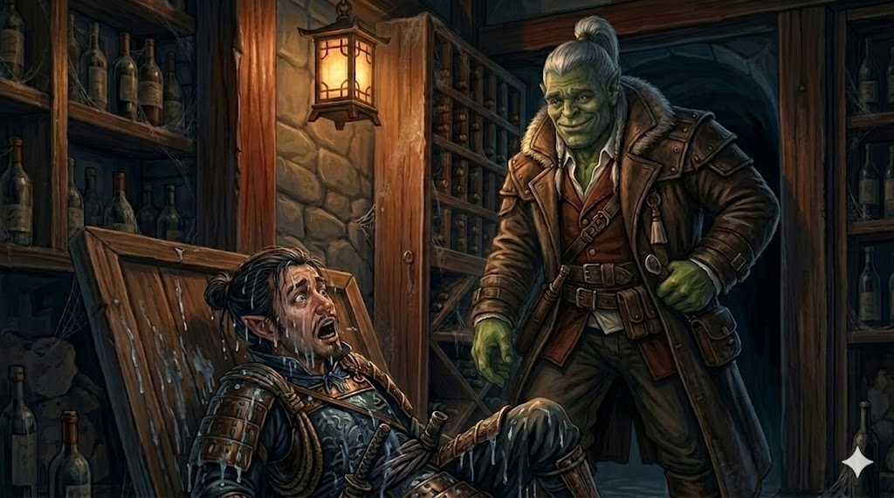

# Session Four: Petals, Wings and Hidden Truths

**Date:** February 26, 2026

---

## Overview

On the morning of the Festival of Returning Spirits, the party split between spa treatments and a child rescue—uncovering a dwarven skeleton in an old well along the way. [Radiant Willow](../wiki/npcs/radiant-willow.md) revealed matchmaking plans and new details about [Cassian Voss](../wiki/npcs/cassian-voss.md), while [Liwen](../wiki/npcs/liwen.md) the florist disclosed a suspicious order of sixty white lilies from [Magistrate Kurosawa](../wiki/npcs/magistrate-kurosawa.md). When the festival began, [Mayor Masru](../wiki/npcs/mayor-masru.md) arrived in the flesh—a surprisingly unimposing, food-obsessed oni flanked by four red-skinned guards. After a moth swarm devoured five lanterns and sent the magistrate rushing back to the estate, the party launched a three-pronged infiltration of the Yeshou manor—only to trigger a fox construct alarm and find themselves trapped inside as Kurosawa stormed through the front door. The session ended on a knife's edge: Donkey clutching stolen papers upstairs, Da Baishan and Littlefinger cornered on the first floor, and the magistrate between them and the exit.

---

## Key Events

### Morning at Silver Mist Lodge

The party woke to warm bread and honey at the Silver Mist Lodge, planning their day around two objectives: Ginkgo's scheduled makeover at [Dew Drop Petals](../wiki/npcs/radiant-willow.md), and the eventual infiltration of the Yeshou estate during the festival. They debated timing—breaking in during the ceremony when the estate would be empty, with some members staying visible at the festival as cover.

### Hong in the Well

As the party arrived at Dew Drop Petals, [Kimmy](../wiki/npcs/kimmy.md)—the girl Boone rescued from the warehouse fire—came running, gasping that [Hong](../wiki/npcs/hong.md) had fallen into an old dry well. Boone sensed no deception (Perception 20). He, Da Baishan, and Littlefinger went to help while Ginkgo and Donkey stayed for their treatments.

At the bottom of the 15-foot well, they found Hong with a gashed leg, clutching the smashed remains of Kimmy's festival lantern—her "first wish" lantern he'd been trying to retrieve. More disturbingly, partially buried in the mud was a **dwarven skeleton** with a **ceremonial clan dagger** bearing the rune for "endurance."

Boone recognized the dagger immediately: **Kaizo clan**—a family from the opposing side of the old war he, Donkey, and Ginkgo share in their histories. "We weren't friends," Boone said quietly, turning the blade in his hands. "But I guess we're not enemies anymore."

Da Baishan noted the body had been stripped of armor and belongings, likely placed there deliberately long ago. The clan dagger was left as a sign of respect. He opened a new investigation: **"The Mystery of the Submerged Dwarf."**

The party collected the bones and buried Kaizo properly at the graveyard. Da Baishan encouraged Kimmy to kiss Hong's injury better—she obliged with a shy peck on the cheek, and the kitsune boy's ears went flat with embarrassment.

### Ginkgo's Makeover and Willow's Gossip

At Dew Drop Petals, [Radiant Willow](../wiki/npcs/radiant-willow.md) gave Ginkgo a peach petal exfoliation and wove flower petals into his fungal exterior, leaving him "glistening in the light of day." She then treated Donkey to a similar spa session—soft skin, leafy hair adornments, the works.

Between treatments, Willow revealed her **matchmaking plans**:

- **Da Baishan & [Peony Switchstep](../wiki/npcs/peony-switchstep.md)** — A cheerful seamstress who loves community gossip. "He's stern; she sees the best in everyone. Can you imagine the wedding on the bridge?"
- **Boone & Cloud Ygritte** — A patient yak herder with "the most adorable chin fuzz." She likes trading stories, and Boone comes from a faraway land with an entirely different culture.
- **Littlefinger & [Meilin](../wiki/npcs/meilin.md)** — The gravekeeper he'd helped with the cricket cages. She's been practicing for the ceremonial dance, and Willow planned to watch Littlefinger's face when he saw her perform.

Ginkgo flirted clumsily with Willow, telling her about the leshy belief that matchmaking five couples earns a place in heaven—"even though we both know heaven doesn't exist." Willow said she'd be happy to get a drink with him later.

Willow also shared new details about [Cassian Voss](../wiki/npcs/cassian-voss.md): he had told her that **"five lines, five fortunes"** converge at Willowshore, and that **"something is being drawn here."** He was excited about his research but this was the only thing that seemed to worry him. He had planned to head east to follow the ley lines along the rivers. Willow still believed he had simply moved on.

On the way out, Willow gave each visitor a fortune petal—a flower with a paper fortune inside:

- **Donkey:** *"Carry hope in your pocket and every path will bloom brighter."*
- **Ginkgo:** *"Even the tiniest bud dreams of becoming a blossom. So should you."*

### The White Lilies

Donkey visited [Liwen](../wiki/npcs/liwen.md), the town florist, to check in about herbs. Liwen mentioned that [Magistrate Kurosawa](../wiki/npcs/magistrate-kurosawa.md) had personally ordered **five dozen white lilies**—the flower traditionally used for funerals. When she asked why, he said only that it was "an oni custom" and refused to elaborate. The specific number—sixty, in dozens of five—resonated with the recurring pattern of fives: five ley lines, five rivers, five lanterns.

### Scouting the Ceremony Route

Boone, Da Baishan, and Littlefinger walked the procession route from the south gate across the bridge to the [Seven Colored Songbird Theater](../wiki/locations/willowshore.md). Everything appeared normal—lanterns hung, tea ceremony preparations underway, food being cooked. Littlefinger pickpocketed 6 gold from the crowd (Thievery 22) without being noticed.

### The Arrival of Mayor Masru

As the sun set, drums began. [Mayor Masru](../wiki/npcs/mayor-masru.md) arrived flanked by **four red-skinned oni guards** in full samurai armor, each standing six to seven feet tall. The mayor himself was a disappointment in stature: a blue-skinned oni barely six feet tall, enormously round, wearing no armor, with folds of blue skin rolling over his waistline. He lumbered slowly along the procession route as the townspeople averted their eyes per custom, then followed behind.

At the Seven Colored Songbird Theater, the transfer ceremony proceeded: [Migo](../wiki/npcs/migo.md) sat across from Masru at a low table. She poured tea; they drank, bowed, and descended to their respective sides—Masru's group on the left, Migo's family on the right.

### The Dance and the Moths

Five dancers performed, including Willow—graceful and radiant as expected—and [Meilin](../wiki/npcs/meilin.md), the gravekeeper, who had received her own glow-up from Willow. The town was stunned: the young woman who normally worked in tatters with matted hair was suddenly the most beautiful person in Willowshore. The whispering was immediate and unanimous. Littlefinger, sadly, was already en route to the estate and missed the entire performance.

Willow presented chrysanthemum blooms to both the mayor and the elder to close the dance. Then—**moths**. Swarms of them, drawn to the five front lanterns like iron to magnets. They enveloped each lantern, fluttering and feeding, casting wild shadows with their wings. When they dispersed moments later, all five lanterns were destroyed—eaten through, tattered, dark.

Ginkgo watched the magistrate's reaction (Perception 25): Kurosawa and Migo locked eyes for what felt like thirty seconds. Then Kurosawa broke away, spoke urgently to the mayor, and began walking rapidly toward the estate. The mayor grumbled about missing dinner. Migo gathered her family and headed for Silver Mist Lodge, slowed by townsfolk wanting to speak with her.

### The Infiltration

The party split:

- **Ginkgo** stayed at the festival, maintaining Message communication with Da Baishan
- **Boone** stayed to observe the ceremony and provide backup
- **Donkey, Da Baishan, and Littlefinger** slipped away toward the estate (Stealth—undetected)

They split into three approaches:

#### Donkey — Through the Sky
Donkey cast **Pest Form** to become a firefly and flew to the estate's second floor. After a flyby of the windows (Perception 7—couldn't find an office), he entered the largest bedroom on the north side—the former master suite. Inside: a large bed, fireplace, wardrobe, paintings of the Yeshou family, a teapot by the bed, and a **desk with papers**.

#### Littlefinger — Through the Water
Littlefinger entered the koi pond and swam down to the hidden tunnel (Athletics 17). Partway through, a **mutated koi fish**—oversized, wrong-mouthed—slammed into him and attacked. Its jaws snapped twice (both missed against AC 17) as Littlefinger swam for his life through the narrow underwater passage. He surfaced in a small underground space beneath the estate, hauled himself onto a stone ledge, and opened the hatch into the wine cellar—arriving soaked and shaken.

#### Da Baishan — Through the Earth
Da Baishan sprinted to the shed near the manor (Stealth 12—adequate). The shed was locked, but he wrenched the latch from the door (Athletics 16) without breaking the lock itself. Inside, beneath potting soil, he found the trapdoor and crawled through a low tunnel to the wine cellar, emerging just as Littlefinger climbed out of the floor.

### Inside the Estate

Da Baishan and Littlefinger checked for traps (Perception 26—none found) and climbed to the first floor. Meanwhile, Donkey—still a firefly—examined the desk. The papers were written in an unfamiliar script with diagrams, but he recognized the writing: **the same language as the Mourndusk Willow dagger**—an infernal tongue the DM described as "Chthonic" or the Devil's tongue.

Then a **carved fox figurine** on a high shelf came to life. Stone and wood, with glowing runes and blue eyes, it scanned the room and locked onto Donkey. He used **Telekinetic Hand** to grab the construct (Wizard DC 17 vs. its Athletics—it failed) and flung it out the window. Before it cleared the sill, the fox **howled**—a deafening bullhorn alarm that echoed across Willowshore.

### The Alarm and the Scramble

Ginkgo heard the alarm and immediately contacted Da Baishan via Message: *"The magistrate and the mayor are heading back to the mansion."* He then tapped into the mycelium network (Nature 27) and overheard fragments of conversation—the mayor was annoyed at being pulled away from the food. Ginkgo told Boone they needed to stall.

Boone grabbed a basket of fish and chased down the mayor. "Mr. Mayor, don't leave without the food!" He tripped (Diplomacy 3), sending fish scattering across the ground. But Masru—easily distracted and enormously hungry—turned back toward the festival with a huge smile, his four guards trailing behind uselessly. "You can call me Mazrou," he told them. "We don't need to be so formal." The magistrate, furious, broke away and rushed to the estate alone.

Donkey transformed back to his true form, grabbed the papers from the desk, and reached for the bedroom door. Downstairs, Da Baishan and Littlefinger heard the front door of the estate swing open. Outside, Boone was running toward the manor. Ginkgo held position at the festival, maintaining contact.

**The session ended here—a five-way cliffhanger.**

### Level Up

The party reached **Level 2**.

---

## Memorable Moments

- **Boone and the Kaizo dagger** — Recognizing a former enemy's clan dagger over an old well, weighing the bones of someone he once fought against: "We weren't friends, but I guess we're not enemies anymore."
- **Da Baishan the matchmaker** — Telling a 10-year-old kitsune boy in a well that he needs a kiss to feel better, then encouraging Kimmy. "Good job, kid."
- **Ginkgo's subtlety** — Telling Willow that leshies believe five successful matches earn a place in heaven, then pivoting to: "And maybe you and I are a match. Oh—that's what I mean when I say I'm not very subtle."
- **Littlefinger vs. the koi fish** — Choosing the water route, immediately regretting it, and arriving in the basement soaking wet while Da Baishan strolled in through a dry tunnel.
- **Donkey's heist planning** — "How could such a well-planned heist have gone so wrong?"
- **Boone's Diplomacy 3** — Chasing down an oni mayor with a basket of fish, tripping, scattering food everywhere, and somehow still succeeding because the mayor just wanted to eat.
- **Meilin's glow-up** — The entire town's jaw dropping at the gravekeeper's transformation during the dance. Littlefinger was in a koi pond at the time.
- **The mayor's priorities** — Masru: "But I didn't get to eat yet." The most powerful person in Willowshore, and all he wants is dinner.

---

## Discoveries

### New NPCs

| NPC | Role |
|-----|------|
| [Kimmy](../wiki/npcs/kimmy.md) | Human girl, ~10-12 years old; rescued from the warehouse fire; Hong's friend/crush |
| [Meilin](../wiki/npcs/meilin.md) | Gravekeeper; performed in the ceremonial dance; potential romantic interest for Littlefinger |
| [Liwen](../wiki/npcs/liwen.md) | Florist in Willowshore; supplied the magistrate with 60 white lilies |
| Peony Switchstep | Cheerful seamstress; Willow's matchmaking candidate for Da Baishan |
| Cloud Ygritte | Patient yak herder with chin fuzz; Willow's matchmaking candidate for Boone |
| Kaizo (deceased) | Dwarven veteran from Boone's war; skeleton found in an old well with his clan dagger |

### Items & Resources

| Item | Details |
|------|---------|
| **Kaizo clan dagger** | Ceremonial dwarven dagger; rune for "endurance"; found with a skeleton in an old well |
| **Stolen papers** | Documents from the magistrate's desk in an infernal script (Chthonic) with diagrams; same language as the Mourndusk Willow dagger |
| **6 gold** | Pickpocketed by Littlefinger from the festival crowd |
| **Fortune petals** | Paper fortunes from Willow's salon; Donkey and Ginkgo each received one |

### Lore Learned

- **Mayor Masru** is a blue-skinned oni, shorter and far rounder than expected, unarmored, with an enormous appetite and a surprisingly affable demeanor. He arrived with four red-skinned oni guards in samurai armor.
- **Cassian Voss** told [Willow](../wiki/npcs/radiant-willow.md) about **"five lines, five fortunes"** converging at Willowshore and that **"something is being drawn here."** He planned to travel east following the ley lines along the rivers.
- **Five dozen white lilies** (funeral flowers) were ordered by [Magistrate Kurosawa](../wiki/npcs/magistrate-kurosawa.md), who called it "an oni custom." The number five continues to recur: five ley lines, five rivers, five front lanterns destroyed by moths, five dozen lilies, five dancers.
- **The moth swarm** that devoured five lanterns at the ceremony carried significance: both Kurosawa and Migo reacted intensely, locking eyes before the magistrate rushed back to the estate.
- **A fox construct** guards the magistrate's bedroom—carved stone and wood with glowing runes and blue eyes. It functions as an alarm system, howling when it detects intruders.
- **The magistrate's papers** are written in the same infernal script as the Mourndusk Willow dagger—a language called Chthonic, the "Devil's tongue."
- **The koi pond passage** is guarded by a mutated koi fish—oversized and aggressive.
- **The Festival of Returning Spirits** includes a procession, a tea transfer ceremony, a five-dancer performance, a lantern-wishing tradition on the river, and a communal feast.
- **Kaizo** was a dwarf from the opposing side of the war Boone, Ginkgo, and Donkey fought in. His skeleton was found in an old well without armor or belongings—likely placed there deliberately, with only his clan dagger left as a sign of respect.

---

## Open Threads

### Active Mysteries

- **The stolen papers** — Donkey grabbed documents from the magistrate's desk in Chthonic script with diagrams. What do they say? Can anyone translate them?
- **The moth swarm** — Five moths destroyed five lanterns at the ceremony. Both the magistrate and Migo reacted with alarm. Is this connected to the Mother of a Thousand Wings?
- **The fox construct** — An animated guardian in the magistrate's bedroom. What else is he protecting? Are there more constructs?
- **Five dozen white lilies** — Funeral flowers ordered by Kurosawa for an "oni custom." Sixty lilies, five dozen—the number five again. What ritual are they for?
- **The Kaizo skeleton** — A dwarven veteran from Boone's war, stripped of armor and placed in a well with only his clan dagger. Who put him there, and why?
- **The Mother of a Thousand Wings** — The moth swarm at the ceremony suggests the summoning may be progressing. What stage is the ritual at?
- **Cassian Voss's warning** — "Five lines, five fortunes... something is being drawn here." His words to Willow echo Migo's revelations about the ley lines.

### Commitments & Debts

- **Escape the estate** — Da Baishan, Littlefinger, and Donkey are inside the Yeshou estate with the magistrate entering. Boone is en route. Ginkgo is maintaining Message contact from the festival.
- **Matchmaking** — Willow has recruited Ginkgo to help set up Da Baishan with Peony Switchstep and Boone with Cloud Ygritte at the festival feast.
- **Translate the papers** — The stolen documents need translation from Chthonic script.
- **Bury or honor Kaizo** — The dwarven bones were buried at the graveyard; Boone may want to do more.
- **Drinks with Willow** — Ginkgo and Willow agreed to get a drink together.
- **Donkey's herb run** — Promised Liwen he'd bring back new buds and flowers from his next foraging trip.

### Next Steps

1. **Survive the estate** — Get out before the magistrate finds them
2. **Decode the papers** — Find someone who reads Chthonic, or use magical means
3. **Investigate the moths** — The five-lantern incident was clearly significant
4. **Follow up on the lilies** — Sixty funeral flowers for an "oni custom" is deeply suspicious
5. **The matchmaking gambit** — Willow's plan requires maneuvering at the feast
6. **Research Kaizo** — A fellow war veteran's remains raise questions about who else from that conflict ended up in Willowshore

---

## Timeline

| Time | Event |
|------|-------|
| Morning | Party wakes at Silver Mist Lodge; breakfast; plans the day |
| ~9:00 AM | Party arrives at Dew Drop Petals; Kimmy intercepts Boone |
| ~9:15 AM | Boone, Da Baishan, and Littlefinger rescue Hong from the well; discover dwarven skeleton |
| ~9:30 AM | Ginkgo receives makeover from Willow; learns matchmaking plans and Cassian Voss details |
| ~10:00 AM | Donkey receives spa treatment; learns about the white lilies from Willow |
| ~10:30 AM | Da Baishan, Boone, and Littlefinger bury Kaizo at the graveyard |
| ~11:00 AM | Donkey visits Liwen the florist; confirms the lily order details |
| Midday | Party regroups; Boone, Da Baishan, and Littlefinger scout the ceremony route |
| Late afternoon | Final preparations; party positions for the festival |
| Sunset | Festival begins; drums, lanterns lit, procession starts |
| ~Dusk | Mayor Masru arrives with four oni guards; procession crosses the bridge |
| ~Dusk +15 min | Tea transfer ceremony between Migo and Masru at the theater |
| ~Dusk +20 min | Ceremonial dance; Willow and Meilin shine; moth swarm destroys five lanterns |
| ~Dusk +25 min | Magistrate rushes to estate; party splits—infiltration team slips away |
| ~Dusk +30 min | Three-pronged entry: Donkey (firefly/window), Littlefinger (koi pond), Da Baishan (shed tunnel) |
| ~Dusk +40 min | Donkey finds papers; fox construct triggers alarm; magistrate storms back to estate |
| ~Dusk +45 min | Boone and Ginkgo stall Mayor Masru with food; Boone trips (Diplomacy 3) |
| **Cliffhanger** | Donkey upstairs with papers; Da Baishan and Littlefinger on first floor; magistrate entering; Boone running to estate; Ginkgo at festival |

---

## The Scene

The koi pond was darker than Littlefinger expected. Not murky—dark in the way that deep water is dark, the way a throat is dark when you look down it. He lowered himself in carefully, one hand on the stone lip, letting the water take him by inches rather than all at once. No splash. The koi drifted away from him like silk scarves caught in a slow current, their pale scales catching the last of the lantern light from above before the surface closed over his head and everything went black.

He kicked downward, fingers trailing along the mossy wall until he found the shelf Migo had described—a ledge that dropped away toward the manor's foundations. The tunnel was tight. His shoulders brushed both sides as he pulled himself forward, arms working in short, efficient strokes, lungs already beginning to tighten. Then something bumped his ribs. Not the wall. Something *muscular*, something that moved with its own intent. He twisted and saw it: a koi the size of a hunting dog, its mouth too wide, its eyes filmed over with something that wasn't cataracts. It came at him openmouthed, jaws snapping shut where his arm had been a half-second before—the sound of it carried through the water like a muffled clap. He kicked. It lunged again. He felt teeth graze his sleeve, felt the pressure wave of its bulk displacing water beside his ear, and he swam harder than he had ever swum in his life, halfling arms churning through the cold black water, every stroke a gamble that the next one wouldn't be his last.

He broke the surface gasping, hauling himself onto a stone ledge in pitch darkness. Behind him the water churned once—jaws snapping one final time at the air where his feet had been—and then the thing sank back into the tunnel with a heavy, sullen ripple. Littlefinger lay on his back on the cold stone, water pooling around him, chest heaving. From somewhere to his left came the groan of a wine rack swinging open, and Da Baishan's massive silhouette stepped through the gap, smelling like potting soil. He looked down at the soaking halfling. "Fun swim?" Littlefinger wheezed something unprintable and got to his feet.
