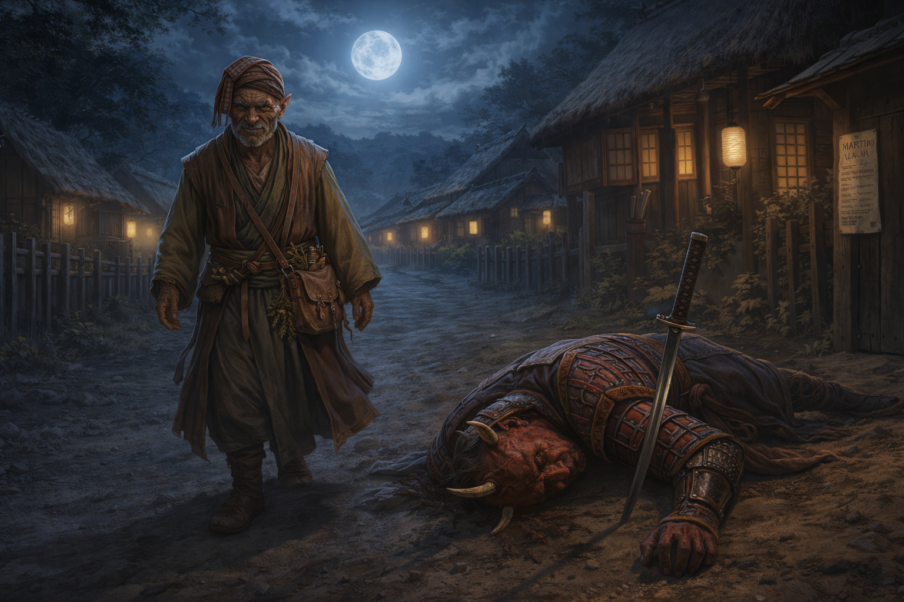

# Session Five: Martial Law

**Date:** March 12, 2026

---

## Overview

Picking up from the cliffhanger inside the Yeshou estate, the party escaped [Magistrate Kurosawa's](../wiki/npcs/magistrate-kurosawa.md) wrath by the narrowest of margins—Donkey transforming into a firefly and buzzing out a window, Da Baishan bluffing at the front door, and Littlefinger picking a lock and vanishing into the shadows. Back at the festival, the party examined their stolen goods and uncovered a map pointing to mysterious ruins east of town, a recent journal entry in the devil's tongue, and a military medal belonging to [Shang Yesho](../wiki/npcs/the-smiling-one.md)—Migo's brother, the one they call "The Smiling One." Then the hammers fell: oni guards nailed martial law decrees across Willowshore, and a desperate night of evasion, deception, and concealment followed. The session ended with the party locked down at Silver Mist Lodge, the stolen papers hidden in a wall crevice, and [Migo](../wiki/npcs/migo.md) revealing the existence of the **Gosembiki**—the Five Pointed Star—haunted ruins to the east that Kurosawa has been investigating.

---

## Key Events

### Escape from the Estate

The session opened exactly where Session Four ended: Donkey in the master bedroom with papers on the desk, Da Baishan and Littlefinger in the first-floor hallway, and Kurosawa's heavy footsteps slamming through the front door.

**Donkey** stuffed three papers into his backpack (Dexterity check—poor) and began his incantation to transform. He won initiative (15) and completed **Pest Form** just as the bedroom door burst open. As a firefly, he buzzed out the window past an angry, bony, demonic face scanning the room. Looking back over his firefly shoulder, he saw Kurosawa stare at the empty shelf where the fox alarm had been, then turn to examine the desk.

**Da Baishan** whispered to Littlefinger to hide and search, then crept toward the front door at half speed (Stealth 18, then 19—with one creaky floorboard and a knocked-over object in between). He emerged outside and called into the estate: *"Magistrate, I heard the alarm! I'm here to help!"* His Deception (12) wasn't convincing, but Kurosawa's grip on his sword loosened slightly. He dismissed Da Baishan, told him to return to the festival, and headed out to inspect the shed—whose door Da Baishan helpfully pointed out was ajar.

**Littlefinger** spotted a glass display case on a pedestal table. Inside: a golden **military medal** encrusted with gems on a ribbon, and a paper describing the award. He picked the lock with embarrassing ease (Thievery—high roll), pocketed both items, and hid in the darkness of the hallway (Stealth—high roll) as Kurosawa descended the stairs without glancing his way. Once the magistrate left the building and closed the door, Littlefinger slipped out and escaped in the opposite direction.

### Reuniting at the Festival

The party regrouped outside the estate walls and walked back to the festival. [Mayor Masru](../wiki/npcs/mayor-masru.md) was still mingling—eating messily, drinking constantly, and charming the townsfolk with his gregarious energy. His four guards stood back, quiet and watchful, never partaking. The magistrate was conspicuously absent.

### Matchmaking at the Festival

[Radiant Willow](../wiki/npcs/radiant-willow.md) found the party and orchestrated her matchmaking schemes. She nudged [Meilin](../wiki/npcs/meilin.md)—all cleaned up from her glow-up, the "classic 80s rom-com transformation"—right next to Littlefinger. Meilin was shy but grateful, thanking the party for their help during the undead crisis and the graveyard cleanup.

Littlefinger, clutching stolen goods in his pockets, kept his head down: *"Always good to have additional friends. I'm not sure I'm ready to declare my intentions."* He asked Meilin about the mayor (Diplomacy with Guidance from Boone). She was cautiously optimistic but wary: *"I can't ignore some of the recent peculiarities. We had an undead uprising—that's never happened."*

[Peony Switchstep](../wiki/npcs/peony-switchstep.md), the cheerful seamstress Willow picked for Da Baishan, was giving Willow visible resistance. Cloud Ygritte, Boone's match, had already retired for the evening.

### Donkey and Luda

Donkey sought out [Luda](../wiki/npcs/luda.md), a seamstress and informal arcane supplier he'd used before for spell components, rare inks, and alchemical ingredients. She held a very low opinion of the oni—particularly Kurosawa, who had **demanded specific arcane ingredients** from her in high volume. He paid her, but the interaction was cold, and the components were unmistakably for something nefarious.

Donkey asked her to track any future purchases and report to him. She agreed immediately: *"I don't trust any of those demons as far as I could toss them."*

### The Mayor Departs

About thirty minutes after the party returned, Kurosawa arrived at the festival. He stood at the edge for an uncomfortably long time, studying the crowd and its dynamics. Then he approached Masru, spoke briefly, and the mayor reluctantly addressed the townspeople: *"Tomorrow is going to be a long day... I'm sure we'll have many more opportunities to get to know each other."* The mayor departed with Kurosawa, the four guards in tow.

### Examining the Stolen Goods

The party found a private spot and spread out their haul.

**Donkey's papers** (three items from the magistrate's desk):

| Item | Details |
|------|---------|
| **Journal entry** | Written in Chthonic (the Devil's tongue). Decipher Writing (19)—couldn't fully translate, but identified **recent date markings** (within the past week), using symbols similar to Elvish dating conventions |
| **Arcane scroll** | A **Web** scroll (2nd-level spell). Can be cast from the scroll (destroys it) or transcribed into Donkey's spellbook for later use |
| **Map with diagram** | Shows the rivers east of Willowshore with a **marking approximately 10 miles east**, past the river junction. Includes a **sketch of a device** that Donkey recognized—it resembles the apparatus [Yong](../wiki/npcs/yong.md) was building under pressure from the magistrate |

**Littlefinger's loot** (from the glass display case):

| Item | Details |
|------|---------|
| **Military medal** | Gold with gem inlays, worth ~100 gp. Awarded to **Shang Yesho** for bravery beyond the call of duty. Not magical (confirmed via Read Aura cantrip) |
| **Award citation** | Paper describing Shang's distinguished act of valor, signed by a general |

The medal's recipient—[Shang Yesho](../wiki/npcs/the-smiling-one.md)—is [Migo's](../wiki/npcs/migo.md) brother, the perpetually smiling family member the party has seen around town. The party debated selling the medal versus keeping it as leverage. They chose to hold it.

### Martial Law

As the party discussed next steps, hammers rang out across town. Oni guards nailed decrees to posts, doorways, and buildings on both sides of the river. One was handed directly to the party.

> **By authority of Mayor and Magistrate, martial law is declared. No citizen shall leave home for the next day. All travel is forbidden until investigations are complete. Gatherings are criminal. Suspects will be dealt with harshly. All glory to Willowshore.**

Boon lit his pipe with it.

### The Scramble

The party split to deal with the crisis:

**Donkey** walked brazenly toward the edge of town, testing the enforcement. An oni guard confronted him, sword drawn. After trading barbs—*"I'm just an old man who can't sleep"*—Donkey used his new **Conceal Spell** feat to cast **Sleep** without any visible gestures or sounds (DC 18; guard rolled 17—failure). The guard toppled over, sword landing in the dirt. *"Remember to meddle not in the affairs of wizards,"* Donkey said, and walked back to the inn.

**Da Baishan, Ginkgo, and Boone** headed toward the magistrate as a distraction, claiming he'd summoned them. Two oni guards intercepted them. Ginkgo's deception sold it: *"He asked us to come see him. Do you want to be the one to tell him that you denied his explicit order?"* The guards escorted them to Kurosawa, who was patrolling the north side of town.

Kurosawa told them pointedly: *"I believe our criminals are within my sight. I think we'll reach them quickly."* He promised to call on Da Baishan's investigative skills the following morning and had them escorted back to the Silver Mist Inn.

**Littlefinger** slipped away with all the contraband, sneaking toward the graveyard (Stealth 10—poor). But his perception saved him: a **nat 20** spotted an oni guard who had been silently following him. They locked eyes. Littlefinger ran.

The chase went downhill fast. Athletics 22 initially, then 13 (failed), then he burned **Halfling's Luck** and rolled a 6. The guard cornered him against a building. But in the critical moment, Littlefinger used **Conceal Object** (25) to roll the stolen papers tight and wedge them into a crevice between boards—right under the guard's nose.

The guard grabbed him and lifted the halfling into the air. Littlefinger apologized profusely about being drunk and turned around, and the guard—sniffing the festival drink on him—bought it. He was escorted back to the inn, papers safely hidden in a wall somewhere on the north side of town.

### Audience with Migo

At the Silver Mist Inn, the party knocked on [Migo's](../wiki/npcs/migo.md) door. She was sitting at her tea table, smoking, and smiled when she saw them.

**On the mayor:** *"New leadership. What do you think?"* Boon called Masru "unbelievably friendly." Da Baishan added: "Suspiciously so."

**On the moths and the Gosembiki:** Migo revealed that the magistrate has been investigating the area around Willowshore—not just the Dark Woods, but the surrounding region. He has named a site to the east: **Gosembiki** (五芒星)—the **Five Pointed Star**. Her brother [Shang](../wiki/npcs/the-smiling-one.md), who has experience with the Chthonic language, translated the term. It refers to **haunted ruins 10–20 miles east of Willowshore**, a place of convergence—arcane, chthonic, possibly evil. Few locals go there or speak of it. Kurosawa has **recently ventured in that direction**.

**On the number five:** *"There's a convergence of five ley lines here in Willowshore. I don't believe the abnormalities we're seeing occurring in fives are a coincidence."*

**On escape:** Migo said the town is larger than six oni can cover without arcane means—but warned that Kurosawa's arcane knowledge is vast.

**Littlefinger's gambit:** He dropped the Shang Yesho medal on the table. [Shang](../wiki/npcs/the-smiling-one.md) came forward, still smiling, and took it back with obvious delight. Migo was confused but appreciative. Littlefinger's diplomacy (11) didn't land as dramatically as he'd hoped, but his perception read her as forthright and honest.

**The alibi:** The Yeshou family agreed to vouch that the party was with them during the festival for a family vote, departing only when the alarm sounded.

**Staying in Willowshore:** Migo revealed that after the ceremony, the family voted to remain: *"This place, we've been here for generations. We can't leave it to the hands of chance."* They will seek a new home if the estate is permanently lost, but they will not abandon Willowshore.

**On the spirits of the land:** *"I believe the mana and the spirits of the land here are not happy with the situation."* She cited the moths, the infestations, and the ghoul uprising as signs of the land's displeasure.

The party retired to their rooms. Long rest. Full recovery.

---

## Memorable Moments

- **Donkey's firefly escape** — Transforming with seconds to spare as the bedroom door slammed open, buzzing out past Kurosawa's furious demonic face, looking back over his "firefly shoulder" at the angry oni.
- **Da Baishan's front-door bluff** — Walking out the front door to greet the magistrate who was investigating them, sweating profusely, and somehow talking his way out.
- **Littlefinger's effortless lockpick** — "Almost like you're embarrassed how easy this is going to be." *Click.*
- **"Meddle not in the affairs of wizards"** — Donkey secretly casting Sleep on an oni guard mid-threat, watching him topple over, and delivering the one-liner as the sword landed in the dirt.
- **Ginkgo's bold deception** — "He asked us to come see him. Do you want to be the one to tell him that you denied his explicit order?" Rolling well enough to make armed oni soldiers hesitate.
- **Littlefinger's cascading failure** — Athletics rolls going from 22 to 13 to 6, burning Halfling's Luck and rolling *worse*, then pulling off a 25 Conceal Object while pinned in a corner. The universe giveth and the universe taketh away.
- **Boon lights his pipe** — Receiving the martial law decree and using it as kindling.
- **Kurosawa's threat** — *"I believe our criminals are within my sight."* Looking directly at the party.
- **"I don't trust any of those demons as far as I could toss them"** — Luda, an elderly seamstress, delivering the hardest line of the evening.

---

## Discoveries

### New NPCs

| NPC | Role |
|-----|------|
| [Luda](../wiki/npcs/luda.md) | Seamstress, alchemist, informal arcane supplier; reported Kurosawa's suspicious ingredient purchases |
| [Peony Switchstep](../wiki/npcs/peony-switchstep.md) | Halfling seamstress; Willow's reluctant matchmaking candidate for Da Baishan |

### Identified NPCs

| NPC | Revelation |
|-----|------------|
| [The Smiling One](../wiki/npcs/the-smiling-one.md) | Now identified as **Shang Yesho**, Migo's brother; military veteran; recipient of a medal for valor |

### Items & Resources

| Item | Details |
|------|---------|
| **Journal entry (Chthonic)** | Recent (within the past week); untranslated; from the magistrate's desk |
| **Web scroll** | 2nd-level arcane scroll; can be cast once or transcribed into spellbook |
| **Map with device diagram** | Marks a location ~10 miles east of Willowshore; sketch resembles the device Yong was building for the magistrate |
| **Shang Yesho's medal** | Gold military award with gems (~100 gp); returned to the Yeshou family |
| **Award citation** | Paper describing Shang's act of valor; returned with the medal |

### Lore Learned

- **Gosembiki** (五芒星, the Five Pointed Star) — Haunted ruins 10–20 miles east of Willowshore, named by Kurosawa in the Chthonic tongue. [Shang Yesho](../wiki/npcs/the-smiling-one.md) translated the term for [Migo](../wiki/npcs/migo.md). It is described as a "convergence"—a place of arcane or chthonic intent. Kurosawa has recently traveled there.
- **The device and the ruins** — The diagram Donkey found on the magistrate's map resembles the apparatus [Yong](../wiki/npcs/yong.md) was commissioned to build. A marked location east of town aligns with the Gosembiki ruins. The magistrate may be building something to place at the convergence point.
- **Kurosawa's arcane stockpiling** — [Luda](../wiki/npcs/luda.md) reported that the magistrate demanded high-volume, highly specific arcane ingredients from her. She believes they serve a nefarious purpose.
- **The journal is recent** — The stolen Chthonic journal entry dates to within the past week, suggesting the magistrate's plans are actively in motion.
- **Martial law** — Declared by the mayor and magistrate. All citizens confined to their homes, travel forbidden, gatherings criminal. Enforcement by oni guards with lethal authority.
- **The Yeshou family is staying** — After the ceremony, the family voted to remain in Willowshore permanently, refusing to abandon their ancestral home.
- **Migo confirms the pattern of fives** — Five ley lines, five lanterns destroyed, and now the Five Pointed Star. She does not believe this is coincidence.
- **The spirits are unhappy** — Migo believes the moths, infestations, and ghoul uprising are signs that the land's spirits object to the magistrate's activities.

---

## Open Threads

### Active Mysteries

- **The Gosembiki ruins** — Haunted ruins east of Willowshore where five ley lines may converge. Kurosawa has traveled there recently. A map with a device diagram was among his papers. What is he building, and what happens when it's placed at the ruins?
- **The device** — Yong was pressured into building an apparatus for the magistrate. The diagram on the stolen map matches its description. Where is it now? Is it complete?
- **The hidden papers** — Littlefinger concealed the stolen documents in a wall crevice on the north side of town during his chase. They need to be retrieved before the oni find them.
- **Kurosawa's investigation** — He declared martial law specifically because of the break-in. He said to the party's face: *"I believe our criminals are within my sight."* How much does he know? What will tomorrow's interrogation look like?
- **Luda's ingredient list** — What exactly did Kurosawa purchase? Donkey asked Luda to provide details and report future orders.
- **The Chthonic journal** — A recent entry in the devil's tongue that no one can fully translate. Someone who reads Chthonic is needed—or more time and samples for Donkey to work from.
- **The Mother of a Thousand Wings** — The summoning ritual is connected to the ley lines, the Mourndusk Willow, the moths, and now potentially the Gosembiki ruins. How far along is it?

### Commitments & Debts

- **Kurosawa's summons** — He told Da Baishan he would call on him tomorrow for investigative assistance. This is likely a trap or interrogation.
- **The Yeshou alibi** — Migo and the family will vouch that the party was with them during the festival for a family vote.
- **Shang's medal returned** — Littlefinger gave back the military medal, building goodwill with the Yeshou family.
- **Luda's promise** — She agreed to track and report any future arcane purchases by Kurosawa.
- **Matchmaking** — Willow's plans continue: Meilin and Littlefinger are being nudged together; Peony resists Da Baishan; Cloud Ygritte retired before meeting Boone.

### Next Steps

1. **Survive tomorrow's investigation** — Kurosawa is coming. The alibi must hold.
2. **Retrieve the hidden papers** — Littlefinger stashed them in a wall crevice on the north side of town. They contain the map to the Gosembiki and the untranslated journal entry.
3. **Investigate the Gosembiki ruins** — 10–20 miles east. The device diagram suggests Kurosawa is building something for that location.
4. **Get the full ingredient list from Luda** — What exactly was Kurosawa stockpiling?
5. **Translate the Chthonic journal** — Find someone who reads the devil's tongue, or continue Donkey's decipher attempts with more samples.
6. **Follow up on Yong's device** — Is the apparatus complete? Has it been delivered? What does it do?

---

## Timeline

| Time | Event |
|------|-------|
| **Cliffhanger pickup** | Kurosawa enters estate; Donkey transforms and escapes as firefly; Da Baishan bluffs at the front door; Littlefinger picks lock and steals medal |
| ~Dusk +50 min | Da Baishan dismissed by Kurosawa; Littlefinger escapes opposite direction; Donkey transforms back in trees |
| ~Dusk +55 min | Party reunites outside estate walls; walks back to festival |
| ~9:00 PM | Festival socializing; Willow's matchmaking; Littlefinger talks to Meilin; Donkey talks to Luda |
| ~9:30 PM | Mayor Masru gives farewell speech and departs with Kurosawa and guards |
| ~10:00 PM | Townsfolk gossip about the mayor; party gathers society information |
| ~10:30 PM | Party examines stolen goods privately; identifies papers, scroll, map, medal |
| ~11:00 PM | Martial law declared; oni guards nail decrees across town |
| ~11:15 PM | Party splits: Donkey tests the perimeter (sleeps a guard); group heads to magistrate; Littlefinger runs for the graveyard |
| ~11:30 PM | Littlefinger chased, caught, conceals papers (25), deceives guard; group confronts Kurosawa ("criminals within my sight") |
| ~11:45 PM | All party members escorted back to Silver Mist Inn |
| ~12:00 AM | Audience with Migo; learns about Gosembiki, alibi arranged, family staying |
| ~12:30 AM | Migo retires; party goes to rooms; long rest begins |
| **Morning** | Party wakes at Level 2, fully rested, under martial law |

---

## The Scene

The road out of Willowshore was nothing more than a dirt track between low fences and sleeping houses, but Donkey had walked it ten thousand times and his feet knew every rut. He walked slowly—not because he was tired, though he was, but because a man in a hurry at midnight invites questions, and a man who ambles invites only pity. The decree was still fresh on the post behind him, the ink barely dry, the nail driven crooked by a guard who didn't care about carpentry. *No citizen shall leave home.* Donkey had been a citizen of Willowshore before the word "citizen" meant anything here. He kept walking.

The oni appeared from the left, stepping out of the shadow between two buildings with his sword already half-drawn. Red skin, black armor, the lamplight catching the lacquer on his shoulder plates. He was young—they all were, these stormtroopers—and he planted himself in the road like a fence post with opinions. "Halt, citizen." The sword came the rest of the way out, leveled at Donkey's chest. Donkey stopped. He looked at the blade, then at the guard, then at the stars above the treeline as if considering whether any of this was worth his time. "I'm just an old man who can't sleep," he said. "A walk in the forest soothes the nerves." The guard's lip curled. "We'll escort you to a place where you can sleep very soundly." The threat hung in the air between them like smoke. Donkey tilted his head. "Do you have a warrant for this arrest?" The guard's knuckles whitened on the hilt. He took a step forward, sword arm rigid, voice dropping to something that wanted very badly to sound dangerous: "Sir. This is your last warning."

Donkey sighed—the sigh of a man who has watched empires rise and rot and rise again, who has buried friends on both sides of wars that history forgot, who has been threatened by better swordsmen than this in languages this boy's grandparents hadn't learned yet. He looked the guard in the eye. "You'll be forced to, will you?" His fingers moved at his side—no flourish, no arcane geometry, nothing a watching eye would catch. The words of the spell slid out beneath his breath like a lullaby hummed under the sound of wind. The guard blinked. His eyelids went heavy. His sword arm dipped, then sagged, and the blade tipped forward and stuck point-first in the dirt as his knees buckled and his body folded sideways onto the road like a puppet whose strings had been snipped all at once. He lay there breathing deeply, armor settling into the mud, face slack and peaceful as a child's. Donkey looked down at him for a long moment. Then he turned back toward the Silver Mist Inn, stepping over the sleeping guard's outstretched hand. "Remember," he said quietly, to no one who would hear it, "to meddle not in the affairs of wizards."

---

## Level 2 Upgrades

### Da Baishan (Investigator)
- **Skill increase:** Thievery (trained)
- **Class feat:** Shared Stratagem — when using Devise a Stratagem, an ally also treats the target as off-guard
- **Skill feat:** Eyes of the City — use local citizens to help track people while in settlements

### Donkey (Wizard)
- **Class feat:** Conceal Spell — cast spells without visible gestures or audible components (gains Subtle trait)
- **Skill feat:** Tattoo Artist — can inscribe magical tattoos using special inks and components

### Boone (Fighter)
- **Archetype feat:** Medic Dedication — expertise in Medicine; enhanced Battle Medicine and Treat Wounds with higher DCs for more healing; once per day can use Battle Medicine on an immune creature
- **Skill feat:** Assurance (Medicine) — take 10 + proficiency on Medicine checks, guaranteeing success at basic DCs

### Ginkgo (Cleric)
- **Class feat:** Communal Healing — when healing one character, also heal an adjacent character
- **Skill feat:** TBD

### Littlefinger (Rogue)
- **Class feat:** Minor Magic — gain the ability to cast a cantrip
- **Skill feat:** TBD

### Homebrew: Hero Points

The GM introduced unique hero point abilities for each class, usable once per session:

| Class | Ability | Effect |
|-------|---------|--------|
| **Wizard** | Improvise Spell | Cast any spell in your spellbook, even if not memorized |
| **Fighter** | Second Wind | Gain temporary HP; immune to fatigued, slowed, and sickened for 10 minutes |
| **Cleric** | Divine Surge | Instantly heal self or one ally in range, OR regain a focus point / re-roll a failed save |
| **Rogue** | Parkour | Spend hero point + 1 action to gain 2 extra actions (stride, step, leap, climb, or tumble through); if adjacent to a foe afterward, sneak attack applies automatically |
