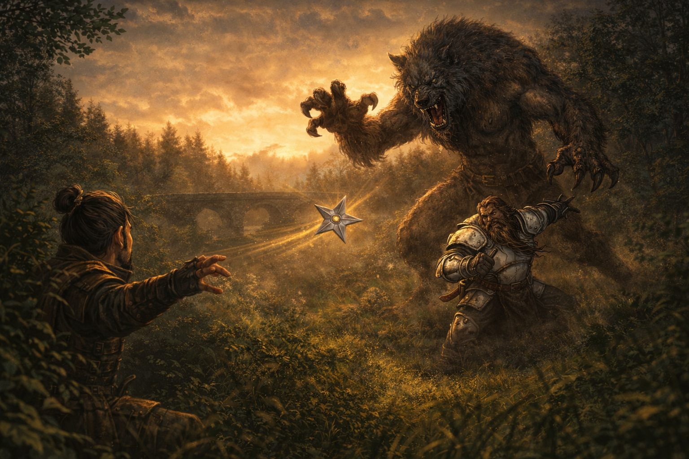

# Session Six: Roots Forgotten, Roots Remembered

**Date:** March 19, 2026

---

## Overview

The morning after martial law began, the party was shaken awake by vivid, shared dreams—the land itself crying out in agony, rivers running black, ley lines buckling under unseen pressure. Boone's dream was radically different: a battlefield massacre where [The Smiling One](../wiki/npcs/the-smiling-one.md) performed a chanting ritual that ripped the sky open and summoned a demon, accompanied by a cryptic prophecy about five who must fall. After [Kurosawa](../wiki/npcs/magistrate-kurosawa.md) interrogated the party and voided their contract, [Mayor Masru](../wiki/npcs/mayor-masru.md) swooped in to hire them as "Masru's Faithful Five"—complete with daily stipends, investigative licenses, and the freedom to move through martial law. Armed with new authority and old questions, the party learned from [Mido](../wiki/npcs/mido.md) that the Yeshou family has been sentenced to exile in five days, consulted the spirit of [Cassian Voss](../wiki/npcs/cassian-voss.md) at the cemetery, and trekked east toward the [Gosembiki ruins](../wiki/locations/gosembiki-ruins.md)—only to be ambushed by an infected werewolf that turned out to be one of Mido's missing guards.

---

## Key Events

### The Dreams

The party woke to discover they had shared an extraordinarily vivid dream. All except Boone experienced the same vision: an eye above the land, the earth crying out in pain, the river running black beneath a wounded sky. Ancient trees bled yellow sap, their leaves brown and sickly. Ley lines—normally invisible—buckled and warped under unseen pressure. Everyone woke with the taste of earth and river water on their tongues.

Boone's dream was radically different. He stood in the mud of a massive battlefield—a massacre. Comrades and enemies of all ancestries lay dead by the dozens around him. A young dwarf wearing enemy colors but someone Boone once trusted helped him to his feet. Then he saw [Cheng Yesho](../wiki/npcs/the-smiling-one.md)—younger, hunched over a ritual circle inscribed in the mud, chanting words that grew louder with each repetition. With every syllable, Cheng's face twisted further from grimace to an unnaturally wide grin that would never leave him. On the fifth chant, the sky ripped open, and a demonic creature emerged through tentacles of dark energy and began slaughtering everything around it. A voice echoed in Boone's skull five times:

> *"The artist, the ruler, the sage, the lover, the judge. Five must fall before the world is born anew."*

Boone jolted awake sweat-soaked, Cheng's distorted smile carved into his thoughts.

### Kurosawa's Interrogation

[Kurosawa](../wiki/npcs/magistrate-kurosawa.md) barged into the Silver Mist Inn looking for the party. He sat them down and peppered them with questions about the Yeshou family, their relationship with [Mido](../wiki/npcs/mido.md), and whether they'd noticed anything "out of the ordinary" the night before. He revealed that several items were missing from the estate and that his investigation pointed to the Yeshou family. He looked directly at Donkey when suggesting that "folks with unique arcane abilities" could bypass physical limitations.

Da Baishan deflected with practiced ease—"As newcomers, we've been trying to ingratiate ourselves with as many people as possible." Donkey played dumb about estate knowledge. Kurosawa warned that punishment for treason would be severe, glared at the party, and turned to head upstairs—presumably to confront the Yeshous.

Ginkgo used **Message** to warn Mido: *"Kurosawa is headed to see you and he's looking for his emblem and some other things."*

Before Kurosawa could reach her, a red trooper arrived summoning the party to the mayor—overriding the magistrate's authority. Kurosawa was furious, arguing he wasn't done investigating. The mayor pulled rank. Kurosawa turned to the party and declared their security contract void: *"You failed to have the event without incident. The alarm went off during your watch. You will not receive any payment. Consider our contract void."*

### Masru's Faithful Five

[Mayor Masru](../wiki/npcs/mayor-masru.md) was in the estate courtyard, barely contained by a struggling chair, surrounded by demolished bread and drinking from what was functionally a pitcher. He described having the same shared dream as the party—the wounded land, the black river, the buckling ley lines—and was deeply disturbed by it.

He offered the party a commission: investigate the dream, determine if the land is truly ailing, and report directly to him. He christened them **"Masru's Faithful Five"** and drew up contracts on vellum brought by [Meilin](../wiki/npcs/meilin.md)—who appeared in uncomfortably revealing attire that the mayor openly leered at, to her visible embarrassment.

**Contract terms:**
- 10 gold per person daily stipend
- Incidentals upon the mayor's approval
- Individual investigative licenses granting authority to act on behalf of the mayor in Willowshore and surrounding areas
- Freedom of movement during martial law

When ringing for Meilin, Masru remarked to the party: *"There's some beautiful things here in Willowshore. The smile on this one could bring the sun in the dead of midnight—or separate a man from his gold. If she was back in [Kirahata](../wiki/locations/kirahata.md) working at the Orchid with me, she would make herself and myself very, very wealthy."*

Donkey requested investigative licenses—each party member received one. Ginkgo signed without reading. Donkey checked for hidden clauses (Society check—the contract was straightforward and honest).

### Testing the Credentials

Walking back through town, the party was immediately confronted by a guard enforcing martial law. They presented their licenses. The guard—[Captain Akoto](../wiki/npcs/captain-akoto.md)—read them, looked confused, but let them pass. Ginkgo demanded his name and rank, and the captain complied.

Boone pressed Akoto for information. The captain admitted the troops were told very little: enforce the lockdown, ensure no one leaves. Kurosawa was handling the investigation personally and insisted on dealing with the estate intrusion himself. The party noted that Kurosawa was first on the scene and refused to let anyone else investigate—and that his story about nothing being missing later changed to things being missing. Akoto found this noteworthy but said nothing more.

### Consulting Cheng

Back at the Silver Mist Inn, the party found their rooms had been ransacked—beds flipped, drawers emptied, floorboards pried up. Kurosawa or his troopers had searched thoroughly.

At the Yeshou family suite, [Mido](../wiki/npcs/mido.md) greeted them. Only one of her two personal guards was present—a detail no one noticed at the time.

[Cheng](../wiki/npcs/the-smiling-one.md) entered from a back room, smiling as always. Boone felt a chill seeing that face again—the same distorted grin from his dream. The party asked Cheng about the Battle of Five Crows. His eyes dilated briefly—recognition, maybe fear, maybe excitement—but his smile never wavered. He gave a shallow nod.

When Boone repeated the prophecy—*"The artist, the ruler, the sage, the lover, the judge. Five must fall before the world is born anew"*—Cheng reached for paper and wrote in common with jerky handwriting: **"Are you sure you heard it correctly?"**

After further pressing, Ginkgo caught Cheng take a quick glance at Mido (Perception 20)—the same kind of loaded glance Mido and Kurosawa had exchanged at the festival. Cheng then wrote two words: **"The old ones."**

Ginkgo said aloud: *"The old gods."* Cheng looked directly at him.

### The Old Gods

Mido explained that **five old gods** existed before the current pantheon. According to legend, they were overthrown by the gods worshipped today—not destroyed, but **banished to a pocket dimension**, imprisoned because they could not be killed.

Da Baishan's spirit lore (17) confirmed this and added: people who claim to commune with the old gods have surfaced throughout history, but they're dismissed as charlatans or fey pretending. Communing would require a **medium with cross-planar reach**—and ley lines could serve that purpose. Five ley lines, even more so. Da Baishan suggested the ancient willow tree in the Dark Woods.

Boone's religion check (18) revealed that the old gods' names had been lost to history—one was even called the **Nameless God**. Their domains were chaos, destruction, lust, and blood—nothing like "artist" or "lover." But the five titles triggered a recognition through occultism: they matched **tarot card archetypes**, though the traditional deck has more than five.

No fortune tellers exist in Willowshore. The nearest would be in [Kirahata](../wiki/locations/kirahata.md), several days' journey to the south.

### The Yeshou Exile

Mido revealed grim news: [Kurosawa](../wiki/npcs/magistrate-kurosawa.md) had sentenced the Yeshou family to **exile in five days**. A carriage would arrive to transport them to an unspecified location—a "gulag." The charges: stealing items vital to the Imperium and the Council of the Magi.

Donkey noted that Kurosawa seemed to know nothing about the actual crime and was simply pinning it on someone. The party promised to speak to the mayor about a stay. Mido smiled dryly and said the family had discussed "contingency plans" as the day approached.

The Yeshou family is providing an alibi for the party—at personal risk.

### Visiting Willow

At [Dew Drop Petals](../wiki/npcs/radiant-willow.md), [Radiant Willow](../wiki/npcs/radiant-willow.md) was more subdued than usual—Kurosawa had visited that morning, asking aggressive questions about the party, especially Ginkgo, Littlefinger, and Donkey. She described him as "an angry person" whose questions felt like leading accusations.

Willow confirmed she had the **same shared dream**: vivid, intense, with the taste of earth and river water lingering after waking. She interpreted it directly: *"Willowshore is sick. The spirits are damaged. They're calling out for help."* She noted the dream's five lines reminded her of the rivers near Willowshore, and that the river no longer "sings as loudly as it did before."

She spritzed Ginkgo and Donkey with a new perfume, attempted to set Boone up with a match, and wished the party well.

### The Cemetery Séance

The party detoured north to the cemetery, hoping to contact [Cassian Voss's](../wiki/npcs/cassian-voss.md) spirit. Da Baishan led a séance (Spirit Lore 18, Diplomacy check). It was daytime—suboptimal—but with five participants, the circle was strong.

A cold breeze moved against the current wind. A rice cake offering toppled. Then Da Baishan's mouth began to move in a voice that wasn't his—Cassian Voss's spirit, speaking through him. Da Baishan could hear but had no control.

Three questions, three answers before the spirit faded:

| Question | Answer |
|----------|--------|
| *What can you tell us about the old gods?* | "There were five. Despite the current understanding, they are much closer than the legends would like us to believe. It is not very difficult to commune with them." Also: "They are clever manipulators and to be seriously concerned." |
| *Who would benefit from bringing them back?* | "Foolish ones seeking power." |
| *The artist, the ruler, the sage, the lover, the judge—what does that mean?* | "That is the ritual for the Unspeakable One. Five must be sacrificed to bring—" *(cut off; the spirit was pulled away mid-sentence)* |

Da Baishan returned to his own body, deeply unsettled.

### The Trek East

The party headed east along the river toward the [Gosembiki ruins](../wiki/locations/gosembiki-ruins.md), leaving the hidden papers in their wall crevice—too much heat to retrieve them now. The forest thinned to grassland as they walked. Around eight miles out, they spotted the ruins: a series of dilapidated buildings jutting from the plains, still about three to four miles distant.

### Ambush: The Infected Werewolf

Near a bridge over the river, a creature leaped from the tree line. It was humanoid—lupine, with piercing red eyes and yellow pustules erupting from burned, distorted skin. A werewolf, but diseased, infected with something that twisted its body.

**Combat highlights:**

- The creature's opening attacks shredded Littlefinger—claw (10 damage) and bite (15 damage), dropping him to **1 HP** before anyone could react
- Littlefinger hid (Stealth 22) and began throwing shurikens from cover, landing a **sneak attack** that drew first blood
- Boone **demoralized** the creature (Intimidation vs. Will—the creature rolled a 1, becoming frightened)
- Donkey's **Tangle Vine** failed, but his **Battle Medicine** healed Littlefinger for 13 HP
- Ginkgo's **Divine Lance** struck the creature's leg, inflicting the **clumsy condition** and slowing it
- Da Baishan missed three crossbow bolts but landed a solid hit with his **Guan Dao** (8 damage) once in melee
- Boone **tripped** the creature (failed Reflex save), making it prone and off-guard to everyone
- Boone then smashed it with his polearm for **21 damage**
- Littlefinger's shuriken with sneak attack (5 damage) struck its throat—the **killing blow**

### The Guard Revealed

As the creature died, it shrank and transformed—shrinking from lupine monstrosity to human shape. The party recognized him: **one of Mido's two personal guards**. The same guard who had been missing that morning when only one guard stood at Mido's door.

His body was riddled with cancerous growths and pustules—swollen, erupting from the skin as if something inside him was trying to rip its way out. He was infected with something profoundly wrong.

### Session End

The party camped about a mile from the Gosembiki ruins as dusk approached, healing up and preparing for what lies ahead. The ruins—a series of ancient buildings—waited in the fading light.

---

## Memorable Moments

- **Ginkgo demands credentials** — "Name and rank, please." To an armored oni guard. Boone adds: "You heard the mushroom."
- **Ginkgo signed the contract without reading it** — Littlefinger: "Ginkgo's signature looks like a mushroom."
- **Masru's priorities** — Openly leering at Meilin while describing how much money she'd make at a gentleman's club in Kirahata. The mayor is disturbing in new and different ways each session.
- **"Uno reverse"** — Littlefinger, upon being told to go home by a guard, flashing his investigative license.
- **Da Baishan channeling Cassian Voss** — His body hijacked mid-séance, speaking in a dead man's voice while fully conscious but unable to stop it: "That was deeply unsettling. I did not enjoy that."
- **Boone's three-bolt miss** — Three consecutive crossbow shots, each worse than the last. "I should have moved in with my staff."
- **Ginkgo's pacifism in combat** — "Am I allowed to hurt?" Targeting the werewolf's leg with Divine Lance to cripple rather than kill.
- **The party's investigative instincts** — Noting that Kurosawa was first on the scene, refused help, claimed nothing was missing, then changed his story. Donkey writes it all in a notebook.
- **Willow's optimism, cracking** — Even the most relentlessly cheerful person in Willowshore admits: "He is beginning to get me to question that most people are good."

---

## Discoveries

### New NPCs

| NPC | Role |
|-----|------|
| [Captain Akoto](../wiki/npcs/captain-akoto.md) | One of Kurosawa's red-skinned oni guard captains; reasonably cooperative when presented with the party's credentials |

### Items & Resources

| Item | Details |
|------|---------|
| **Investigative licenses** | One per party member; signed by Mayor Masru; grant authority to act on his behalf in Willowshore and surrounds |
| **Employment contract** | "Masru's Faithful Five"; 10 gp/day per person; incidentals by approval |
| **50 gold (party fund)** | From Kurosawa's original advance; divided 10 gp each |
| **10 gold per person** | First day's stipend from the mayor |

### Lore Learned

- **The Old Gods** — Five ancient deities that predated the current pantheon. They were not destroyed but **banished to a pocket dimension** by the current gods. Their domains were chaos, destruction, lust, and blood. Their names have been lost to history; one was called the **Nameless God**. People who claim to commune with them are dismissed as charlatans, but [Cassian Voss's](../wiki/npcs/cassian-voss.md) spirit says "they are much closer than legends would like us to believe."
- **The Unspeakable One** — The prophecy from Boone's dream (*"the artist, the ruler, the sage, the lover, the judge—five must fall before the world is born anew"*) is identified by Cassian Voss as **"the ritual for the Unspeakable One."** Five must be sacrificed to bring... something. The spirit was cut off before finishing.
- **The Battle of Five Crows** — A massacre from Boone's past where [Cheng Yesho](../wiki/npcs/the-smiling-one.md) performed a chanting ritual that summoned a demonic entity. The ritual permanently distorted Cheng's face into his eternal smile. The battle's name and the number five continue to echo through the campaign.
- **Cheng knows more than he says** — He recognized the Battle of Five Crows, exchanged a loaded glance with Mido before answering, and wrote "the old ones" when asked about the prophecy. His written question—"Are you sure you heard it correctly?"—implies the exact wording matters.
- **Communing with old gods** requires a medium with **cross-planar reach**. Ley lines can serve this purpose. Five ley lines converging—as at Willowshore—would be especially powerful.
- **Tarot connection** — The five titles (artist, ruler, sage, lover, judge) are reminiscent of **tarot card archetypes**, though the traditional deck has more than five.
- **The Yeshou exile** — [Kurosawa](../wiki/npcs/magistrate-kurosawa.md) sentenced the Yeshou family to exile in **five days**, claiming they stole items vital to the Imperium and the Council of the Magi.
- **Mido's guard was a werewolf** — One of Mido's two personal guards was found 8+ miles east of town, infected with a disease that transformed him into a werewolf with pustules and cancerous growths. He attacked the party on sight and died in combat.
- **The shared dream is widespread** — [Mayor Masru](../wiki/npcs/mayor-masru.md) and [Radiant Willow](../wiki/npcs/radiant-willow.md) both had the same dream. It appears anyone connected to the land experienced it. Willow interprets it as the spirits calling for help.

---

## Open Threads

### Active Mysteries

- **The Unspeakable One** — Cassian Voss identified the five-part prophecy as a ritual for "the Unspeakable One." Five must be sacrificed to bring... what? Is this one of the old gods? Is someone performing this ritual now?
- **The Gosembiki ruins** — The party is camped a mile away. Kurosawa's map pointed here. His device diagram matches what Yong was building. What will they find inside?
- **The infected guard** — One of Mido's guards transformed into a diseased werewolf 8+ miles from town. What infected him? Was he sent to the ruins? Did he encounter something there?
- **Cheng's secrets** — He recognized the Battle of Five Crows, communicated through writing, and glanced at Mido before saying "the old ones." His face was distorted during the ritual Boone saw in his dream. How much does he know about the old gods?
- **The hidden papers** — Still wedged in a wall crevice on the north side of town. The party decided not to retrieve them while Kurosawa is searching.
- **The Yeshou exile** — Five days until a carriage arrives. Can the party convince Masru to intervene? Will the family's "contingency plans" work?
- **The Council of the Magi** — Kurosawa claims membership. His authority to sentence the Yeshous comes from this body. Who are they?
- **Kurosawa's investigation** — He searched the party's rooms, interrogated Willow, and is building a case. The alibi from the Yeshou family held—for now.
- **The Mother of a Thousand Wings** — How does the moth-demon ritual connect to the old gods and the Unspeakable One? Are they the same thing?

### Commitments & Debts

- **Masru's Faithful Five contract** — 10 gp/day per person; investigate the ailing land; report to the mayor
- **Yeshou alibi** — The family continues to vouch for the party at their own risk
- **Save the Yeshous** — The party promised to try to get a stay of exile from the mayor
- **Mido's contingency** — The family has escape plans if needed; the party may need to help
- **Luda's reports** — She agreed to track Kurosawa's future arcane purchases
- **Matchmaking** — Willow is still working on it; Boone's match was suggested again this session

### Next Steps

1. **Explore the Gosembiki ruins** — One mile away; the party plans to enter after resting
2. **Petition the mayor** — Ask Masru to intervene in the Yeshou exile before five days elapse
3. **Retrieve the hidden papers** — The Chthonic journal and map are still in the wall crevice
4. **Translate the Chthonic journal** — Cheng reads Chthonic and could translate, but getting time alone with him is difficult
5. **Investigate the infected guard** — What disease transforms someone into a werewolf with pustules? Is it connected to the land's sickness?
6. **Research the Unspeakable One** — The ritual, the five sacrifices, and the connection to the old gods

---

## Timeline

| Time | Event |
|------|-------|
| Dawn | Party wakes with shared dream; Boone has different battlefield dream |
| ~8:00 AM | Party shares dream details over breakfast; discovers the prophecy of five |
| ~8:30 AM | Kurosawa interrogates the party at Silver Mist Inn; Ginkgo Messages Mido |
| ~8:45 AM | Red trooper summons party to the mayor; Kurosawa voids security contract |
| ~9:00 AM | Mayor Masru hires party as "Masru's Faithful Five"; contracts signed; licenses issued |
| ~9:30 AM | Party tests credentials on Captain Akoto; learns Kurosawa told troops nothing |
| ~10:00 AM | Visit to Mido and Cheng; Cheng writes "the old ones"; learns about old gods |
| ~10:30 AM | Mido reveals Yeshou family sentenced to exile in five days |
| ~11:00 AM | Visit to Radiant Willow; she confirms the shared dream; Kurosawa interrogated her |
| ~11:30 AM | Party leaves town heading east toward Gosembiki ruins |
| Midday | Detour to cemetery; séance with Cassian Voss's spirit; learns of the Unspeakable One |
| ~1:00 PM | Party heads east along the river; forest thins to grasslands |
| ~4:00 PM | Werewolf ambush near a bridge; Mido's infected guard attacks; party kills him in combat |
| ~4:30 PM | Guard's identity revealed; party camps about one mile from the Gosembiki ruins |
| **Dusk** | Party rests and heals, preparing to approach the ruins |

---

## The Scene

> The body,
> The mind,
> The target,
> The shape,
> The breath,
> The hand,
> The weapon,
> The weight.
>
> The silence,
> The sound,
> The tide,
> The wake,
> The sword,
> The spirit,
> The soul,
> Ablaze.
>
> The bird slips out of my hand,
> And into the throat of the enemy,
> The bird slips out of my hand,
> Plunges into the throat.
>
> The strike,
> The union,
> The quest,
> The aim,
> The perfect momentum,
> The unyielding haze.
>
> The focus,
> The tide,
> The void,
> The space,
> The domain of self.
>
> The bird slips out of my hand,
> And into the throat of the enemy,
> The bird slips out of my hand,
> Plunges into the throat.

*— "Shuriken" by Twelve Foot Ninja (adapted)*
