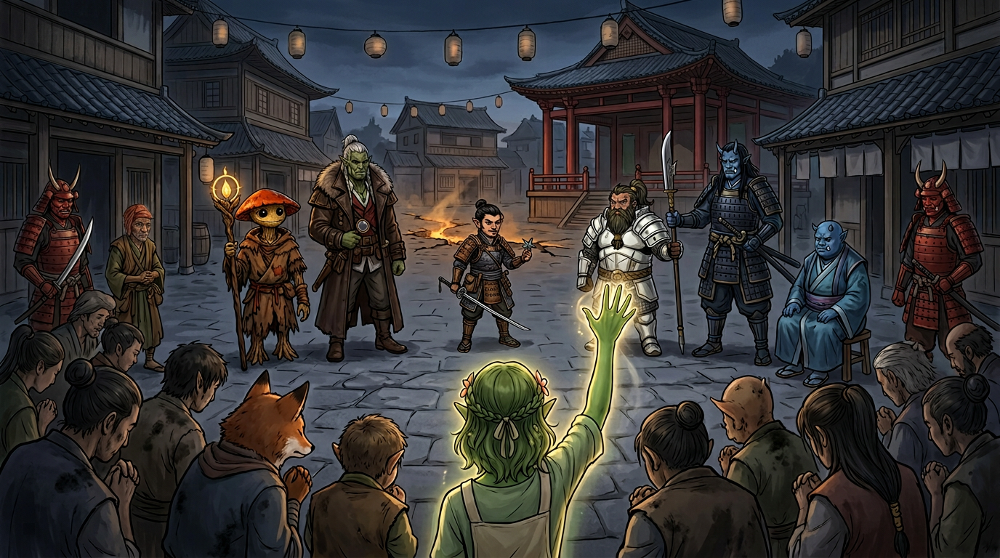

# Session Eight: Fault and Judgement

**Date:** April 22, 2026

---

## Overview

The party pulled [Kurosawa's](../wiki/npcs/magistrate-kurosawa.md) device free from its gear cradle and unleashed a catastrophe—a chasm tore across the land toward [Willowshore](../wiki/locations/willowshore.md), the [Gosembiki ruins](../wiki/locations/gosembiki-ruins.md) collapsed around them, and a golden dragon calling itself **[Gujravati](../wiki/npcs/gujravati.md)** appeared in frozen time to mark each of them against "the falling darkness." They recovered a legendary sword, rested on the hill, then returned to find demons boiling out of the chasm in town. Kurosawa himself joined the battle, and when it was done he invoked the ancient **Rite of Open Reckoning**—a public trial that ended with the party charged, convicted, and disarmed.

---

## Key Events

### The Device Comes Loose

The session opened where the last had ended: the party in the subterranean chamber, the flower-petal device frozen in its gear track by Donkey's vines, its ley line redirection halted but unresolved. They spent time analyzing the mechanism—Ginkgo on geomancy (Arcana 14), Donkey with Detect Magic. The device was warping the ley line **counterclockwise** toward the river, aiming its artificial path closer and closer to Willowshore. What it would do when it arrived, none of them could say—only that the manipulation of ley lines is *a way to change power, transform power*.

Littlefinger circled the device checking for traps (Perception natural 20, +2 from Trap Finder). Nothing. He gave the go-ahead. Da Baishan reached in, gripped the metal, and pulled it free.

The chamber erupted.

- **Blinding light** burst from where the device had been anchored
- Rocks cracked and the roof began collapsing
- Birds outside exploded in the sky as heat vented upward
- A jagged **chasm** opened from the ruin itself, arcing like a lightning strike across the coastline toward Willowshore
- Static electricity raised the hair on every arm in the room

The party took bludgeoning damage as the ruin fell around them. Da Baishan dropped to zero and started dying (**4 damage, he had 4 HP**). Donkey went unconscious too.

### The Golden Dragon

Before darkness took them, time slowed.

A golden glow formed in the center of the collapsing chamber. It rose, took shape, and became a dragon—no wings beating, no roar, only a voice the party recognized. It was **the same voice from the shared dream**, the one [Mayor Masru](../wiki/npcs/mayor-masru.md), [Radiant Willow](../wiki/npcs/radiant-willow.md), and the party had all heard before (even Boone's vision of the Battle of Five Crows carried it, distorted).

> *"You have heard me in fragments. Now hear me in truth. I am [Gujravati](../wiki/npcs/gujravati.md). The wound is opened. I cannot close it for you—but I can mark those who still choose to stand against the falling darkness."*

The dragon fixed its gaze on each PC in turn. Each received a personal message and a **gift**—handouts given privately, the specifics of each mark kept between the recipient and the dragon.

> *"I am not your master. I am not your shield. I am only one who saw the rot spreading, and chose to answer before silence did. What is open now will call many things to the surface—some buried, some invited, some long denied. Remember this: this wound in the land is not the first wound. Only the freshest."*

The form dissolved back into a glowing orb, then nothing. Time resumed. The ruin finished falling.

### Aftermath in the Rubble

Ginkgo and Donkey were stabilized. Bludgeoning damage around the table: Littlefinger 6, Boone 3, Da Baishan 4 (dying), Ginkgo 6, Donkey 6. Treat Wounds equipment was partly destroyed in the fall—Littlefinger couldn't stabilize Da Baishan at all. Boone's **Assurance (Medicine)** saved Baishan; Ginkgo healed Donkey.

Outside, the sky had gone dark. Clouds had rolled in where a peaceful morning had been. **Birds were gone—dead, vaporized, or fled**. The chasm arced toward Willowshore parallel to the river. Steam and sulfuric mist hissed from its edges.

**The crushed leshies.** Donkey dug tirelessly through the rubble and recovered **four leshy bodies**—not the two the party had tied up, but four. Ginkgo performed a burial rite:

> *"Go back to the soil, my brothers. The mycelium will carry you home."*

Vic and Braedon admitted they'd both thought about asking Ginkgo to recite the mushroom recipe. They did not.

### Judgement's Edge

Buried in the rubble Donkey also found an **unblemished longsword** in a sheath—pristine in the heart of devastation, its edge *unnaturally sharp*. Donkey identified it: a **+1 magical longsword with a Rune of Striking** (+1 to hit and damage, plus an extra damage die). Its name: **Judgement's Edge**.

Braedon's warfare lore (25) brought back a name from legend: **[Shen Takashi](../wiki/npcs/shen-takashi.md)**—the *Silent Duelist*—an **oni swordsman** who broke from the oni leadership eons ago and wandered Chu Ye doing his own brand of justice. Stories said he fought *for the little folk and the workers*, against the propaganda of the dynasty. He hadn't been seen in roughly twenty years. Boone observed that there are apparently good oni as well as bad, and Littlefinger noted that "wandering the countryside, meting out justice as he sees fit" was a concept he approved of. Da Baishan took the sword. ("Only criminals would be afraid of such a person.")

### The Long Rest

The party climbed the hill back to the wolf-fight vantage point, set up camp overlooking the cratered ruins, and bedded down for **eight hours**. Littlefinger crafted four level-one snares and laid them around the perimeter (caught two rabbits by morning). Everyone healed to full. No one came up the road.

### The Night March to Willowshore

They broke camp near midnight and followed the riverside trail back west, the chasm meandering alongside the path. Every so often hot sulfurous gas hissed from a crack. Trees leaned into the rift or had already fallen. The chasm **had not stopped**—it was still running, still alive, still making its way to town.

As Willowshore came into view, the party saw **fire, torches, and fleeing townsfolk**. The chasm had cut straight into the village, splitting farmland and shattering buildings. Worse: **demons were emerging from it**.

### The Battle in the Streets

Three demonic creatures—roughly six feet tall, broad-bodied, clawed—had come up from the chasm and were attacking townsfolk. Two red-skinned oni guards (familiar from Kurosawa's retinue, including [Captain Akoto's](../wiki/npcs/captain-akoto.md) detachment) were already engaged, as were a handful of commoners wielding hoes and shovels.

The party waded in. **Initiative: Ginkgo 26, Donkey 24, Littlefinger 22, Da Baishan 16, Boone 12.**

**Combat highlights:**

- Donkey summoned a **Summoned Construct**—"basically Groot as a dog," a root-and-bark thing with hardness and decent defenses; used it as a hit-point sponge through the fight
- Littlefinger opened the fight by hiding behind a building, then sneak-attacked with his **rapier** from behind a demon—deep wounds under the arm and ribs
- Ginkgo cast **Bane** and sustained it; two demons failed Will saves and took −1 to attacks
- Donkey hit one demon with **Tangle Vine** (success); later cast it again—**natural 20, critical immobilization**
- Da Baishan drew **Judgement's Edge** for the first time (Vic: *"Maybe you should put the sword on the crossbow"*); missed the first swing, then hit the second and **felled a demon with 13 damage**—its eyes blackened and it tumbled at his feet in a snarling final reach
- A demon clawed Baishan for **13 damage**, half his HP in one exchange
- Boone struck a demon with his reach-polearm for 15 damage, gutting it across the belly
- A commoner was **sliced nearly in half** by a demon they couldn't reach in time
- **Kurosawa arrived**—tall, blue-skinned, nodachi drawn—and killed a frenzied demon in **one 20-damage swing**, the creature just gone before Boone could close
- The last demon took sneak attack damage from Littlefinger and its own immobilization, eventually freed itself and **dove back into the chasm**. The guards swiped as it fell; it was gone

With that, the townsfolk calmed. The mayor emerged. And Kurosawa cleaned his blade, sheathed it, and turned to the gathering crowd.

### The Rite of Open Reckoning

Kurosawa invoked an ancient Chu Ye legal procedure known as the **Rite of Open Reckoning** (Society check confirmed)—an *open court hearing* in which the public witnesses but does not judge. Rarely invoked. Called only by those in office. The **mayor is the judge**, and his ruling is final.

Kurosawa stated the charges:

> *"I accuse these newcomers and some folks who have been in Willowshore for a while of these crimes: unlawful intervention of ancient infrastructure, reckless endangerment of Willowshore, unauthorized ritual manipulation, desecration of spiritually sensitive ground, destruction of property, and endangerment of life."*

The party was moved to a central spot near the [Seven Colored Songbird Theater](../wiki/locations/willowshore.md)—untouched by the chasm—and the town gathered around.

#### The Prosecution

**Witness 1 — A humble farmer.** He lost livestock, a family pet, and several fish from the river that floated up dead when the water turned hot. He wept briefly. Kurosawa stopped him ("no performance needed") and let him finish. Baishan tried to belittle the testimony; Kurosawa accused him of belittling the farmer himself.

**Witness 2 — [Captain Akoto](../wiki/npcs/captain-akoto.md).** The red oni captain testified he encountered the party leaving town toward the eastern ruins, and that they had **stopped at the graveyard first, conversing in secret—possibly with the dead**. He did not mention being put to Sleep by Donkey. He concluded: the party *acted on their own authority*, sought no counsel, and reported to no one.

**Witness 3 — [Luda](../wiki/npcs/luda.md).** The elderly herbalist was visibly reluctant. Kurosawa wrung out of her that she had **never trusted him personally**—but then pivoted, forcing her to admit that **Donkey had asked her to spy on the magistrate and report his purchases**. She said she hadn't felt she had a choice. She ended by refusing to say the party couldn't be trusted: *"I don't think they can be seen as deceiving."* Not a full rescue, but not a condemnation either.

#### The Defense

The party asked for a moment to confer (Kurosawa: *"Anybody whose heart is true and does not need to deceive could probably just speak their mind now."*). They decided on a strategy and began.

- **Da Baishan** opened: *"You haven't asked where we've been, what we've been doing, or whose mission we've been on."*
- **Donkey** produced the **writs of investigation from Mayor Masru**. Kurosawa's counter was immediate: *"A license to investigate does not give you authority to take command and control."* He argued arcane ruins fall under the **Council of the Magi**, not the municipality. Had they consulted him—an acknowledged student of geomancy—none of this would have happened.
- **Ginkgo** pressed: *"We have brought it back. This is exactly what we're doing right now. What can you tell us about the ruin in the woods?"*
- **Boone** called the people: *"The mayor should see all of the evidence and not just these unfounded, self-serving accusations from Kurosawa."*
- **Littlefinger** tried the cover-up angle: *"We had concerns this was an inside job. We had to take immediate action."* Kurosawa: *"Could we stop with the conspiracy theories?"*
- **Ginkgo (calling their first witness)** summoned [Meilin](../wiki/npcs/meilin.md). The gravekeeper, quiet and measured, testified the party had been *nothing but positive*—they had **not** caused the zombie uprising and had run *toward* the undead to help the town. She could not speak to the cause of the chasm.
- **Donkey's Cross-Examination.** The turn of the trial. Donkey asked: *"How did you know it was a magical artifact?"* Kurosawa, momentarily off guard: *"Because I commissioned it."* The party pounced—but Kurosawa recovered immediately, re-framing it as a *lawful geomantic measuring device* built to precise tolerances, and **claiming the device has done no harm in all the days it has been operating**. He pivoted the blame: *"What you turned it into seems to be some type of catastrophic apocalyptic device."*
- **Littlefinger (second witness)** called **[Yong](../wiki/npcs/yong.md)**. The blacksmith confirmed he'd built the device on Kurosawa's commission with rigorous tolerances, turned it over completed, and—*critically*—revealed Kurosawa had once mentioned **multiple devices** (plural). Kurosawa cut in before Yong could opine on the device's purpose: *"An expert craftsman cannot speak on what the device is designed for."*
- **Ginkgo** demanded an **impartial expert**. Kurosawa simply invoked his own office: *"I am the Council of the Magi."*
- **Boone (closing witness)** turned to the townspeople: *"The people you should hear from the most—the people of this wonderful town. Who had the dream?"* (Diplomacy 13 with Ginkgo's Guidance.) The crowd looked nervous. They looked around. One hand went up. **Only [Radiant Willow](../wiki/npcs/radiant-willow.md) raised her hand.** The flower leshy, alone, in a square full of cowards, spoke to what she had seen—the land sick, the rivers silent, a dream of wounding. Kurosawa scoffed: *"Oh, so we're going to put visions and dreams on trial now?"*

#### The Verdict

The mayor—tired, reluctant, but unwilling to contradict Kurosawa publicly—delivered his ruling:

> *"In light of the testimony I heard this evening, the danger to Willowshore, and the need to preserve public order, the council finds the accused **guilty** of unlawful interference, reckless endangerment, and spiritual disruption. We'll have them held until we can decide what to do."*

Kurosawa smiled. *"Wise Mayor. I appreciate your wise and prudent judgment here."*

He ordered the party's weapons taken. One of his red oni guards came forward; the party handed their weapons over—Judgement's Edge, Boone's ji-sarm, Da Baishan's guan dao, Littlefinger's rapier and shuriken, Ginkgo's holy symbol and gear. The guards formed up to march them to a warehouse.

Session ended on the hand-off.

---

## Memorable Moments

- **"Because I commissioned it"** — Donkey's lawyerly trap: *"How did you know it was a magical artifact?"* Kurosawa: *"Because I commissioned it."* The one visible crack in the magistrate's armor all evening—patched over in seconds, but it broke open.
- **Only Willow raises her hand** — Boone asks a whole town *"Who had the dream?"* and gets one flower leshy standing alone. The quietest condemnation in the campaign so far.
- **"Maybe you should put the sword on the crossbow"** — Vic, watching Da Baishan miss yet again with a brand-new magical longsword. Braedon: *"I got nothing to lose."*
- **"I was setting you up"** — Vic genuinely apologizing to Braedon after Da Baishan grabbed the device and triggered the catastrophe: *"I felt like I was setting you up. And sure enough, I should have followed my gut and just let you do it."*
- **The Groot dog** — "Basically, if Groot were a dog." Donkey's root-construct hit-point sponge, summoned roots-and-branches form, swinging wooden limbs at demons.
- **The Predator handshake redux** — Da Baishan and Boone have apparently locked this move in permanently. Also: *"Devashan, did somebody else see Little Finger?"*
- **"Go back to the soil, my brothers"** — Ginkgo's leshy farewell for the four crushed kin; a real moment of grief in a session otherwise full of wisecracks.
- **Meilin, coming through** — The shy gravekeeper, called as character witness, delivering a quiet, clean, entirely unflashy defense of the party.
- **Kurosawa's one-swing kill** — Twenty points of damage in a single swing of his nodachi. A reminder of what the party is up against when he stops pretending they're the threat.
- **Ginkgo's invocation of "We demand an impartial expert"** — A genuinely good courtroom move. Also immediately quashed: *"I **am** the Council of the Magi."*

---

## Discoveries

### Lore Learned

- **[Gujravati](../wiki/npcs/gujravati.md)** — A golden dragon who is the voice the party (and several townsfolk) have been hearing in their shared dream. Introduced itself to the party in a frozen moment as the ruins collapsed. Claims not to be their master, not their shield—only a witness to "the rot spreading." **Marked** each of them with a personal gift against "the falling darkness." The nature and extent of Gujravati's power and agenda are unknown.
- **"This wound is not the first"** — Gujravati's final words implied the ley-line wound the party opened is one in a long series. Older wounds exist, perhaps ongoing.
- **[Judgement's Edge](../wiki/locations/gosembiki-ruins.md#items-recovered)** — A named magical longsword once wielded by **[Shen Takashi](../wiki/npcs/shen-takashi.md)**, the *Silent Duelist*—a legendary oni ronin who broke from the oni leadership to dispense his own justice. Not seen in roughly twenty years. Why his blade was buried in a corrupted Chu Ye ruin is entirely unexplained.
- **The Council of the Magi** — Kurosawa explicitly claimed this body's jurisdiction over arcane ruins and artifacts. He is *"in the office of the Magi"* (his words) and used that authority to dismiss the party's writs as inapplicable.
- **Multiple devices** — Yong, under questioning, said Kurosawa mentioned the word *"devices"*, plural. The ruin device may not be the only one.
- **Rite of Open Reckoning** — A Chu Ye legal procedure: a public hearing where all evidence must be stated openly before a judge (in this case the mayor). Rarely invoked. The accused may call witnesses and speak in their own defense, but the judge's ruling is final.
- **The device was always a trap for pullers** — What appeared to be a slow, glacial manipulation of the ley line was actually **potential energy being wound like a spring**. Removing it released all of that stored energy at once. The Tangle Vine freezing merely delayed the explosion.
- **Demons from the chasm** — The corrupted ley line "wound" is now an active portal-like feature. Demonic creatures are climbing out of it. Presumably more will follow.

### Items & Resources

| Item                        | Details                                                                                                                                                                     |
| --------------------------- | --------------------------------------------------------------------------------------------------------------------------------------------------------------------------- |
| **Judgement's Edge**        | +1 magical longsword with a Rune of Striking; once wielded by [Shen Takashi](../wiki/npcs/shen-takashi.md); carried by Da Baishan *(currently confiscated)*                  |
| **The device**              | Pulled free from the gear cradle; now mangled and bent, no longer pristine; carried by Littlefinger then handed to Boone/Baishan; still recognizable *(currently on party)* |
| **Gujravati's five gifts**  | One personal mark/gift per PC, distributed privately as handouts                                                                                                            |
| **Alabaster dial piece**    | Still carried by Boone *(currently confiscated)*                                                                                                                             |
| **Two rabbits**             | From Littlefinger's snares; eaten at camp                                                                                                                                    |

---

## Open Threads

### Active Mysteries

- **The trial verdict** — The party is disarmed and about to be marched to a warehouse. What happens next is entirely Kurosawa's to decide, with the mayor unwilling (or unable) to countermand.
- **Who is Gujravati?** — A golden dragon with knowledge of the land's wounds, speaking to the faithful in dreams, handing out marks like a patron deity. Aligned with the party, for now. But what is its history? What is its cost?
- **What are Gujravati's gifts?** — Each PC received something. What each gift *does*, and what calling upon it might cost, is left to individual play.
- **The chasm is alive** — Demons are coming out of it. It has not stopped growing. It has reached Willowshore. Who or what is on the other side?
- **Kurosawa's "measuring device" defense** — Either a calculated lie told in front of witnesses, or a partial truth (the device genuinely *measured* something as it built up potential energy). Either way, he is now publicly on record as its commissioner.
- **The plural "devices"** — Yong confirmed the word. Are there more? Where?
- **Where is Shen Takashi?** — Alive? Dead? Why his sword in this ruin? The timing is roughly twenty years ago—the same window as his disappearance.
- **The Rite of Open Reckoning as a tool** — Can the party use it back against Kurosawa if they can get to the mayor? The mayor is the judge. The mayor has also just convicted them.

### Commitments & Debts

- **Masru's Faithful Five contract** — Complicated by a guilty verdict under Masru's own ruling. The writs did not protect them.
- **Yeshou exile clock** — Still running. Has become vastly more complicated.
- **The hidden papers** — Still in the wall crevice on the north side of town, un-retrieved, un-translated, with Kurosawa actively searching.
- **The corrupted leshies** — Crushed in the collapse (four bodies recovered). The second pair may have wandered off, died elsewhere, or still be out there. The corruption *may* be receding now that the device is gone, but the chasm itself is still venting.
- **Gujravati's mark** — A new patron, a new obligation, a new thread.

### Next Steps

1. **Get out of custody** — The obvious immediate problem. Warehouse, disarmed, guarded. Options: escape, appeal, await outside help.
2. **Reach Mido and the Yeshous** — They've been vouching; they will have heard about the chasm and the trial. Allies on the outside.
3. **Recover the hidden papers** — Still hidden; still important; chthonic journal, map, Web scroll.
4. **Determine what Gujravati's gifts do** — Each PC has a new tool. Try it.
5. **Find out what is coming out of the chasm** — Three demons down. Presumably more to come. The town cannot defend itself alone.
6. **Leverage Yong's plural "devices" testimony** — If there are more devices elsewhere, finding them matters.

---

## Timeline

| Time             | Event                                                                                              |
| ---------------- | -------------------------------------------------------------------------------------------------- |
| ~Midday          | Party in the Gosembiki subterranean chamber; analyze the ley-line device with Detect Magic         |
| ~12:45 PM        | Ginkgo and Donkey determine the device is winding potential energy, not just drifting              |
| ~1:00 PM         | Littlefinger checks device for traps (nat 20, clear); Da Baishan pulls it free                     |
| **~1:01 PM**     | **The explosion**; chasm erupts from the ruin toward Willowshore; ruin collapses around the party  |
| ~1:02 PM         | **Gujravati appears**; frozen time; each PC receives a personal gift and mark                      |
| ~1:15 PM         | Party stabilizes Donkey and Da Baishan; Littlefinger's kit partly destroyed                        |
| ~1:30 PM         | Donkey digs out four crushed leshy bodies; Ginkgo speaks the leshy farewell                        |
| ~1:45 PM         | Donkey finds an unblemished longsword in the rubble: **Judgement's Edge**                          |
| ~2:00 PM         | Party climbs hill to camp; Littlefinger sets snares; 8-hour rest begins                            |
| ~Midnight        | Party breaks camp; walks through the night along the chasm toward Willowshore                      |
| ~Pre-dawn        | Party sees fires and torches in Willowshore; the chasm has cut through the town                    |
| ~Pre-dawn        | **Battle in the streets**: three demons vs. party + oni guards + commoners                         |
| ~Pre-dawn        | Kurosawa arrives; kills one demon in a single nodachi swing                                        |
| ~Pre-dawn        | Last demon dives back into the chasm; calm returns                                                 |
| ~Just after dawn | Kurosawa invokes the **Rite of Open Reckoning**                                                    |
| Morning          | Trial: farmer, Akoto, and Luda for the prosecution; Meilin, Yong, and Radiant Willow for the defense |
| Morning          | Donkey's cross of Kurosawa: *"Because I commissioned it"* → "lawful measuring device" defense       |
| Morning          | Mayor's verdict: **guilty**—unlawful interference, reckless endangerment, spiritual disruption      |
| **Morning**      | **Session ends**—party disarmed, surrounded by guards, about to be marched to a warehouse          |

---

## The Scene

### The Raised Hand

Boone turned his back on Kurosawa and faced the town. *"Mr. Mayor, I have one last witness. The people of this wonderful town."* Steam hissed from the chasm two streets away. No drums, no lanterns, no food—only soot on everyone's faces. *"If you had the dream—the land wounded, the rivers silent—raise your hand. Just be brave and tell the truth now. Look around."*

They did look around. That was the terrible part. The farmer who had wept for his livestock. The shopkeeper whose window the chasm had taken. The brothers from the Luckless Cod. They looked at each other, then at the oni guard holding a naked blade at the edge of the ring, then at the mayor—who would not meet their eyes—and then they looked at the ground. Nobody moved.

One hand went up. A flower-leshy's slender green arm, rising alone above a crowd of bent necks. **Radiant Willow**—uncalled, unregistered, a woman who braided beards and poured cucumber water—was the only person in the square willing to say aloud that she had dreamed of her town dying. She spoke briefly: the silent rivers, the tired ground, a voice in the vision. Kurosawa let her finish, then turned to the mayor with a small, patient smile. *"Oh—so we're going to put visions and dreams on trial now?"* The crowd said nothing. The mayor said nothing. A flower leshy stood with her hand still half-raised, and Willowshore looked for the first time exactly like what [Gujravati](../wiki/npcs/gujravati.md) had warned them it was: *a wound in the land—not the first, only the freshest.*
