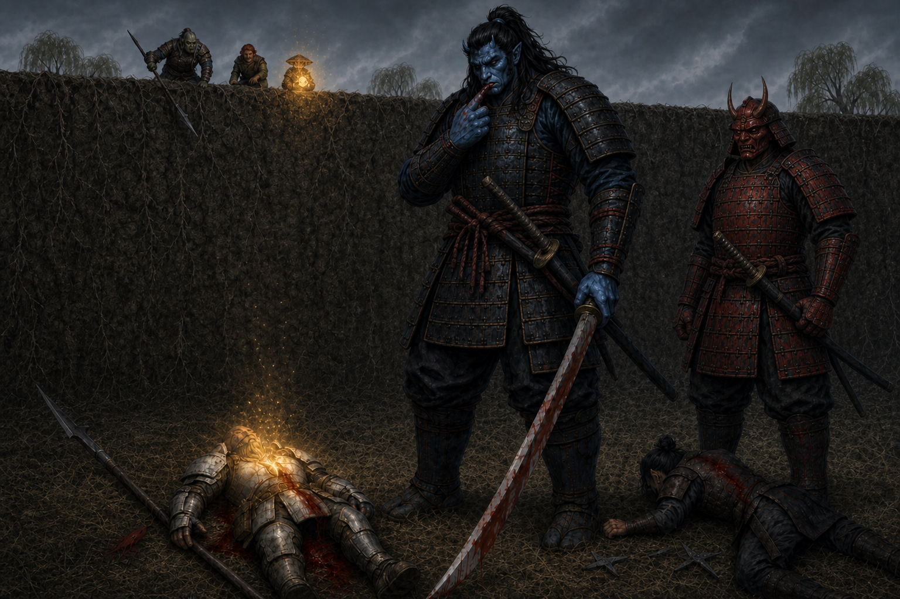

# Session Nine: Five Veins, Five Keys

**Date:** May 7, 2026

---

## Overview

Convicted at the close of Session 8, the party chose not to surrender. They ran. [Kurosawa](../wiki/npcs/magistrate-kurosawa.md) chased them across the grasslands west of [Willowshore](../wiki/locations/willowshore.md) — pinning Boone in earthen hands, raising a wall of stone and dirt across their escape, dropping Boone twice with the nodachi and gutting Littlefinger to the brink of death. The party would have died in the field if [Radiant Willow](../wiki/npcs/radiant-willow.md) hadn't run out of town unarmed and asked them all, by name and out loud, to stop. The magistrate did. The party surrendered, were marched to a fishy warehouse near the river, and were given the night to tend their wounds. They used it. Da Baishan's crowbar pried planks loose at the back of the warehouse; Littlefinger slipped out under cover of darkness and recovered **the hidden papers** — among them, a planning note in Kurosawa's own hand naming five ley-line "keys" needed to remake Willowshore as a chrysalis for the **Mother of a Thousand Wings**. Then a hatch opened in the warehouse floor, and a young man named [Kuji Yasho](../wiki/npcs/kuji-yasho.md) climbed up out of an old Yeshou smuggling tunnel. The session ended with the party fully resupplied (full plate for Boone, healer's kits, healing potions), Da Baishan finally understanding his **[Vujravati](../wiki/npcs/vujravati.md) gift** — a path to the legendary **[Order of the Palatine Eye](../wiki/factions/order-of-the-palatine-eye.md)** ~50 miles south — and the party crossing the river under a full moon, leaving Willowshore behind for the first time in the campaign.

---

## Key Events

### The Chase

The session opened mid-action — the party had just decided in the closing seconds of Session Eight to **run rather than be detained**. Kurosawa and his oni gave chase. The first round set the tone:

- **Boone** got an earthen-grasp around the legs and torso — *"Don't run off now, warrior"* — pinning him in place mid-stride
- **Da Baishan** sprinted for the edge of town with all three actions; one oni's sword swing missed, another tried to grapple him by the shoulder and slipped off
- **Donkey** ran (David absent — the GM moved Donkey along with the group)
- **Ginkgo** ran with all three actions
- **Littlefinger** asked if there was *any* COVID to hide behind. There was none. *"Then I'm running."* The oni's sword caught him across the back: **19 slashing + 6 bludgeoning**, the bludgeoning carried as a "hammer-globe" of force on the strike — magical edge work. Littlefinger pushed through (Fortitude 17, succeeded) and ran on at half speed
- **Boone** broke free of the earthen-grasp with a **30 on Athletics** — described as ripping his way out *"like a python had him."* Spent his second action moving

Kurosawa, having taken two actions to set the grasp, walked toward the group with his nodachi unsheathed.

### The Wall

When Kurosawa got close enough, he dropped the spell on Boone and called something heavier. A **5 ft thick, 10 ft high earthen wall** rose across the party's escape line — earth, stone, sand, magically amalgamated.

- **Da Baishan** got there first. With **Combat Climber** + **Terrain Expertise** he parkoured up in two actions (Athletics 23, then 17), reached the top, and *"flipped off Kurosawa from a distance."*
- **Donkey** climbed 5 ft and stalled; clung to the wall but did not fall
- **Ginkgo** asked if he could **burrow**; ruled no (no burrow speed); tried to climb — Athletics 22 first round, then 7 the next, slipping back to the base in mud and rock
- **Littlefinger** had reached the wall but was attacked by an oni — **18 to hit; 8 damage — Littlefinger went to negative 7 HP** and crumpled at the base of the wall, dying

**Kurosawa reached the wall.** He had a **reactive strike triggered as he approached** — Boone caught him on the way in for 13 damage with the polearm, drawing first blood. Kurosawa *grimaced with surprise*, snarled, and brought the nodachi down two-handed:

- **First strike:** **24-damage critical** on Boone
- **Second strike:** **18 damage** on Boone
- Boone went to **0 HP**, dying

Kurosawa, unhurried, ran his finger along the edge of the blade and tasted Boone's blood.

### The Wall Comes Down

Three things happened in close order on the top of the wall.

1. **Da Baishan** lowered the **guandao** down from the top of the wall like a fireman's pole. Donkey grabbed on and was hauled up (Athletics 10 → 21 with the assist). Ginkgo grabbed on next and made it to the top.
2. **Ginkgo, at the top,** invoked **Vujravati's gift for the first time in the campaign** — a once-per-day stabilize on a dying ally — to bring **Boone** back from death. Boone opened his eyes at one HP, lying on the grass beneath Kurosawa, who was still standing over him licking the blade.
3. **Boone** used the **Step action** (no reactive strike) to crawl elbows-first through the mud over to **Littlefinger**, and used **Battle Medicine (Assurance)** for **9 HP** — Littlefinger blinked back to consciousness ("Yeah, I appreciate that"). Then Boone used his second action on **himself**, healing further.

### Willow

[Radiant Willow](../wiki/npcs/radiant-willow.md) — the flower leshy beautician, the only person who had raised her hand at the trial — ran out of town toward the killing field, alone, hands open.

> *"No, stop the ugliness. No more bloodshed. Please, please. Our town has sacrificed enough. No more killing."*

Kurosawa turned, raised the nodachi, then **lowered it.** He took a less aggressive stance. Willow knelt by the wounded party and put a hand on Boone, who was still breathing in the dirt.

> *"No more. Just please, everybody stop. We need beauty here. We need peace."*

Kurosawa looked at the wall, at the one fallen oni, at the bloodied party. His hand glowed. The wall **lowered into the earth**. He sheathed his nodachi and addressed the party:

> *"I am nothing but honorable for my word. I said I would not attack. But the town saw with their own eyes and heard with their own ears, and the party here has decided to prove their guilt beyond any reasonable doubt by fleeing. If they turn themselves over now, I will uphold my word and detain them. You will talk nothing more."*

Da Baishan, fuming, tried one last argument — *"Your kangaroo court charges, Kurosawa, do not prove our guilt"* — and asked for a fair trial with the party's own evidence. Kurosawa rejected it cleanly, claimed his powers as a magi, and offered Boone the choice to *"see them personally."* Boone declined.

In the end, **out of respect for Willow**, the party dropped weapons. As Boone said: *"Willow, you showed bravery during our trial. Out of respect for you, I will talk peacefully."*

### The Weapon Search

The oni took the obvious gear — Judgement's Edge, the ji-sarm, the guandao, the rapier and shuriken, Ginkgo's holy symbol. The party ran small thievery checks for what they could keep:

| Player | Hidden | Roll |
|---|---|---|
| Boone | Vestri clan dagger | 19 — kept |
| Littlefinger | A brace of daggers (in the boot) | high — kept |
| Da Baishan | A **crowbar** | 16 — *"You wouldn't want me to have that in confinement, so I'm gonna keep it"* |
| Donkey | His **spell book** | rolled by GM — kept; the oni took his dagger and other arcane gear but missed the book |
| Ginkgo | **[Vujravati's](../wiki/npcs/vujravati.md) scale gift** | not recognized as a weapon, kept openly |

Marched back into town. [Yong](../wiki/npcs/yong.md) shook his head as they passed, disappointed. Townsfolk peeked out and went back inside. The party were locked into a **40 ft × 50 ft fishy warehouse** near the river — barred double doors, a single oni guard outside, no windows, rafters maybe 12 feet up to a 20-foot peak. A few crates. Some rats. Around 8:30 PM.

### The Long Treat-Wounds Clinic

The party spent **45 minutes** in a quiet, methodical heal-up.

- **Boone (Treat Wounds, Medicine clinic):** 11 to Littlefinger, 11 to Da Baishan, 10 to Ginkgo, 7+8 to himself; later +6 more on himself after the cooldown
- **Da Baishan** borrowed Donkey's healer's kit (he had medicine but no toolkit); helped his patients
- **Ginkgo** cast a 3-action **Heal** in radius — 1d8 = 3 to everyone; followed up with single-target heals as needed
- **Littlefinger** ran **Administer First Aid** on himself for top-up

The party ended the rest **back at full HP**.

### The Crowbar

Da Baishan's plan was simple: *"We go to the opposite side of the warehouse from the doors, I use the crowbar, and we pry old planks loose. Littlefinger slips out, gets the evidence, comes back."*

They waited until full dark. Around 11 PM by Vic's reckoning. Two-person pry: **Athletics 27** with crowbar +2 and assist +2. The salt-rotted planks gave easily. They opened a Littlefinger-sized gap.

### Littlefinger and the Hidden Papers

[Littlefinger](../wiki/pcs/littlefinger.md) slipped out through the back. **Stealth 23** (+1 Guidance from Ginkgo) past the guard at the front of the building. He worked his way to the **graveyard wall crevice on the north side** where he had wedged the stolen papers in [Session Five](2026-03-12.md) — Kurosawa had been searching for them ever since, but Littlefinger had hidden them well.

The papers were **still there**. He retrieved them, tucked them into an inner pocket, and made the second stealth roll easily. The guard out front was leaning on his halberd and looking up at the moon. Littlefinger was back inside the warehouse before anyone had moved.

### The Note of Five Keys

The recovered papers contained a planning note in Kurosawa's own handwriting, signed *— Kurosawa*. The party read it aloud:

> *"The confluence is upon us. Five veins. Five keys. Willow. Root. Stone. Water. Ash. Each must be forced into accord. Each must be corrected. Each must sing the same note."*
>
> *"The first device has awakened the star beneath Gosembiki. Four remain."*
>
> *"The old lovers' grove, now called the [Hollow of Seven Cedars](../wiki/locations/hollow-of-seven-cedars.md), must be opened at the root next. Memory can be cut, grafted, and made to grow in a new direction."*
>
> *"[Cloudbreaker Cairn](../wiki/locations/cloudbreaker-cairn.md) must be made to bow. Even stone yields when proper law is spoken with sufficient force."*
>
> *"The drowned markers of the [River's Lantern Spine](../wiki/locations/rivers-lantern-spine.md) must be turned with the current. Water carries every name."*
>
> *"The [Terrace of Whispering Clay](../wiki/locations/terrace-of-whispering-clay.md) must be sealed last. Clay receives the hand. Clay remembers the shape."*
>
> *"When all five lines flow as one, the Mother's resonance will pass through Willowshore. Not death. Not ruin. Transformation. The city will become chrysalis. Its history will soften. Its old loyalties will dissolve. Let the weak call it corruption. Let the sentimental call it loss. When the lines are harmonized, the Mother's reign begins. And if I must die beneath her wings, then I will at least die moving the world."*

Boone's read: *"I love that he signed it, though. I feel like if we show this to him, he will kill us. The easiest solution is to kill you."*

The party debated next steps. Take it to Willow? To the old ruling family? Memorize and nail it to the door like Martin Luther? Burn down the warehouse and fake their deaths and run?

The discussion stopped when Da Baishan rolled a **Perception 19** and heard a creaking sound at the corner of the warehouse floor.

### The Hatch

A box slid sideways. A small **floor hatch** opened up. A hand appeared, then a head — a young man the party had seen before but never had a name for. He greeted them with the small smile of someone who had done this before.

> *"Come, come. We have these smuggling tunnels all over the town. It's come in very handy in the past."*

He introduced himself as **[Kuji Yasho](../wiki/npcs/kuji-yasho.md)** — son of [Mido](../wiki/npcs/mido.md) of the Yeshou family. *"I see it runs in the family,"* Da Baishan said.

The tunnel was narrow at the top — Boone had to squeeze sideways into it — but opened up into a natural passage after about five feet. It ran westward beneath the town, past one section where it was **partially exposed to the chasm crevice** still venting sulfurous steam, and surfaced in a hidden cave outcropping on a rocky overhang **west of town**. They crawled out into long grass, willow weeds, and moonlight, with the rushing of the river not far off.

### Mido at the Cave

[Mido](../wiki/npcs/mido.md) was waiting in a rickshaw, blanket across her legs, with her **single surviving guard**, her son [Kuji](../wiki/npcs/kuji-yasho.md), and her daughter. She greeted them warmly and explained:

> *"We've been here in Willowshore for several generations, and these tunnels we haven't had to use in recent times — but in our early ascent to the ruling family, they were used by many a Yeshou back in the day. Every once in a while they come in very handy. We've had some around our estate as well as ways to get goods and means in and out of the warehouses in our past."*

Beside the cart, the party's **confiscated weapons** were laid out — the guandao, Judgement's Edge, the ji-sarm, the rapier and shuriken, Ginkgo's holy symbol. The Yeshous had retrieved everything.

### Mido Reads the Note

Vic asked if Mido could help them understand what they had found. She read the note carefully and told them everything she knew.

She had long known Kurosawa was *"a geomancer by studies, by arts, very interested in the Gosembiki ley line."* The five-vein plan was new to her, and she said it was *"even worse than I may have thought."*

She named the **[Hollow of Seven Cedars](../wiki/locations/hollow-of-seven-cedars.md)** — *"or Lovers' Grove, as it used to be called"* — about **10 miles west** of Willowshore. She told them about the **Dream Eater**, a spirit (gender unknown) that had once accepted unwanted dreams and griefs from townspeople and lovers — a child's toy left in one of the seven cedars, a soldier's badge from a war fought too long ago, the memory of a wandering eye, the daily edge of a parent's grief. She did not know what gender the spirit was; the tradition didn't care.

> *"I'm not exactly sure what Kurosawa wants with the roots there, but I am frightened... if the legends are true and the spirit does still exist... perhaps he is in the phrasing of his story trying to manipulate the dreams and worries of the townspeople of Willowshore. Will the surviving people forget their loved ones? Will they remember only the dark thoughts? I'm not exactly sure what he wants, but it seems very important to his next phase of this ritual — of this Mother of a Thousand Wings."*

She could not interpret all five sites. She could not advise on how to face Kurosawa's geomancy directly. But she told them the family had **decided not to wait for the exile escort** Kurosawa had threatened. They had moved out of Silver Mist Inn into hideouts around Willowshore. They would stay close.

> *"We do not want to stray far. Willowshore is still our home. We will look to find ways of usurping this Kurosawa before he can do more damage."*

### Da Baishan Reads His Mark

Da Baishan asked the party to wait a moment. He tried an **Occultism check on his Vujravati gift** — the only one of the five gifts that had been a vision rather than a tangible object — and rolled **21**.

The vision finally resolved.

It was a token marking him as connected (or owed) to the **[Order of the Palatine Eye](../wiki/factions/order-of-the-palatine-eye.md)** — an extinct legendary occult-investigator order, *"like the SSA or CIA of occult investigations."* Their lore had been thought lost to the world. The vision contained a **fixed location**, **40–50 miles south** of Willowshore, in the mountains. The path was *"ingrained in his brain,"* the way a Google Map zooms in on a known address. He understood, finally, what *"When the town closes its hand against you, seek the eye that opens"* meant.

He shared it with the group. *"There may be allies there. There may be something useful there for fighting Kurosawa if they know these lost dark arts."*

The party debated: **Hollow first** (closer, urgent, Kurosawa's next move) or **Order first** (further, but the only counter-knowledge they had any lead on)? They agreed: **south, to the Order**, before the Hollow. *"Plus, it gets us away from town and Kurosawa a little bit more,"* Da Baishan said. *"Gives us a little more time to prepare."*

### Resupply

[Kuji](../wiki/npcs/kuji-yasho.md) was sent to retrieve gear from the family's stashes. He came back with most of what was asked for:

- **Two healer's toolkits** (Da Baishan claimed one)
- A **full plate** sized for [Boone](../wiki/pcs/boone.md) — *"This is amazing. This increases my AC by 2 — where it's supposed to be"*
- A **sling** for [Littlefinger](../wiki/pcs/littlefinger.md) (no upgraded leather armor was on hand, and what they had wouldn't have been an upgrade anyway)
- **Five potions of healing** — one each
- Healing supplies generally for [Ginkgo](../wiki/pcs/ginkgo.md) — *"any interesting healing supplies, kits — anything I can use to heal quicker, better"*

They did not have a full plate sized for Da Baishan's frame, but offered to look. Mido said the family would stay close to Willowshore, **using their spy network and the smuggling tunnels** to keep eyes on Kurosawa for the party while they were gone.

### The River Crossing

Vic dropped from the call partway through the resupply (an AWS outage was eating his work day). Littlefinger climbed onto Da Baishan's back, gripped, and stayed there.

The party walked away from the cave under a **full moon** with stars enough to read by. They reached the river south of town and waded across — Boone had to **strip the new full plate off** to swim, and put it back on shaking on the far shore. The ground beyond was harder, rockier. Trees thinned out. Willowshore's silhouette dropped slowly behind them.

The session ended on the south bank. Everyone reached **Level 3.**

---

## Memorable Moments

- **"Don't run off now, warrior."** — Kurosawa, as the earth itself reached up and grabbed Boone by the legs and torso. The first time the party has seen him use his geomancy openly in combat
- **Da Baishan parkours a 10-foot earthen wall and flips Kurosawa off from the top** — Combat Climber + Terrain Expertise, two clean Athletics checks, a pure escapist victory in a session full of disasters
- **"He's a mushroom."** — The party trying every option to get Ginkgo over the wall. He is, in fact, a mushroom. He still cannot burrow without a burrow speed
- **Kurosawa licks the blood off his blade after dropping Boone** — and then runs his finger along the edge and tastes it. *"Of course he does."* — Boone
- **Vujravati's first gift cashed in** — Ginkgo's once-per-day stabilize, used at the top of the wall, on a dwarf bleeding out under a magistrate's nodachi. Dragon-magic and the dragon's chosen working as advertised
- **"I'm just trying to get him out of harm's way, then we can go on the offensive. Don't worry, I'm not gonna leave you, but I'm trying not to TPK this whole encounter."** — Da Baishan, hauling Ginkgo over the wall while Boone bleeds in the dirt
- **Willow walks into a battlefield and stops a magistrate with no words louder than *please*** — *"No more bloodshed. Our town has sacrificed enough."* Kurosawa lowered the sword. The wall lowered into the earth. The party survived because of a flower leshy with cucumber water and a soft voice
- **"Willow, you showed bravery during our trial. Out of respect for you, I will talk peacefully."** — Boone, choosing the surrender for the only reason that actually mattered
- **Da Baishan smuggles a crowbar into prison** — *"You wouldn't want me to have that in confinement, so I'm gonna keep it."* Came in handy three hours later
- **"It runs in the family"** — Da Baishan, as a young man named Kuji Yasho climbed up out of a hidden hatch in the warehouse floor with a smile. The Yeshous have apparently been running smuggling tunnels under Willowshore for *generations*
- **Reading the Note** — *"The confluence is upon us. Five veins. Five keys."* The single most important document the party has held all campaign, named most of the rest of the chapter ahead, and was sitting in a wall crevice the entire time the party was on trial for crimes Kurosawa described in the same handwriting
- **"I love that he signed it, though."** — Boone, quietly delighted at Kurosawa's ego. *"If we show this to him, he will kill us."*
- **"When the town closes its hand against you, seek the eye that opens"** — Da Baishan finally cracking his Vujravati gift. The phrasing landed completely differently after the trial verdict and a chase through earthen walls
- **"In Baldur's Gate you can splash healing potions on people"** / **"Just to drench them in healing"** — Ginkgo proposing to chuck potions like grenades. Kept on file for emergencies
- **The mayor's escort is in three days** — Mido, smiling small. The Yeshous have been ready to leave for weeks. They aren't going to. *"Willowshore is still our home."*
- **Kurosawa's last words to the town as the party were marched away** — *"The reckless intruders have been confined. We are safe for this evening. The town is now in a good place. He has shown mercy and is glad the town has shown mercy as well."* The same speech he was giving at the moment the Yeshous were lifting a hatch in the floor under the prisoners' feet

---

## Discoveries

### Lore Learned

- **The Note of Five Keys** — A document in [Kurosawa's](../wiki/npcs/magistrate-kurosawa.md) own hand naming his five ley-line targets and his end-state for [Willowshore](../wiki/locations/willowshore.md): not death, not ruin, **chrysalis**. The full text is preserved on the magistrate's wiki entry under *[The Note of Five Keys](../wiki/npcs/magistrate-kurosawa.md#the-note-of-five-keys)*
- **The four remaining keys** — [Hollow of Seven Cedars](../wiki/locations/hollow-of-seven-cedars.md) (Root), [Cloudbreaker Cairn](../wiki/locations/cloudbreaker-cairn.md) (Stone), [River's Lantern Spine](../wiki/locations/rivers-lantern-spine.md) (Water), [Terrace of Whispering Clay](../wiki/locations/terrace-of-whispering-clay.md) (Ash). Gosembiki was the Willow / "first device" — already done
- **The Hollow of Seven Cedars / Lovers' Grove** — An ancient site ~10 miles west, home to a *Dream Eater* spirit who once accepted unwanted memories and desires in exchange for relief. Kurosawa intends to **invert** the spirit's function and use it to graft new memories onto Willowshore's survivors after the ritual
- **The [Order of the Palatine Eye](../wiki/factions/order-of-the-palatine-eye.md)** — A legendary occult-investigator order, presumed wiped out, with a known location ~40–50 miles south of Willowshore in the mountains. Da Baishan's [Vujravati](../wiki/npcs/vujravati.md) mark is a token tied to the Order — and the only counter-knowledge lead the party has on Kurosawa's chthonic geomancy
- **Kurosawa is a *magi*** — He used the word himself when threatening *"all the power that I have as a magi"* to the party. Confirms his earlier *"I am the Council of the Magi"* claim was framing, not just rhetoric
- **The Yeshou family runs an extensive smuggling-tunnel network beneath Willowshore** — under several warehouses and the family estate; predates the current crisis by generations; was used in their original *"ascent to the ruling family"*
- **[Kuji Yasho](../wiki/npcs/kuji-yasho.md) is the family's tunnel and quartermaster operator** — Mido's son, named for the first time, though the party had seen him in the background of family scenes for sessions
- **Kurosawa's geomancy is offensive** — earthen-grasp (like a Hold Person, but earth and rock), 5×10 ft instant earthen wall, his nodachi strikes carry **bludgeoning force** alongside the slashing of the blade. He has options the party have not seen the floor of yet
- **Kurosawa hesitated for [Willow](../wiki/npcs/radiant-willow.md)** — The first time the party has seen him stand down on someone else's appeal. The reason is not yet known

### Items & Resources

| Item | Details |
|---|---|
| **The Note of Five Keys** | Recovered from the graveyard wall; in Kurosawa's hand and signed; carried by the party |
| **The other recovered papers** | The Chthonic journal, the Web scroll, and the map (all from Session 5) — all now back with the party |
| **Boone's full plate** | +2 AC; sized for him; gift of the Yeshou stash via Kuji |
| **Healer's toolkit ×2** | One for Da Baishan, one for shared use (Ginkgo) |
| **Sling** | For Littlefinger; he keeps the confiscated rapier and shuriken from before |
| **Healing potions ×5** | One per PC |
| **Crowbar** | Da Baishan, smuggled past the weapon search |
| **Vestri clan dagger** | Boone, smuggled past the weapon search |
| **Brace of daggers** | Littlefinger, smuggled past the weapon search |
| **Donkey's spell book** | Smuggled past the weapon search (specifically searched-for, missed) |
| **Ginkgo's [Vujravati](../wiki/npcs/vujravati.md) scale** | Not recognized as a weapon; openly kept |
| **Judgement's Edge / guandao / ji-sarm / Ginkgo's symbol / alabaster dial piece** | All retrieved from the Yeshou stash at the cave |
| **Confluence map (mental)** | Da Baishan's vision-location for the [Order of the Palatine Eye](../wiki/factions/order-of-the-palatine-eye.md) — 40–50 miles south, in the mountains |

---

## Open Threads

### Active Mysteries

- **Kurosawa does not yet know the party escaped.** As of session end he believes them held in a barred warehouse under guard. How long this lasts depends on his next visit to the building
- **The Dream Eater of the Hollow** — Is the spirit still there after centuries of disuse? Is it still bound to its ancient agreement, or is it a hostage? Will it answer to invocation?
- **Cloudbreaker Cairn, the River's Lantern Spine, the Terrace of Whispering Clay** — all named, none located. The party has hints but no maps. Mido didn't know
- **The Order of the Palatine Eye** — Living remnant? Ruined archive? Trap? Memorial? Why did Vujravati direct *Da Baishan*, specifically?
- **Kurosawa "as a magi"** — He used the term explicitly. The Council of the Magi entry is going to need expanding the next time the party hears it from anyone besides him
- **Willow's pacifism, again** — She walked into a magisterial sword and made it stop. How she did that, and what it cost her, and what Kurosawa thinks of her now, are open questions

### Commitments & Debts

- **Mido's pledge to keep watching Kurosawa** — The Yeshou spy/tunnel network is now actively running counter-intelligence on the party's behalf
- **The exile clock** — Kurosawa's deadline was three days from this session. The Yeshous have **opted out**. This is now an open standoff, not a countdown
- **Owed to [Radiant Willow](../wiki/npcs/radiant-willow.md)** — The party owes their lives to her courage, twice now (the trial, the chase). She is in town, unarmed, presumably under increased scrutiny from Kurosawa after this
- **The town watched the party get marched in** — [Yong](../wiki/npcs/yong.md) shook his head. Others looked away. The party will need to repair their reputation when they return — if they return

### Next Steps

1. **South to the [Order of the Palatine Eye](../wiki/factions/order-of-the-palatine-eye.md)** — ~40–50 miles in the mountains; Da Baishan's gift contains the path
2. **Then: the [Hollow of Seven Cedars](../wiki/locations/hollow-of-seven-cedars.md)** — to disrupt or seize the Root key before Kurosawa
3. **Find or place** [Cloudbreaker Cairn](../wiki/locations/cloudbreaker-cairn.md), [River's Lantern Spine](../wiki/locations/rivers-lantern-spine.md), and [Terrace of Whispering Clay](../wiki/locations/terrace-of-whispering-clay.md) on the map
4. **Decide the public strategy** — Does the party publish the note? Take it to a third oni authority? Use it as leverage on Kurosawa himself? It's a weapon if delivered well, and a death warrant if delivered badly
5. **Stay in touch with the Yeshous** — Mido offered the family's network. The party should arrange a contact protocol on the way back

---

## Timeline

| Time | Event |
|---|---|
| ~Morning | The chase opens — earthen-grasp on Boone, the party scattering west under nodachi attacks |
| Morning | Earthen wall raised; Boone goes to 0; Littlefinger goes to dying 3; Da Baishan clears the wall |
| Morning | Ginkgo invokes Vujravati's gift to stabilize Boone at the top of the wall |
| Morning | Boone crawls to Littlefinger and battle-medicines him back to consciousness |
| Morning | [Radiant Willow](../wiki/npcs/radiant-willow.md) arrives. Kurosawa lowers the sword and the wall. Surrender |
| Morning | Weapon search; smuggled items kept; party marched into the warehouse |
| ~8:30 PM | Locked into the warehouse; one oni guard outside; rest begins |
| 8:30 – 11 PM | 45-minute treat-wounds clinic; everyone back to full HP |
| ~11 PM | Da Baishan pries the back wall planks loose with the crowbar |
| Late night | Littlefinger sneaks to the graveyard, recovers the hidden papers, sneaks back |
| Late night | The Note of Five Keys is read aloud; party debates next steps |
| Late night | Floor hatch opens; [Kuji Yasho](../wiki/npcs/kuji-yasho.md) climbs up |
| Late night | Tunnel west under the town, past the chasm crevice, out at a hidden cave outcropping |
| Late night | Mido at the cave with rickshaw, guard, son, daughter; reads the note; explains the Hollow |
| Late night | Da Baishan rolls Occultism 21 on his Vujravati gift; the [Order of the Palatine Eye](../wiki/factions/order-of-the-palatine-eye.md) reveal |
| Late night | Resupply from the Yeshou stash — full plate, healer's kits, sling, five potions |
| Just before dawn | Party crosses the river south of Willowshore under a full moon |
| Pre-dawn | Trees thin; ground hardens; Willowshore drops below the horizon behind them |
| **Pre-dawn** | **Session ends. Party reaches Level 3.** |

---

## The Scene

### The Taste of It

The first cut opened Boone from collarbone to hip and the world went very quiet around him. He felt the hammer of force behind the blade more than he felt the blade itself — a sound the inside of his chest made when the metal passed through. The second cut came before he could fall. His knees gave somewhere underneath him and he was on the ground without remembering how he got there, looking up through grass at a sky he had not bothered to notice was grey. Somewhere a long way off a dwarf was screaming, and after a moment he understood the dwarf was him, and after another moment he understood it had stopped.

Kurosawa stood over him and did not speak. The magistrate raised the nodachi between his eyes and turned the blade slowly, examining its edge the way a craftsman inspects a tool he has just used well. Boone's blood ran down the steel in a thin bright line and pooled along the flat. Kurosawa watched it run. Then, unhurried, he laid the pad of one finger against the metal and drew it the length of the blade — gathering — and lifted the finger to his mouth, and tasted it, the way a man tastes wine to know whether it has turned. The oni's eyes never left Boone's. He did not smile. He did not frown. He registered the flavor with the small inward attention of someone making a private note, and then he lowered his hand, and the world tilted and went grey at the edges, and Boone understood that he was dying.

He felt the gold before he saw it. It came down through the grey like something warm settling against a wound that had stopped being his — a hand, almost, but lighter than a hand, a weight made out of attention rather than flesh. From very far away he heard Ginkgo's voice say nothing at all, and the gold was the saying of it. The bleeding inside him slowed, then stopped, then forgot it had ever been there. His chest filled. Air came in. His eyes opened on Kurosawa standing above him with a finger still wet at the corner of his mouth, and the magistrate looked down at the dwarf who had refused his sword, and for one long moment neither of them moved. Boone drew a slow ragged breath through his teeth, tasting his own blood and the iron morning, and said, to no one in particular: *"Of course he does."*
