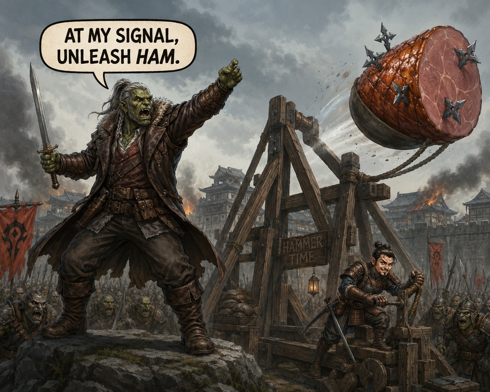

# Session Ten: Southern Charm

**Date:** May 14, 2026

*Chapter 10, as titled by the GM at the top of the recording — "Southern Charm, for fun, since we are going south."*

---

## Overview

The party set out south from Willowshore under cover of darkness, leaving Mido's safehouse for the mountain road to the [Order of the Palatine Eye](../wiki/factions/order-of-the-palatine-eye.md). They tracked something large and bipedal up the trail, watched it ambush an elk by the southern stone bridge, and chose not to fight it — instead launching a shuriken-stuffed cured ham over the trees with a hastily-built bamboo trebuchet. The ogre chased the ham. The party crossed the bridge.

On the switchbacks above the ravine they met a blind hermit who called himself "Cliché" — a halfling oracle who knew things he had no right to know, who framed their three quest lines as a single triage problem (*"which wound can you bear?"*), gave each of them a warm hand-stone from his fire, and vanished without footprints. Above his landing, on a sheer cliff with no door, [Da Baishan](../wiki/pcs/da-baishan.md) knocked twice and the cliff drew an eye in stone — and on the back of his hand. Inside, the [Hall of Divided Testimony](../wiki/locations/palatine-eye-vault.md) waited: four scrolls, four dials, a heatless lantern, and a 360-degree mural that *changed* when the scrolls were read aloud, showing where each lie was wounded.

Beyond the unlocked door, a stone witness rose at [Boone's](../wiki/pcs/boone.md) eye-marked approach, walked to the inscription, and opened a small alcove. On the lectern: the [Book of Divided Testimony](../wiki/locations/palatine-eye-vault.md#the-book-of-divided-testimony), blank to everyone but its keeper. Boone took the book, took the **Palatine Detective** dedication, and read aloud the first two of eight reveals — naming Mido's omission and Kurosawa's structural error in the same breath. The cliff sealed behind them. The party reached Level 3 and turned west.

---

## Key Events

### Heading South

The session opened with the party several hours out of Willowshore, the river sound long behind them, the air starting to cool with elevation. [Da Baishan](../wiki/pcs/da-baishan.md) used Survival to check for a tail — none — while [Ginkgo](../wiki/pcs/ginkgo.md) spent ten minutes surveying wildlife: nests, scat, broken vegetation. The wounded-land sickness from the [Dark Woods](../wiki/locations/dark-woods.md) is **not** present south of the river. The forest here is healthy.

But the same Survey turned up something else — large bipedal tracks, fresh, 8 to 12 foot strides, heading south along the same path the party was. The party debated forced-march vs. camp; [Littlefinger's twilight halfling night-vision](../wiki/pcs/littlefinger.md) tipped the balance to *keep moving*. Several hours later, around 2 to 3 AM, [Littlefinger](../wiki/pcs/littlefinger.md) picked up the trail again on Survival 15. The tracks were **fresher**. Whatever it was, the party was catching up.

They rested an hour. Ginkgo took watch from a tree branch. Littlefinger walked an hour ahead under the dim mountain moon and came over a ridge to find a stone footbridge across a dry chasm — and the source of the tracks.

### The Glutton at the Bridge

A massive bipedal form, ~9 feet tall, blended into the rocks at the south end of the bridge with disconcerting skill *for a thing that size*. Littlefinger watched two deer step onto the bridge from the south — and watched the creature explode out of cover, run one of them down in three strides, slam it to the ground, and start eating it bones-and-all. Knees crunching. Branches snapping. Then it returned to its hiding spot and was, again, almost invisible.

He held position until the party arrived. [Ginkgo](../wiki/pcs/ginkgo.md) and [Donkey](../wiki/pcs/donkey.md) recognized it from his description and the terrain: a **glutton ogre**. Not necessarily evil — *"by their nature they need to eat a lot"* — but big, fast in short bursts (*"the gluttons-rush"*), and absolutely capable of swallowing a halfling whole.

The party was on the path the [Order](../wiki/factions/order-of-the-palatine-eye.md) was south of, so going around wasn't really an option. They cycled through plans:

- **Boone:** Trap a deer, poison it, sacrifice it. ([Ginkgo:](../wiki/pcs/ginkgo.md) "I'm not a fan of that plan, for the year.")
- **Littlefinger:** Use Littlefinger as bait. (*"Don't orcs and ogres hate each other?"* / *"He's got me a little outclassed."*)
- **Boone:** *"I do have my alchemist toolkit. Maybe we can poison something."*
- **Ginkgo:** *"I just happened to pick up this cured ham."*
- **Boone:** *"What if we take a young tree and we bend it over and stake it down, tie a rope to the top and the ham, get his attention, and we pull the stake out as soon as he grabs the ham — and it flings it away and he chases it?"*
- **Donkey:** *"On the other hand, I am not one to pass up a chance to craft something to launch a ham. I think that's a rare opportunity, and we should take it."*

### The Ham Trebuchet

Ginkgo found a small grove of bamboo on Nature 1 (lucky terrain — the GM ruled in favor). [Da Baishan](../wiki/pcs/da-baishan.md) hauled the largest spar down, hand over hand, until it was bent into an arch. Boone built a stake-and-latch trigger so the line could be pulled and the spar would whip back. Littlefinger insisted on stuffing his old shuriken collection — which he had no use for anymore now that he had a sling from [Mido's](../wiki/npcs/mido.md) cache — *into the ham*. *"He'll swallow that whole. They will be in his stomach, and if we have to fight him, those will help us."*

Boone's Crafting roll: **27.** Treat-as-trebuchet.

Donkey distracted himself with the puzzle long enough to lose track of the ogre, which broke cover and **moved into the team's clearing** while they were finishing. Da Baishan caught the relocation on **Perception 22 / Seek**, called the angle (*"11 o'clock, headed our way"*), and the party staged: Littlefinger hidden by the rope (Stealth 15), the rest scattered northwest behind cover.

The ogre rushed in — fast, much faster than its idle 30 feet — and grabbed the ham. Littlefinger pulled the latch on **Initiative 18.** The ham flew at treetop level, hit a tree, tumbled, and *kept flying*. The ogre charged after it. The party heard the ham land, the ogre crash through brush after it, the ham swallowed in a satisfying gulp — and then a *yelp* as the shurikens did their work going down. The ogre never came back over the bridge.

The party crossed Glutton's Bridge in daylight without resistance.

### Cliché on the Switchback

The trail beyond the bridge climbed into colder air and switchbacked up the south face of a ridge. About midday they came around a landing barely 5 by 8 feet, cliffside on one edge — and found a small fire-ring with a hermit beside it.

He was halfling-sized, in tattered Tibet-style fur wraps, with cloth wound entirely over his eyes — blind by every visible measure. He had a walking stick. He was poking dark, perfectly-spherical stones in his coal fire. He smiled in their direction without looking up:

> *"Late, you are early. Always rushing, truth seekers. Never asking if the truth wishes to be found, though. Come, come — sit."*

He greeted them by what he saw in them — *"truth hound"* for [Boone](../wiki/pcs/boone.md), *"the one who makes sparks"* for [Donkey](../wiki/pcs/donkey.md). Asked for his own name, he answered:

> *"What could be more cliché than a blind man giving wise advice in the mountains?"*

So the party called him **[Cliché](../wiki/npcs/cliche.md)**.

He was carrying knowledge a halfling shouldn't have — Society 26 from Donkey produced **no recognition at all**, and Cliché still managed to know about [Cheng Yesho](../wiki/npcs/the-smiling-one.md) (the *"smiling one"*), about [Vujravati](../wiki/npcs/vujravati.md) (the *"celestial one — through cycles of time, has seen the rise and fall of civilizations and the gods themselves"*), and about [Magistrate Kurosawa](../wiki/npcs/magistrate-kurosawa.md), all without ever naming any of them aloud. He never said *Order* or *Palatine* either, only *"the eye."*

Asked what road to take, he gave the campaign's three quest lines back as a single triage problem:

> *"Go south, find the eye. Go west, cut the root. Go back, save the town. All roads are dire. The question is not which road is safe — there is no safe road. The question is which wound can you bear?"*

Asked about the Order itself:

> *"Truth is not a lantern. Truth is a knife. It cuts rope, yes — and also the hand of those who uncovered too much."*

> *"A thing buried is not always buried by cowards. Sometimes buried by the wise."*

> *"Seek the cliff that has no door. Knock with the hand that doubts. And when truth speaks kindly, distrust it most."*

He reached down into the coals, pulled out a warm stone, tossed it to Da Baishan with the words *"Knowledge found. Keep nose to ground, mind to thread. That's good — but careful. Some tracks follow you back."* Then he handed enough warm stones around for everyone who wanted one. Then the party looked back, and **he was gone.** Stones still warm in the fire pit. No footprints. No sound of departure.

### The Cliff With No Door

Above Cliché's landing the path switchbacked another fifteen miles into thinner air, and Da Baishan's [Vujravati](../wiki/npcs/vujravati.md) location-mark started pulling on him like a magnet. The trail ended at a sheer cliff — no carving, no door, no gate. *Pure stone.* Only Da Baishan could feel it; the rest of the party saw rock.

The party recalled Cliché's riddle: *knock with the hand that doubts.*

[Donkey](../wiki/pcs/donkey.md) reasoned his way through: *"I doubt that just my hand will work — but because I doubt it will work, it is now the hand that doubts."* He knocked. Solid rock.

Then [Da Baishan](../wiki/pcs/da-baishan.md), of his own accord, raised his hand and knocked. **The sound was different.** Deeper. Almost metallic. He knocked again. **A closed eye drew itself in the cliff face along his second strike** — and the same eye, in henna-style ink, **drew itself simultaneously on the back of his hand**. When the figure completed, the eye opened. The cliff opened along it.

A 30-step staircase descended into a circular chamber 20 feet below. The air inside was stale — *eons* stale. Da Baishan's tattooed eye stayed open as long as the cliff door stayed open.

A second click in his head: **[Cassian Voss](../wiki/npcs/cassian-voss.md) had this same mark, in this same place, on the back of his hand.** Voss was Order, or Order-marked, and Mido and Cheng *had not said so.*

### The Hall of Divided Testimony

The first chamber inside the cliff was a 20-foot circular hall with a continuous **panoramic ink mural** running 360 degrees around it. On the far side: a sealed stone door with **four bronze dials** (Moon, Willow, Bridge, Flame), a **jade dragon-coil ring** in the center to lock the answer, and the inscription:

> *"Lies do not bury truth. They show where truth was wounded."*

In the ceiling: a **black metal lantern**, blue flame, **giving no heat at all**. On the floor: **four small parchment scrolls**, like fortune-cookie strips, named *Pale Witness*, *Weeping Root*, *Loyal Crossing*, and *Devout Flame*.

[Da Baishan](../wiki/pcs/da-baishan.md) caught the lantern's "tell" almost immediately on a *That's Odd* check: **the cast shadows were out of sync with the flame.** The lantern was the key.

[Boone](../wiki/pcs/boone.md) added a free-action **Expeditious Inspection / Occultism 26**: the scrolls weren't just lying on the floor — they were **lying**. The room was stating its rules. The party experimented at length:

- Burn the scrolls in the lantern (Ginkgo) — they wouldn't light
- Hold the scrolls under the lantern (Ginkgo) — shadows shifted, but no reveal
- Overlay the scrolls (Ginkgo) — no hidden message
- Swing the lantern through the room (Da Baishan / Boone) — shadows jittered with no pattern
- Light a torch and check the murals separately (Donkey) — flame was normal; murals were ink
- [Littlefinger's](../wiki/pcs/littlefinger.md) **Trap Finder** (Perception 17 with +1) — *no mechanical traps*; the puzzle was arcane all the way down

Donkey took an **Arcana 18** on the lantern itself and the GM volunteered the next clue: *spells have material, somatic, and verbal components. The party hasn't tried verbal.*

[Ginkgo](../wiki/pcs/ginkgo.md) put it together: *"voicing the words, blow on the lantern somehow."* The party read the **Pale Witness** scroll aloud at the lantern. The shadows lengthened across the floor, reached the mural, and the mural **changed** — the moon shifted from the *first arrival* tower to the **opposite tower**, the one nearest the sealed door.

The rest of the puzzle fell in sequence:

| Scroll | Mural answers | Dial set to |
|---|---|---|
| Pale Witness (Moon) | Moon to opposite tower | **Right tower** |
| Weeping Root (Willow) | Black leaves climb past grave to shrine | **Shrine roof** |
| Loyal Crossing (Bridge) | Left and right arches walk away as soldiers | **One arch** |
| Devout Flame (Flame) | Monk stands, raises **left** hand, eye appears on his palm | **Monk's left hand** |

Boone called the lock: *"I think we should lock them in. What do y'all think?"* Ginkgo: *"Yeah, do it."* Littlefinger: *"I didn't come all this way to not turn that stone."*

The dragon-coil turned. The stone door ground 10 feet back into the wall. A 30-foot ink-dark hallway poured itself into existence between the two chambers and the inner sanctum opened.

### The Stone Witness

The inner room was another 20-foot circular chamber. In the center: a kneeling stone figure, no mouth, a single closed eye in its forehead, ~12 feet tall standing. Behind it, an inscription:

> *"The eye does not open for strength. It opens for the hand that accepts being seen."*

Boone walked in with the eye on the back of his hand raised, palm forward. The statue rose, opened its single eye, **mirrored the gesture**, and walked stiffly to the wall — placing its palm under the inscription. A small alcove opened beneath. Inside: a lectern. On the lectern: a single book.

The statue did not move again. It is still standing inside the sealed cliff in the open posture, watching the door.

### The Book of Divided Testimony

A leather-bound mage-style tome with a strap-and-clasp lock and **no keyhole**. The cover read **The Book of Divided Testimony**.

When Boone got close, the eye-tattoo on the back of his hand grew warm. The clasp released to him directly. He opened it.

To the rest of the party, every page was **blank.** To Boone, the first page read:

> *"Truth does not rescue. Truth is responsibility."*

The book was offered as a class-style **dedication** into the [Order of the Palatine Eye](../wiki/factions/order-of-the-palatine-eye.md) — Boone could now take the **Palatine Detective** archetype. Beyond the dedication pages, the book contained *fragments of testimony from past members*. The bearer earns them over time. On first reading, **two of eight possible reveals** would surface.

Boone rolled twice on a 1d8: **5 and 8.**

#### Truth I — Mido's Half-Truth

> *Beware the elder who lies by subtraction.*
>
> *She does not hide the road because she serves the dark.*
>
> *She hides the road because she knows what followed the last traveler home.*
>
> *A tyrant believes law can replace loyalty.*
>
> *A geomancer believes lines can replace roots.*

Boone read it aloud and the table caught it the same instant: *"the first name, Mido. Is that the old lady in the inn?"* Yes. The Order is *not* accusing her of treachery. It is naming her *omission* — and naming the **last traveler** who paid for it. The party do not yet know who.

#### Truth II — Kurosawa's Error

> *A tyrant believes law can replace loyalty.*
>
> *A geomancer believes lines can replace roots.*
>
> *Both are wrong until the roots are made to forget themselves.*

Boone read this one with quieter recognition. It is the campaign's **first explicit theoretical objection** to Kurosawa's plan. The Confluence rite *as designed* requires the [Hollow of Seven Cedars](../wiki/locations/hollow-of-seven-cedars.md) to **invert** before the other four keys can be made to harmonize. Stop the Hollow and the Confluence is broken regardless of what happens at Cloudbreaker, the Lantern Spine, or the Whispering Clay. The Order has handed the party Kurosawa's **single point of failure** — and the party already knows where it is.

Boone took the book, took the dedication, and dropped his eye-tattoo on the way out — *"I'll drop the tattoo. Let Donkey be the ink master here."* [Da Baishan](../wiki/pcs/da-baishan.md) kept his.

The cliff sealed seamlessly behind them. They stood on the south-facing trail in the late afternoon, with a book that only one of them could read and a road that pointed west.

**Everyone reached Level 3.**

---

## Memorable Moments

- **"I just happened to pick up this cured ham."** — Ginkgo, deep in his pack, three minutes into a poison-deer-or-snare-trap brainstorm. The line that pivoted the entire encounter
- **"I am not one to pass up a chance to craft something to launch a ham. I think that's a rare opportunity, and we should take it."** — Donkey, voting yes on the bamboo trebuchet plan over Boone's tree-spring sling
- **The shuriken-stuffed ham** — Littlefinger's contribution. *"He'll swallow that whole. They will be in his stomach, and if we have to fight him, those will help us."* Crafting 27. Treetop trajectory. Satisfying yelp on swallow
- **"That's up there on my favorite things I've done in D&D"** — Boone, after the launch, agreed by Gary: *"That's a good one. I think I've ever done that in years of playing"*
- **Cliché's introduction:** *"Late, you are early. Always rushing, truth seekers."* — the only NPC this campaign who has known the party's quest lines back to them before they sat down
- **"What could be more cliché than a blind man giving wise advice in the mountains?"** — the hermit's chosen self-name, given with a small smile, when Ginkgo tried to ask his real one
- **Cliché vanishes** — stones still warm in the fire pit; no footprints; nothing to follow. Donkey's Society 26 produced no recognition at all
- **"Knock with the hand that doubts"** — Donkey logic-puzzled it (*"my hand doubts that knocking on rock will work, therefore my hand is the doubting hand"*); Da Baishan's hand was the one the door wanted
- **The eye drawing itself in the cliff and on Da Baishan's hand simultaneously** — the moment the Order moved from rumor to fact
- **"Cassian Voss had this on the back of his hand"** — Da Baishan's recall mid-knock. Shifted the campaign's understanding of Voss in a single sentence
- **"He's a mushroom"** — second session running. Still relevant. Still without burrow speed
- **Reading the scrolls aloud** — *"Reading it out loud ended up being the big kind of reveal move there at the end."* The party tried burning, overlapping, holding under, swinging the lantern, and brute-forcing 4^4 combinations before they read out loud
- **The mural reshaping itself in real time** — the willow growing along the shrine roof, the soldiers stepping out of the bridge arches, the monk standing and raising his left hand. The Order's cleanest single piece of theater
- **Boone's blank book** — the rest of the party watched him page through it for thirty seconds before he read aloud the first line. *"Truth does not rescue. Truth is responsibility."*
- **The Two Truths in one breath** — Mido's omission and Kurosawa's structural error revealed in the same reading. The party left the cliff with a working theory of *both* the friend who has been holding back and the enemy whose plan has a seam
- **"I love that we found like 20 ways not to solve the puzzle"** — Boone, at session's end. A clean self-summary of the night

---

## Discoveries

### Lore Learned

- **The Order of the Palatine Eye is not all dead.** Their seal still answers, their architecture still performs, their stone witnesses still stand and witness. Whatever was wiped out, *the [vault](../wiki/locations/palatine-eye-vault.md) was preserved*
- **[Cassian Voss](../wiki/npcs/cassian-voss.md) was Order, or Order-marked.** He carried the cliff-mark eye on the back of his hand. Mido and Cheng knew Voss; they did not say
- **The Order's catechism:** *"Truth does not rescue. Truth is responsibility."*
- **The Order's epistemology, as preached by Cliché:** *"Truth is not a lantern. Truth is a knife."* Truth is a tool with an edge — it can cut your binding, and it can cut your hand
- **The Confluence has a single point of failure.** Per the Order's own testimony — *"both are wrong until the roots are made to forget themselves"* — Kurosawa's five-key rite cannot succeed unless the **Root** key inverts. The [Hollow of Seven Cedars](../wiki/locations/hollow-of-seven-cedars.md) is the joint that holds the rest of the rite together. **Break it and Cloudbreaker, the Lantern Spine, and the Whispering Clay become inert**
- **[Mido](../wiki/npcs/mido.md) is not a collaborator.** She is an elder who *lies by subtraction* — and the Order's reading is that she does it because *the last traveler who was told what she will not say did not survive being told*. Identity of that traveler is the next direct question to ask her
- **[Cliché](../wiki/npcs/cliche.md) is not what he appears.** He knows Cheng Yesho's epithet, Vujravati by epithet, and the Order without naming any of them. Society 26 produced no recognition. No tracks at exit. No identity claimed beyond a self-acknowledged placeholder name
- **Glutton ogres exist on the southern road.** Eight intelligence. Ambush hunters. Will swallow a ham whole

### Items and Resources

| Item | Holder | Detail |
|---|---|---|
| **The Book of Divided Testimony** | [Boone](../wiki/pcs/boone.md) | Locks to the eye-tattoo, blank to anyone else. 6 of 8 reveals remaining |
| **Eye-tattoo (open)** | Boone | Now bound to the book; will likely re-open the cliff |
| **Eye-tattoo (cliff knock)** | Da Baishan, *dropped on exit* | Released to keep the bearer-mark with Boone |
| **Frost Walker tattoo** | Boone (existing) | Negates severe environmental cold; reduces extreme cold to severe |
| **Triangular Teeth tattoo** | Boone (existing) | Survival in water; situational AC and damage bonus on activation |
| **Bewitching Bloom + Navigator Star + Frost Walker** | Donkey (existing) | Inked since before the session |
| **Warm hand-stone (Cliché)** | Each PC who took one | Holds heat for hours; small, dark, perfectly round; no visible runes |
| **Cured ham (consumed)** | n/a | Glutton-ogre vector; loaded with three shuriken; deployed by Crafting 27 |
| **Sling** | [Littlefinger](../wiki/pcs/littlefinger.md) (Mido cache, last session) | Now in use; old shuriken stash spent into the ham |

### The Palatine Detective Dedication

[Boone](../wiki/pcs/boone.md) elected the **Palatine Detective** archetype as offered by the book; details to be uploaded by the GM after session. The dedication is open to retrofit on his last class feat or to be taken next time he gains one. Six possible additional truths remain accessible to him as he progresses with the book.

---

## Open Threads

### Active Mysteries

- **What followed the last traveler home?** Mido's omission is the seam the Book named. The party do not yet know who the last traveler was, what they were told, or what came back with them
- **Was Cassian Voss Order?** The cliff mark says yes. Mido and Cheng's silence on it is its own data point; the [Voss](../wiki/npcs/cassian-voss.md) wiki entry needs a cross-reference for the next time the party can press the Yeshous
- **What is Cliché?** Halfling oracle? Order outpost? Something pretending to be either? *"Some tracks follow you back."* What did the party draw with them when they left his fire?
- **The Order itself.** The vault was preserved. The Stone Witness still rises. The book still answers. *Where is the rest of it?* Are there other vaults? Are there other surviving members? Did Voss know any of them by name?
- **The Six Remaining Truths.** Six entries in the Book have not yet revealed themselves to Boone. The first two were named at random; the rest will surface as he earns them
- **The Hand Warmer Stones.** They are warm. Are they only warm? Cliché had them in the fire as if they were waiting for *someone*

### Commitments and Debts

- **The Order, implicitly.** The vault opened, the witness witnessed, the book answered. Boone is now an inducted member; the rest of the party are by association part of the only known living thread of the Order's work. *"Truth does not rescue. Truth is responsibility."*
- **A direct conversation with Mido**, the next time the party can have one. The question is no longer *will you tell us*, it is **what did the last person die for, and who was it**
- **The Yeshou family's silence on Voss.** Cheng knew Voss. Mido knew Voss. Neither said his hand was Order-marked. That is not nothing
- **Owed to Cliché**, perhaps. The hermit gave warm stones, gave riddles, named the campaign's three roads. The party did not give him much in return. He may not need anything. He may eventually call

### Next Steps

1. **West to the [Hollow of Seven Cedars](../wiki/locations/hollow-of-seven-cedars.md).** Per Cliché (*"go west, cut the root"*) and per the book (*"both are wrong until the roots are made to forget themselves"*) — the **Root key** is the conditional joint of the entire Confluence. This is now the highest-leverage move the party has
2. **Then back to [Willowshore](../wiki/locations/willowshore.md)** with both the Note of Five Keys *and* the Order's two truths in hand — for [Mido](../wiki/npcs/mido.md), [Radiant Willow](../wiki/npcs/radiant-willow.md), and the next unfolding of [Kurosawa's](../wiki/npcs/magistrate-kurosawa.md) plan
3. **Confirm the cliff still answers.** Boone's hand is bound to the book; Da Baishan dropped his mark. Whether the door will open again for either of them — or anyone — is now an open question
4. **Continue working through the book.** Six truths to go; the GM will have a small table for new reveals as Boone's involvement with the Order grows
5. **The ogre is presumably still alive.** It chased the ham off the south side of the bridge. *"I hope the ogre is not there when we go back, just saying"* — Boone

---

## Timeline

| Time | Event |
|---|---|
| Pre-dawn | Day-start; party 10–15 miles south of [Willowshore](../wiki/locations/willowshore.md), under cloud-broken moonlight |
| Pre-dawn | Da Baishan/Survival: no tail. Ginkgo/Survey wildlife: bipedal tracks; healthy southern forest |
| Late night | Forced march continues; Littlefinger night-vision rolls Survival; tracks fresher |
| ~3 AM | Camp-rest hour; Ginkgo on watch; Littlefinger walks an hour ahead solo |
| Dawn | Littlefinger crests the ridge above Glutton's Bridge; watches the ogre kill an elk by hand |
| Morning | Party reaches Littlefinger; recall-knowledge confirms glutton ogre; planning loop |
| Morning | Bamboo trebuchet built; ham loaded with shurikens; ogre repositions; Da Baishan spots |
| Morning | Trigger pull; ham flies; ogre chases; party crosses the bridge |
| Late morning | Switchbacks south; air cools |
| Midday | Cliché's landing; warm stones; the three-roads riddle; the cliff riddle |
| Midday | Cliché vanishes |
| Afternoon | Party climbs further; Da Baishan's mark pulls toward a sheer cliff |
| Afternoon | Donkey knocks, no answer. Da Baishan knocks, the eye draws itself in stone and on his hand |
| Afternoon | Descend the staircase; the [Hall of Divided Testimony](../wiki/locations/palatine-eye-vault.md#the-hall-of-divided-testimony) |
| Afternoon | The four-dial puzzle — burning, overlaying, holding scrolls, brute-force, GM hint, *read aloud* |
| Afternoon | All four scrolls read; mural reshapes; dials lock; door grinds open |
| Afternoon | The Stone Witness rises at Boone's eye-marked approach; the lectern alcove opens |
| Afternoon | Boone takes the [Book of Divided Testimony](../wiki/locations/palatine-eye-vault.md#the-book-of-divided-testimony) |
| Afternoon | First page: *"Truth does not rescue. Truth is responsibility."* |
| Afternoon | Two of eight reveals: **Mido's Half-Truth** and **Kurosawa's Error** |
| Afternoon | Boone takes the Palatine Detective dedication; Da Baishan drops his eye-tattoo |
| Afternoon | Cliff seals behind the party; trail points west |
| **Evening** | **Session ends. Everyone reaches Level 3.** |

---

## The Scene

### The Ham Trebuchet

The grove was very quiet. Boone had the bamboo bent into an arch under his shoulders; the spar groaned the way a ship's rope groans when it's been hauled one inch past honest. Donkey was tying the ham — *good, good, good*, half a word per knot — and Littlefinger, who had insisted, was sliding three shuriken into the meat one by one. *He'll swallow that whole. They will be in his stomach.* Somewhere across the clearing, the size of a milled tree, a thing was hunkered into a shadow that was *almost* the right shape, not breathing.

The latch took. The rope took. Boone let the spar go the way you set a thing down when you mean to come back to it, and the bamboo held. Then Da Baishan's hand came up at eleven o'clock — *headed our way* — and the ogre was already in the clearing. It did not crash; that was the worst part. Three strides and it was on them. Four and it had the ham. Littlefinger pulled the latch.

The bamboo *answered*. The ham went up — treetop, past treetop — bounced off a pine, and the ogre — eight intelligence, nine feet of hunger — went after it at the burst gait, the gluttons-rush, footfalls passing under Boone's chest. A snap of brush. The meat sound of a ham swallowed whole. And then a *yelp* — not the swallow, the yelp of three shuriken finding three different walls of an esophagus on the way down. The crash got further. Then nothing. Littlefinger stood up out of the brush with twigs in his hair. The bamboo, freed, rocked back and forth as if it were trying to remember it had ever been bent. They walked across Glutton's Bridge in the morning sun while a faint, painful, halfling-sized yelp went on getting fainter behind them, growing — they all agreed later — into something almost like song.
