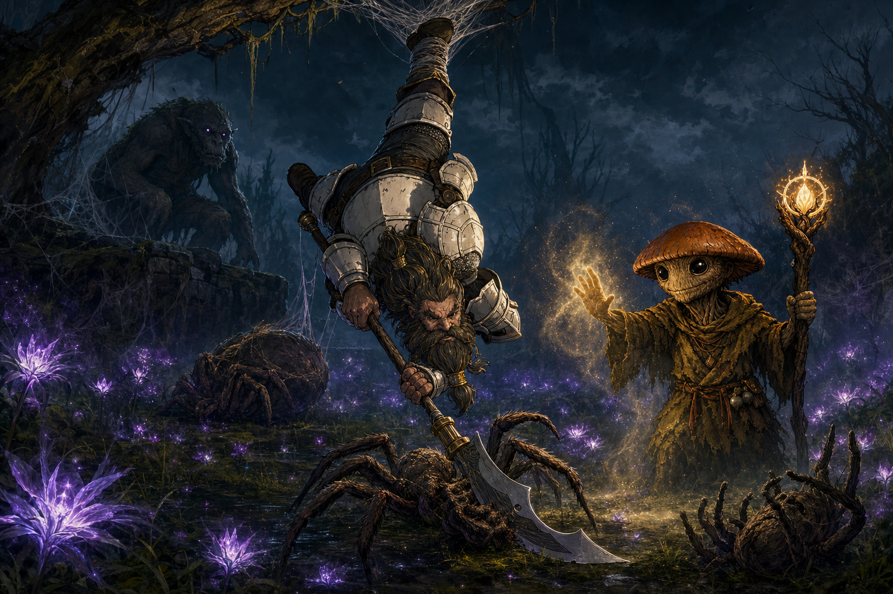

# Session Eleven: The Root That Forgets

**Date:** June 4, 2026

*Chapter 11. The GM's working title at the top of the recording — "the root that forgets" — held up: a grove built to take away your worst memories, made to take away your best, with one severed, blackened root at the bottom of it all.*

---

## Overview

The party turned west from the sealed Palatine cliff toward the old Lovers' Grove, fought their way through a hunter-spider ambush and the web lurker that ran it, and reached the [Hollow of Seven Cedars](../wiki/locations/hollow-of-seven-cedars.md) expecting to *stop* [Kurosawa's](../wiki/npcs/magistrate-kurosawa.md) Root rite. They were months too late. The grove was already corrupted — copper nails bleeding black sap into a light-swallowing pool, the white ring-stones blackened, a dead Order investigator's name scratched off a cedar.

When [Da Baishan](../wiki/pcs/da-baishan.md) touched the water, the pool showed them the truth: Kurosawa had already grafted a corrupting root into the cedars' shared roots, chanting *"Memory is not sacred. It is only precedent. And precedent can be overturned,"* turning the grove's old gift inside-out to poison Willowshore's memory of itself. The only cure, the pool and the mycelium both said, is to **kill the grove.** [Ginkgo](../wiki/pcs/ginkgo.md) jumped into the pool to try anyway; [Boone](../wiki/pcs/boone.md) tore the master graft out of the drained basin — and a horned **[Warden of the Grove](../wiki/npcs/warden-of-the-grove.md)** erupted from the treeline, howling. The session ended on its arrival.

---

## Key Events

### The Road West and the Widow's Lanterns

With the Palatine cliff sealed behind them and [Cliché's](../wiki/npcs/cliche.md) three roads in their heads, the party chose **west** — toward the Lovers' Grove — over a return to [Willowshore](../wiki/locations/willowshore.md), which felt unsafe. The trail wound down out of the unnaturally cold mountains into foggy, marshy lowland plains. As dusk fell, the path lit up with **widow's lanterns** — purple, night-blooming, faintly bioluminescent flowers, common in the area, valued mostly for a dye that keeps its glow. [Ginkgo](../wiki/pcs/ginkgo.md) gathered a handful to make dye, and floated coating [Littlefinger's](../wiki/pcs/littlefinger.md) sling stones with it to leave **glowing traces** on quarry.

### The Hunter Spiders and the Web Lurker

Bending to pick flowers, Ginkgo found his feet stuck in a concealed mound of webbing — a pit-trap — and eyes opened in the dark nearby. His recall-knowledge named the threat: **hunter spiders**, large and poisonous, are bad enough, but they usually run with a **web lurker** — a bipedal, troll-like, *intelligent* creature that talks to spiders and builds the traps. He whispered the warning to the party.

The fight sprawled across the lantern-field:

- Boone speared the first spider and **yanked Ginkgo free** of the web-pit
- Advancing on movement he'd spotted in a tree, Boone was **snared upside-down** by a hidden web-snare; two spiders dropped on him; he kept swinging while inverted and killed one
- [Da Baishan](../wiki/pcs/da-baishan.md) debuted his new **Divine Lance** — a beam fired from the eye on the back of his hand (*"very Iron Man-ish"*) — and missed, repeatedly, but looked spectacular doing it
- The **web lurker** appeared on a southern ledge and spat a webbing-glob that immobilized Littlefinger; spiders leapt onto him and Boone. Littlefinger **failed his save against the spider venom**, then burned **Halfling Luck** to reroll — and a lucky coin took the fang instead of a vein
- Ginkgo ended the threat with one **Calm** spell: both nearby spiders failed their Will saves (one critically) and went placid, and the party put them down — Littlefinger's rapier finding a calmed spider's eye for a **deadly-d8 critical**
- The web lurker fled over the hill. *"I have a feeling we're gonna see him again."*

Afterward, Ginkgo **harvested hunter-spider poison** (two applications) from a carcass, Boone ran his usual **Battle Medicine** clinic, and the party pushed on out of "Spider Valley" to a defensible, fireless camp by the river — heating food on [Cliché's](../wiki/npcs/cliche.md) warm hand-stones — and rested to full.

### Something Wrong at the Grove

Across the river the forest was *healthy* — no wounded-land sickness like the [Dark Woods](../wiki/locations/dark-woods.md) — but it carried a **dissociation**, a wrongness Ginkgo felt in his roots. On the approach they found a **cut red ribbon** and a broken child's toy lying in the path: grave-tokens that belonged *at* the grove, somehow strewn *away* from it. A Society 23 recovered the legend of the place — the **Grandmother**, the **Dream Eater**, who would *eat your dark memories and let you keep the good*, poisoned in your place if she answered your plea — and confirmed the scattered tokens meant the grove was not as it should be.

Inside the cedar ring, the corruption was unmistakable: the white alabaster ring-stones **blackened and marbled**, the central pool gone **inky and light-swallowing**, and heavy **copper nails** — sledge-driven, bark-side toward the basin — wounding every cedar, bleeding the same black sap the party first saw at the [Mourndusk Willow](../wiki/locations/dark-woods.md).

- Ginkgo's **Augury** on pulling the nails returned *"no positive outcome"* — so the nails stayed in
- Da Baishan's **"That's Odd"** flagged the **third cedar**: frantic knife-scratches, ~20 inches up, had **gouged out a carved name**, leaving only **·S·S·I·N·V·O·S·S** — [Cassian Voss](../wiki/npcs/cassian-voss.md) — packed with a fine **mustard-khaki powder** that Da Baishan identified as **ground moth-wing carapace** (the inauguration-moth / Mourndusk signature)
- Da Baishan's magic-identification: a live **ritual between the nails and the pond**; the Voss carving **6 months to a year old**, *older* than Kurosawa's recent nails; and a **glint of magic in the base of the basin**

The timeline lined up against the party's belief that Voss died ~6 months ago: an **Order investigator reached this leyline before Kurosawa**, and was killed and scrubbed from the tree.

### The Vision in the Pool

The eye-mark on Da Baishan's hand warmed and pulled toward the water — the same magnetic tug as the cliff door. He touched the pool, and it showed him, from below, **what was done here**:

[Kurosawa](../wiki/npcs/magistrate-kurosawa.md), alone by moonlight, hands black with soil, a sledge-mallet and a pouch of copper nails at his side, holding a **severed, blackened root** that squirmed hungrily toward the water as he chanted. He pressed it into the pool; it bled its corruption off and **grafted onto the cedars' shared root system**, blackness streaking outward. The mumbled incantation the vision carried up:

> *"Memory is not sacred. It is only precedent. And precedent can be overturned."*

Then the vision cut to **Willowshore**: husbands remembering only disappointment, children only fear, neighbors forgetting kindnesses owed. [Liwen](../wiki/npcs/liwen.md) looking at the party without recognition. [Radiant Willow](../wiki/npcs/radiant-willow.md) lowering a hand she'd once raised for them, *unable to remember why she trusted them.* [Yong](../wiki/npcs/yong.md) keeping the memory of his rescued son but **fixating that the party caused the danger** in the first place. The grove's gift, inverted — eat the *good*, keep the *dark* — flowing from the cedars into the town.

### The Trees Must Die

The vision's final truth, confirmed by Ginkgo's consult with the **mycelium** (ecology 21): the poison is in **all seven cedars' interconnected roots**. Pulling the nails won't do it. Draining the basin won't do it. Pulling the graft won't do it. There is **no cure and no extraction** — this is occult corruption, not a blight to be salved. The only hypothesized escapes — *know the originating ritual*, or *go back before it was done* — are out of reach. To stop it, **the grove itself must die.**

Ginkgo, a leshy looking at trees older than everyone present, could not accept it — *"I'm sorry, guys. I have to try"* — and jumped into the pool.

### Ginkgo's Test and the Drained Basin

The pool showed Ginkgo a *test*, not a record: two childhood friends laughing on a bench, one called to war; seasons blur; a battlefield; one soldier kills the other and lifts the helmet to find the friend who went to war. The water asked: *"Who do you choose? Even when there is no blood law or prophet bind — who would you save?"* Ginkgo answered: his **childhood friend from the village he left behind.** The water honored it and **drained into the earth**, setting him at the bottom of the dry basin beside the **heartbeat-alive master graft**, still throbbing in the cedar roots.

Ginkgo and Da Baishan couldn't wrench it loose. **Boone jumped down and tore it out** on Athletics 25 — black ichor splattering, the root writhing for fifteen seconds before going limp and ashen.

### The Warden

The instant the graft came free, the trees *outside* the ring swayed and a **horned creature ripped out of the treeline, howling at the sky.** Da Baishan's Occultism named it: a **[Warden of the Grove](../wiki/npcs/warden-of-the-grove.md)**, the grove's protector — and it looked **angry.** The session ended there, on its arrival, with the party caught in the cruelest possible bind: the only cure they know is to kill the grove the Warden exists to protect.

---

## Memorable Moments

- **"Memory is not sacred. It is only precedent. And precedent can be overturned."** — Kurosawa's mumbled incantation in the pool's vision; the clearest single statement of his philosophy the campaign has produced
- **"I just happened to pick up this cured ham"** has an heir: **"I just happened to pick up these flowers"** — Ginkgo's instinct to forage mid-crisis nearly got him eaten by a spider
- **Divine Lance, from the eye on his palm** — Da Baishan's new Order trick, missing every shot but looking *"very Iron Man-ish"* every time. *"Can you see out of the eye on your hand?"* / *"Not with that attitude, you can't."*
- **Boone fighting upside-down** — snared by the ankle, dangling from a tree, choosing to keep stabbing spiders rather than cut himself down. *"I can attack upside down, sure. Why not?"*
- **The lucky coin** — Littlefinger failing his poison save, burning Halfling Luck, and having the spider's fang *clink* off a coin instead of finding a vein
- **"I didn't want one until I knew I shouldn't take one"** — Littlefinger, eyeing the copper nails after Ginkgo's augury came back *no good outcome*
- **Ginkgo jumping into the pool** — a pacifist leshy who couldn't bear to kill the trees, diving in to look for any other way, and getting asked who he'd save instead
- **Boone tearing the root out** — the moment two characters couldn't manage and the fighter just *grabbed it* on a 25 and pulled
- **The Warden's howl** — the perfect summer-break cliffhanger: you fixed it, and *that* is the thing that fixing it summoned
- **"Maybe it knows we're on the same side"** (Boone) / *"You didn't look very diplomatic"* (Littlefinger) — the party's instant, doomed optimism about negotiating with the thing they just provoked
- **Donkey, run by the GM** — David out for the night; the GM moving Donkey through combat and admitting *"I'm not good at this though"*

---

## Discoveries

### Lore Learned

- **The Root key is already done.** Kurosawa completed the grove's corruption *months ago*, before the party ever arrived in Willowshore. The Order's "single point of failure" was a point that had **already failed** by the time they learned to look for it
- **Kurosawa's philosophy, in his own words:** memory is *precedent*, and a strong enough authority may *overturn* it. The whole Confluence follows from that sentence
- **The grove's true function:** the **Grandmother / Dream Eater** ate dark memories and let pilgrims keep the good, poisoning herself in their place. Kurosawa **inverted** it — keep the dark, eat the good — and aimed it at Willowshore
- **[Cassian Voss](../wiki/npcs/cassian-voss.md) was here first.** An Order investigator working the grove's leyline 6 months to a year ago — before Kurosawa — whose carved name was violently scratched out and packed with moth-wing powder. He came to investigate, and died for it. Littlefinger half-recognized the carving's handwriting
- **The corruption is localized.** Unlike the Dark Woods, it isn't spreading through the surrounding ecosystem — it's a targeted, arcane working confined to the seven cedars and aimed down the leyline at the town
- **Web lurkers** run hunter-spider ambushes on the western lowlands — intelligent, trap-laying, and dangerous; one got away

### Items and Resources

| Item | Holder | Detail |
|---|---|---|
| **Hunter-spider poison** | [Ginkgo](../wiki/pcs/ginkgo.md) | Harvested from a carcass (Nature 26); **two applications**; two-stage poison for a coated weapon |
| **Widow's-lantern dye** | Ginkgo | Glowing purple dye; proposed for marking sling ammo to trail targets |
| **Warm hand-stones** | each PC who took one | [Cliché's](../wiki/npcs/cliche.md) gift; used to heat food at a fireless camp; still warm hours later |
| **The master graft root** | (destroyed) | Torn from the basin by Boone; went limp and ashen — but the cedars' own roots remain blackened |

---

## Open Threads

### Active Mysteries

- **The Warden of the Grove.** Fight it, or talk to it? Its purpose (protect the cedars) and the party's cure (kill the cedars) point at the same trees from opposite directions. Is it the Dream Eater roused and warped, or a separate guardian?
- **Will the party actually kill the grove?** It's the only known cure, and it ends the Dream Eater's gift — and possibly the Grandmother herself, if she's a hostage inside the corruption rather than gone
- **What killed Cassian Voss at this grove**, who scratched out his name, and **whose handwriting** did Littlefinger almost recognize?
- **Reversibility.** The pool dangled two impossibilities — *know the originating ritual* (which Da Baishan now has *seen*, partially) or *go back before it was done.* Is either a real door?
- **The web lurker** got away and may come back with friends
- **The hand-stones**, still open from last session: only warm, or waiting?

### Threats to Willowshore

- The memory-corruption is **already flowing toward the town.** Even if it's a *threatened* future and not a confirmed present, the vision named real people — Liwen, Willow, Yong — and the cost of *not* stopping it is the town forgetting the party were ever its friends

### Next Steps

1. **Resolve the Warden** — the next session opens on it, in combat or in conversation
2. **Decide the grove's fate** — kill seven ancient cedars to save a town's memory, or find the door the pool implied but did not open
3. **Then the remaining keys and the road back** — [Cloudbreaker Cairn](../wiki/locations/cloudbreaker-cairn.md), the [River's Lantern Spine](../wiki/locations/rivers-lantern-spine.md), the [Terrace of Whispering Clay](../wiki/locations/terrace-of-whispering-clay.md), and eventually Willowshore itself — though with the Root key already turned, the party's theory of *"break the Root and the rest go inert"* may need re-examining

*The group is breaking for the summer; the table will reconvene in July to pick up with the Warden in the party's faces.*

---

## Timeline

| Time | Event |
|---|---|
| Day 1, afternoon | Leave the sealed Palatine cliff; choose **west** to the Lovers' Grove over a return to Willowshore |
| Day 1, dusk | Descend into foggy lowland plains; **widow's lanterns** bloom; Ginkgo gathers dye-flowers |
| Day 1, dusk | **Hunter-spider ambush** — Ginkgo web-trapped; Boone snared upside-down; the **web lurker** spits and flees |
| Day 1, dusk | Ginkgo's **Calm** ends the fight; Littlefinger's rapier crit; **spider poison** harvested |
| Day 1, night | March out of "Spider Valley"; fireless riverside camp warmed by hand-stones; full rest |
| Day 2, morning | Cross the river; the forest *feels wrong*; scattered grave-tokens on the trail |
| Day 2, ~late morning | Reach the **[Hollow of Seven Cedars](../wiki/locations/hollow-of-seven-cedars.md)** — corrupted: black pool, bleeding nails, blackened ring-stones |
| Day 2, midday | Augury (*no good outcome*); the **Cassian Voss** carving and moth-wing powder; the ritual dated |
| Day 2, midday | **Da Baishan touches the pool** — the vision of Kurosawa's rite, the incantation, the ruin of Willowshore's memory |
| Day 2, midday | Mycelium confirms: **the trees must die**; no cure |
| Day 2, midday | **Ginkgo jumps in** — the *"who would you save?"* test; the basin drains |
| Day 2, midday | **Boone tears out the master graft** (Athletics 25) |
| Day 2, midday | A **[Warden of the Grove](../wiki/npcs/warden-of-the-grove.md)** erupts from the treeline, howling |
| — | **Session ends. Summer break; resume in July.** |

---

## The Scene

### Hanging in the Lantern-Light

The snare took Boone by the ankle and the world turned over. Purple lantern-glow swung past him, the grass now a ceiling, two hunter spiders scuttling down the limb toward his upturned face. He did not reach for the rope. He reached for a spider. *I can attack upside down, sure — why not.* His polearm went through the first one and it did its little death-shake and went limp; the second bit down and found a gauntlet instead of a throat. Off on the southern ledge the **web lurker** crouched in its own webbing, patient, watching its trap do its work, waiting for the party to tire against the smaller things.

Then the air went musky and sweet, and the fight simply *stopped*. [Ginkgo](../wiki/pcs/ginkgo.md) had set a **Calm** down beside the tangle, and the two spiders nearest him failed to shake it — one curling up where it stood, the other rolling over like a cat to take a nap in the middle of the killing. *Don't touch that one*, Ginkgo said. *Kill the other.* It was the strangest mercy: a leshy lowering the temperature of a battlefield while a dwarf swung at a snare-line over his own head, the placid spiders breathing slow in the grass between them.

Littlefinger's stone found a calmed spider's eye and that was the end of the eye, and the end of the spider. The lurker, robbed of its ambush, scrambled back over the hill and was gone — *I have a feeling we'll see him again.* They cut Boone down. He landed in the wet grass among sleeping spiders and glowing flowers, righted his helmet, and looked west, toward the grove, where something far quieter and far worse was already waiting.
