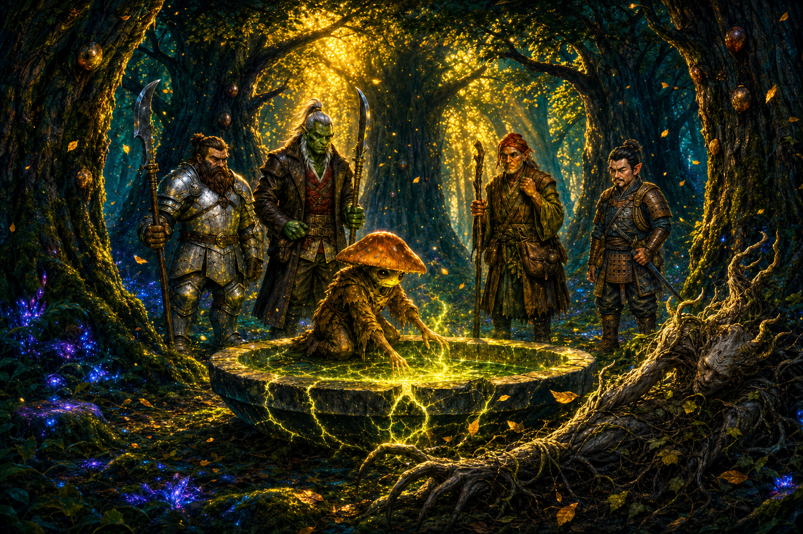

# Session Twelve: A Hand That Answers

**Date:** July 16, 2026

*Chapter 12. The GM named it "A Hand That Answers" — and by the end of the night the party had met three of them: the Warden's clawed hand, the Grandmother's voice rising through the cracked basin, and the unknown hand whose erasure was sealed into the cedars before Kurosawa ever drove a nail.*

---

## Overview

Back from summer break, the party opened where Session Eleven cliffhung: the **[Warden of the Grove](../wiki/npcs/warden-of-the-grove.md)** bearing down on them at the [Hollow of Seven Cedars](../wiki/locations/hollow-of-seven-cedars.md). They fought it, tried to talk to it, and — despite [Ginkgo's](../wiki/pcs/ginkgo.md) best efforts to subdue rather than kill — put it down, only for Ginkgo to feel the *presences* that had been puppeting it still hanging in the grove. Then the basin cracked open and the **[Grandmother](../wiki/npcs/the-grandmother.md)** — the Memory Eater of the Seven Cedars — finally spoke, to Ginkgo alone: the grove *can* be saved, without killing the trees, if the party can reverse the ritual that bound her — [Kurosawa's](../wiki/npcs/magistrate-kurosawa.md) custom rite, the **Root Correction, the Second Key**.

The only copy sat in Kurosawa's chambers in [Willowshore](../wiki/locations/willowshore.md). So the party went back, cased the town from the tree line — finding **eight oni guards** where there had been four, and a **[new blue-skinned oni](../wiki/npcs/oni-administrator.md)** giving orders in Kurosawa's conspicuous absence — and pulled off a clean night heist of the estate: [Donkey](../wiki/pcs/donkey.md) as a dragonfly, [Littlefinger](../wiki/pcs/littlefinger.md) on the lock, the fox construct thirty seconds too late. At camp, the stolen papers delivered the session's real bomb: **there are two seals on the grove**, and the second one — the erasure over [Cassian Voss's](../wiki/npcs/cassian-voss.md) name — **is not Kurosawa's work.** Kurosawa himself is investigating who beat him to the cedars.

---

## Key Events

### The Warden Falls

The Warden — seven-and-a-half feet of bark, vine, and thorn-fingered fury, a lean "swamp thing" with no armor because it *is* the grove — closed the distance through the trees like the underbrush wasn't there and tore into Ginkgo (10 damage) at the drained basin's edge.

The fight was a slow, instructive grind:

- Blades did almost nothing. [Boone's](../wiki/pcs/boone.md) glaive **clanked off its barky hide**; even hits that carved away chunks of bark and vine-sinew didn't slow it — no blood, no organs, no fatigue
- **Fire worked.** Donkey's **Ignition** (18 to hit, 7 fire) set its leafy shoulder smoldering, and the flames *spread wider than they should have* — the creature is weak to fire
- Ginkgo layered control instead of damage: **Calm** (a save-success still imposed −1 to its attacks), then **Enfeeble** on a near-critical failure (**enfeebled 2**)
- Donkey's **Tangle Vine** (21) immobilized and slowed it; **Boone tripped it prone** (29 vs. reflex) after announcing, mid-combat, *"We don't want to hurt you. Talk to the mushroom."*
- [Da Baishan](../wiki/pcs/da-baishan.md) cast **Shield** — a plain wooden orc-style shield floating out of the eye tattoo on his hand — and it earned its keep, **Shield Blocking** a 17-damage claw down to 12 before splintering into a thousand shards
- Littlefinger opened the fight with a **natural 1 on Stealth** (*"that's some powerful stuff"*) but still landed a hidden **sneak-attack sling stone**; Da Baishan's crossbow, as is tradition, sailed twice into legend (*"statistically, it has to work sometimes"*)

### Talking to the Thing That Cannot Answer

Mid-fight, Ginkgo spent his actions trying to **reach the Warden** instead of harm it. Through voice and mycelium he got through the fog for one long moment: the red rage in its eyes **softened into fear** — and then something *squeezed* it, and the anger snapped back like a mask. His follow-up ecology read found the truth underneath: the grove is crowded with **multiple presences** — *"like a city where you expect a few voices and there are several, chattering"* — **two, maybe three** unnatural forces, slightly opposed to each other, all pulling on the Warden at once. Something was wearing it.

Da Baishan ended it with **Devise a Stratagem** keyed to his standing investigation of the pool — a blade through the trunk. The Warden's reaching hands closed, the green faded, and it **wilted like a flower in the sun**, leaves drifting down anime-slow into a suddenly quiet grove. Da Baishan apologized to Ginkgo that they couldn't subdue it. *"We did our best,"* Ginkgo said. **The presences did not leave with it.**

### The Grandmother Speaks

Then the basin **vented** — cracks spidering across the stone, an exhale of air and mist, and beneath the cracks a vast **interweaving of roots connecting all seven cedars**. To everyone else it was a shape in the shadows, a face in the clouds. To Ginkgo — who had passed the pool's test and become its **speaker** — it was a voice: elderly, wavery, tired.

> *"I've been eating the dark for thousands of years."*

What the **[Grandmother](../wiki/npcs/the-grandmother.md)** told him, relayed to the party:

- The grove **does not have to die.** The verdict of Session Eleven has a door in it after all: **undo the ritual that binds her**, and she can *"open my mouth again... and eat the darkness"* — stopping any further corruption of Willowshore
- The ritual is Kurosawa's custom geomantic rite: the **Root Correction, the Second Key** — she knows it by its *shape and diagram*, not its maker
- **What's done cannot be undone.** *"What went downhill must remain downhill."* The good memories already eaten from Willowshore are gone; the townsfolk **will not remember the party kindly**, ever. Reversal stops the bleeding; it does not restore what bled out
- She did **not** send the Warden — the seal corrupted the whole grove, Warden included
- The rite must be reversed **by voice and by actions**: perform its steps in reverse order, *"give back the name and undo the seals."* The **originator is not required**
- She has been **bound nearly a year**, and can offer no army — only *"allies in the woods"*, eyes and ears, once freed
- Ginkgo's read (Perception 23): **no deception** — she is restricted by the same seal he felt in the voices

Donkey's recall (with the name in hand) placed the ritual instantly: **he saw those papers on Kurosawa's desk** during his firefly infiltration of the estate. Arcana confirmed the worst logistics: it is a **custom ritual in Kurosawa's own handwriting** — no library copy exists. *"All right, so we gotta steal that ritual."*

### Willowshore, Watched from the Trees

The party walked the ~10 miles back east and spent the last two hours of daylight glassing the town from the northwest tree line (Ginkgo, Perception 26):

- The town looked eerily **normal** — recovering, going about its business, the chasm scar still on the east side
- The oni garrison has **doubled**: roughly **eight red-skinned guards** where there had been four (one of whom had died)
- **[Kurosawa](../wiki/npcs/magistrate-kurosawa.md) was nowhere to be seen** — not once in hours of watching
- In his place, a **new figure**: a smaller **blue-skinned oni woman** (~5'6"), no weapons, bookkeeper-or-wizard energy, working out of the estate and **issuing orders** — even [Captain Akoto](../wiki/npcs/captain-akoto.md) follows them. All three blue-skins seen so far (Kurosawa, the [Mayor](../wiki/npcs/mayor-masru.md), and her) command the red-skinned soldiery
- Boone's tactical assessment: *"I think she's a potential ally, guys. I feel it. I think she's a good one."* Da Baishan: *"You just think she's pretty."* Boone: *"Often go hand in hand."*

### The Estate Heist

The plan, executed after full dark with cool hand signals and (per the GM) the Mission Impossible theme:

- **Boone and Da Baishan** held the tree line outside the estate's five-foot back wall, rope slung over for the exit — and passed the time playing **boulder-parchment-shears**, best three of five
- **Littlefinger led Ginkgo over the wall** with Follow the Expert; Ginkgo hit a 24 Stealth (*"don't step there"*)
- **Donkey went in as a dragonfly** through Kurosawa's cracked-open second-floor office window. The desk was **swept clean of papers** — but the room held a coin pouch (30 gp), a rack with one **greenish vial**, and a **new lacquered chest with a lock.** No fox construct in sight
- **Littlefinger climbed the wall and slipped in**: Trap Finder found the chest clean, and **Thievery 19** clicked the lock open — *"average to good,"* in his professional opinion; not a lock left weak on purpose
- Inside: **seven pages of diagrams in arcane script** — *the ritual* — a pouch of **five copper nails** matching the ones in the cedars, and a small locked box with a **note fixed to its lid**
- Then Donkey, peeking down the hall, saw the **stone fox construct** — geometric patterns, glowing eyes — padding calmly toward the room, thirty seconds out. *"We got company."*

The exit was pure slapstick grace: Littlefinger bagged the loot and **dove out the window** — 4 falling damage, *"worth it"*, sticking the landing next to Ginkgo — while Donkey closed and latched the chest, tried to swing athletically out onto the sill (**Athletics +0**), **clanged his knee off the bedpost**, and was still standing in the room when the fox rounded the corner. *"The jig is up."* He burned his second Pest Form, went dragonfly on the sill as the fox's eyes brightened at the chest and desk — and **no alarm ever sounded.** Everyone went over the wall on Da Baishan's rope, and the party melted west into the woods to a fireless camp warmed by [Cliché's](../wiki/npcs/cliche.md) hand-stones.

### Two Seals

At camp, the haul rewrote the case. Donkey and Da Baishan (esoterica in hand, cross-referencing the ritual pages, the book, the powder, and the scratched-out carving) pieced together what Da Baishan summarized as *"he's playing with things he doesn't fully understand"*:

- There are **two seals** on the grove, and they do not match
- **Seal one** — the geomantic one — is all Kurosawa: orderly lines, graphs, diagrams, *transformation.* The nails, the graft, the Root Correction
- **Seal two** — the **erasure** — is nothing like it: the frantic scratching-out of [Cassian Voss's](../wiki/npcs/cassian-voss.md) name, packed with the mustard **moth-wing powder**, done in *"haste... emotion... emotional removal,"* in a script Donkey half-recognizes and cannot place. **Not a geomancer's hand. Not Kurosawa's intent. Not the same originator**
- The small lockbox held a **vial of the same mustard powder** — a *collected sample* — with Kurosawa's own investigation note on the lid. **Kurosawa is investigating the second seal too, and (per his notes) does not know whose it is.** It predates his own work
- This maps exactly onto what Ginkgo felt in the grove: **two, maybe three** opposed presences — and onto the Grandmother's *"nearly a year"* of binding, which fits the **older erasure's** timeline better than Kurosawa's recent nails

The note itself (see [the full text](../wiki/npcs/magistrate-kurosawa.md#the-lockbox-note-the-second-seal)) ends on the sentence that hangs over everything now: *"My nails hold on top of another hand's work. Useful. But it means my diagram alone will not open what it alone did not close."* If Kurosawa's own diagram can't fully open the grove's mouth — **can reversing his diagram fully close what he did?**

The party ended the night around the hand-stones arguing exactly that. Do they trust a note found conveniently taped to a lockbox? Is it a plant? Is Kurosawa an unreliable narrator, half-cocked, *earnestly here to fix something he doesn't understand*? Is the second seal Voss's own work — or the work of whatever killed him? The consensus: **more investigation before performing anything** — consult the Grandmother again, and maybe [Littlefinger's](../wiki/pcs/littlefinger.md) relatives among the [Yeshou family](../wiki/factions/willowshore-ruling-family.md).

---

## Memorable Moments

- **"Is this a friend of yours?" / "Not that I know."** — Boone and Ginkgo, opening the session's leshy-to-grove-monster diplomacy on exactly the right foot
- **The table debates AI mid-initiative** — the GM wishing he had a better map (*"I should probably get AI in this"*), Littlefinger: *"I heard that AI stuff's pretty cool"*, Ginkgo: *"It's just a trend."*
- **Littlefinger's natural 1 Stealth** to open the fight — *"That's some powerful stuff. It's a good start"* — followed later by the quietest, cleanest infiltration of the campaign. Range restored
- **Da Baishan's crossbow, chapters later, still building suspense** — one bolt into the basin, one *"somewhere off into the deep woods."* *"One day I might learn."* / *"Today is not that day, my friends."* / GM: *"Open your eyes next time."*
- **"We don't want to hurt you. Talk to the mushroom."** — Boone's negotiation strategy, delivered while tripping the Warden prone
- **"Is he still on fire?" / "No." / "Is he hot, though?"** — Ginkgo, checking on the enemy's wellbeing mid-combat
- **The shield from the eye** — Da Baishan's Shield spell manifesting as a plain wooden orc shield floating out of his hand tattoo, eating a 17-damage claw, and splintering *"into a thousand shards"* on its one block
- **"I've been eating the dark for thousands of years"** — the Grandmother's first words, through the cracks of a drained basin, to the one party member who'd earned the right to hear them
- **The clown gambit** — Donkey's plan for a town that hates them: *"We could be clowns that are specifically mocking us... It'll be my greatest role yet: playing myself."*
- **Vic's meta-moment** — *"I love how differently all of you approach things... I would have never thought to try to talk to the swamp creature."* Da Baishan: *"Vic's like: it's ugly, kill it."*
- **Boulder, parchment, shears** — Boone and Da Baishan on "overwatch," best three of five, completely absorbed while the entire heist happened over the wall behind them
- **"Worth it."** — Littlefinger, taking 4 falling damage out a second-story window with the campaign's most important papers in his bag, claiming he left *"an outline of a halfling"* behind him
- **Donkey vs. the bedpost** — Athletics +0, one clanged knee, and a wizard standing flat-footed in the room as the fox construct walked in; saved by his own second Pest Form
- **"He's got the goods."** — Donkey, dragonfly-brained and loyal, latching the chest shut behind Littlefinger to buy the heist thirty more seconds of deniability

---

## Discoveries

### Lore Learned

- **The grove can be saved without killing it.** Session Eleven's verdict ("the trees must die") had an exception buried in it — *know the originating ritual* — and the party now **has** it. Reversing the **Root Correction (the Second Key)**, step by step, by voice and action, unbinds the Grandmother
- **The damage to Willowshore is permanent.** Reversal stops further corruption; it does not return the eaten memories. The town will *never* remember the party kindly again — that future is already spent
- **The ritual's mechanics:** custom geomantic rite, Kurosawa's own design and handwriting, no other copies; the originator need not perform the reversal; *"give back the name and undo the seals"*
- **There are two seals — from different hands.** Kurosawa's orderly geomantic working sits **on top of** an older, hastier, *emotional* erasure (the scratched-out Voss name, the moth-wing paste). Kurosawa is **investigating the first seal himself** and doesn't know who made it
- **Kurosawa's own note warns his diagram is insufficient** — *"my diagram alone will not open what it alone did not close"* — raising the live question of whether reversing his rite alone can free the Grandmother
- **The Warden was a puppet.** Two or three opposed presences were pulling on it; killing it did not disperse them. The grove is still occupied
- **Willowshore's garrison doubled** (~8 red-skinned oni), Kurosawa is absent from view, and an unarmed **blue-skinned oni administrator** now gives orders even Captain Akoto follows

### Items and Resources

| Item | Holder | Detail |
|---|---|---|
| **The Root Correction ritual (7 pages)** | Party ([Littlefinger](../wiki/pcs/littlefinger.md) carried it out) | Kurosawa's custom geomantic rite, arcane script + diagrams; the steps, reversible in reverse order — the key to unbinding the [Grandmother](../wiki/npcs/the-grandmother.md) |
| **Five copper nails** | Party | Identical to the nails driven into the seven cedars; Kurosawa's spares |
| **Kurosawa's lockbox + note** | Party | Small locked box, note on the lid ([full text](../wiki/npcs/magistrate-kurosawa.md#the-lockbox-note-the-second-seal)); inside, a **vial of mustard moth-wing powder** — Kurosawa's collected sample of the *other* hand's work |
| **Coin pouch (30 gp)** | Donkey (from the desk) | Sitting in plain sight on the office desk |
| **Greenish vial** | *Left behind* | One stoppered vial of mossy, earthen-dark liquid in a four-slot rack on the desk — unidentified, untouched |

---

## Open Threads

### Active Mysteries

- **Whose is the second seal?** The erasure predates Kurosawa, was made in haste and emotion, in a script Donkey half-knows. Candidates floated at camp: **Cassian Voss himself**, whatever **killed** Voss, or *"some ancient power"* — with the unsettling corollary that Kurosawa might be *"earnestly here to fix things; he just doesn't know how"*
- **Can the reversal work at all?** Kurosawa's note says his diagram alone couldn't open what the erasure closed. Does the reversal need to address **both seals** — and does the party have the *"name"* that must be *"given back"*? (Whose name? Voss's?)
- **Do they trust the note?** Found conveniently atop a lockbox, behind an average lock, in an unguarded room, with no alarm raised. Setup, sloppiness, or a researcher's honest filing?
- **The Grandmother's timeline.** She says she's been bound *"nearly a year"* — closer to the **erasure's** age than to Kurosawa's recent nails. Was she first bound by the *second* seal, and Kurosawa merely built on it?
- **Who is the blue-skinned administrator** — and where has **Kurosawa gone**? Boone has already pre-registered her as a potential ally
- **The remaining presences at the grove.** Two or three; opposed; still there after the Warden's death. What are they, and what happens when the party returns to perform a ritual in the middle of them?
- **The fox construct** saw the disturbed room but sounded no alarm — this time. Does Kurosawa know?

### Next Steps

1. **Consult the Grandmother** with the recovered ritual — can she read its shape, and does it address the second seal?
2. **Investigate the second seal** before performing anything — possibly via the Yeshou family (Littlefinger's relatives) or Voss's spirit
3. **Perform the reversal at the Hollow** — by voice and action, in reverse order, with five spare nails in hand if it comes to it
4. **The other keys still wait** — [Cloudbreaker Cairn](../wiki/locations/cloudbreaker-cairn.md), the [River's Lantern Spine](../wiki/locations/rivers-lantern-spine.md), the [Terrace of Whispering Clay](../wiki/locations/terrace-of-whispering-clay.md) — and a doubled garrison now stands between the party and everything in [Willowshore](../wiki/locations/willowshore.md)

---

## Timeline

| Time | Event |
|---|---|
| Day 2, ~10:00 | **The Warden attacks** at the drained basin; fire found effective; Calm, Enfeeble, Tangle Vine, and a trip stack up |
| Day 2, mid-fight | Ginkgo reaches the Warden — rage softens to **fear**, then something squeezes it back; ecology reads **2–3 opposed presences** |
| Day 2, ~10:30 | Da Baishan's stratagem-strike **kills the Warden**; it wilts; the presences remain |
| Day 2, late morning | The basin cracks and vents; the **Grandmother speaks** to Ginkgo — the Root Correction can be reversed; the grove need not die; what's lost is lost |
| Day 2, midday | Donkey places the ritual: **Kurosawa's desk.** The plan becomes a heist; the party marches east, healing on the road |
| Day 2, ~16:00 | Willowshore surveilled from the tree line: **eight oni guards**, no Kurosawa, a **new blue-skinned administrator** giving orders |
| Day 2, full dark | **The heist**: over the wall; dragonfly recon; lock picked (Thievery 19); ritual pages, five nails, and the noted lockbox lifted; fox construct arrives 30 seconds late; no alarm |
| Day 2, night | Fireless camp west of town on Cliché's hand-stones; the **two-seals** analysis; debate over trusting the note; **session ends** |

---

## The Scene

### A Voice Through the Cracks

The grove had only just remembered how to be quiet. The Warden lay where it had wilted, a tangle of vine and bark going grey on the blade that killed it, and the last leaves of the fight were still sifting down through the canopy when the basin **exhaled**. Not an eruption — an exhale. Stone cracked along the bowl's base with a sound like old knuckles, and air came up through the fissures in a long, tired breath of mist, the way a held thing lets go. The others crowded the rim and saw shapes the way you see elephants in clouds: something in the shadows beneath the cracks, a suggestion of a face in the vast lattice of roots that laced all seven cedars into one buried body. [Ginkgo](../wiki/pcs/ginkgo.md) saw more. Ginkgo *heard*.

It came up through his feet first, the way everything true always had — through soil and thread and the patient chemistry of the ground — and then it was a voice: elderly, wavery, worn thin as an old ribbon. *"I've been eating the dark for thousands of years,"* the [Grandmother](../wiki/npcs/the-grandmother.md) said, and Ginkgo stood very still at the edge of the empty pool that had tested him, the pool that had made him its speaker, and listened to a spirit older than nations explain the terms of her captivity. She had not sent the Warden. She could not stop what her stolen mouth was being made to swallow. And when he asked her — hands open, feelers spread, the party watching him talk to a hole in the ground — how to end it, she gave him a name like a key turning: *the Root Correction. The Second Key.* Undo it step by step, voice and action, give back the name, unbind the seals. The grove did not have to die. He felt the truth of her the way he felt rain coming: no deception, only restriction, a mouth held shut by another's hand.

But she would not let him keep all of his hope, because she was old, and the old do not lie to spare the young. *"What went downhill must remain downhill,"* she said, gently, the way you tell a child the bird will not wake up. The kindnesses Willowshore had forgotten — Liwen's recognition, Willow's raised hand, every warm thing the party had earned — were eaten, digested, gone. *"Your friends in the town will not remember you kindly. And I am sorry."* Ginkgo crouched at the basin's rim a long moment, a small fungal thing conversing with a grandmother made of roots, and then he stood and turned to his friends to translate — the mercy and the price of it, both — while somewhere beneath his feet, for the first time in a year, something ancient allowed itself to believe it might open its mouth again.
