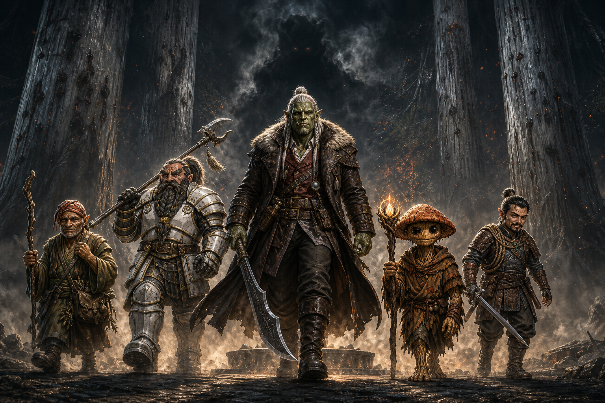

# Session Thirteen: The Breaking of Two Seals

**Date:** August 13, 2026

*Chapter 13 — "lucky or unlucky." A shorter session, and a hinge: one long night of counsel by the campfire, and one morning walk back to the grove to start undoing what Kurosawa did. The GM named the chapter for the two seals; the party only got as far as scratching at the first.*

---

## Overview

The party's fireside camp outside [Willowshore](../wiki/locations/willowshore.md) was interrupted by a rickshaw in the dark: **[Mido](../wiki/npcs/mido.md)**, hunting for them for hours with fresh intelligence. The blue-skinned administrator now has a name — **[Otsuru](../wiki/npcs/atsura.md)**, a young tiefling oni magistrate of the [Council of the Magi](../wiki/factions/council-of-the-magi.md) — and [Kurosawa](../wiki/npcs/magistrate-kurosawa.md) himself has left town, marching guards northwest to **[Cloudbreaker Cairn](../wiki/locations/cloudbreaker-cairn.md)**: the Stone key. Mido laid out a legal counterattack — a party-called **Rite of Open Reckoning**, with [Boone](../wiki/pcs/boone.md) as the outsider judge the old law demands — and a bombshell about [Mayor Masru](../wiki/npcs/mayor-masru.md): a disgraced [Kirahata](../wiki/locations/kirahata.md) businessman whose commission to Willowshore was **signed by Kurosawa himself**.

The party chose their order of operations — **reverse the ritual first, sue second** — took Mido's parting gifts, slept, and marched back to the [Hollow of Seven Cedars](../wiki/locations/hollow-of-seven-cedars.md) with the five reversal steps assigned. [Littlefinger](../wiki/pcs/littlefinger.md) began etching the counterclockwise octagon around the dry basin. By his third circuit the light dimmed, the trees leaned in, and the black ichor rose as smoke — coalescing into **a shadowy shape**. Session over. *"Cliffhanger achieved."*

---

## Key Events

### Mido at the Campfire

Between eight and ten at night, a hunched silhouette hauled a rickety two-wheeled cart into the firelight — one of the Yeshou guards, pulling **[Mido](../wiki/npcs/mido.md)** herself, blanket over her crossed legs, gray-streaked hair unmistakable. *"These old bones are not used to sleeping out under the stars."* She had been searching for the party for hours, and her network had been busy:

- **A new group has arrived in Willowshore**, led by a **young tiefling oni woman** named **[Otsuru](../wiki/npcs/atsura.md)** — the party immediately recognized the description: *"Yeah, we noticed her."* Mido first feared she was the long-promised exile escort; she now believes Otsuru is a **magistrate of the [Council of the Magi](../wiki/factions/council-of-the-magi.md)**, studying things in the estate, questioning [Masru](../wiki/npcs/mayor-masru.md), and commanding the other oni. *"She is awfully young, and surprisingly they all defer to her."* Either she is **looking for Kurosawa or affiliated with him** — Mido can't yet say which
- **[Kurosawa](../wiki/npcs/magistrate-kurosawa.md) left Willowshore** the previous night, taking a few oni guards **northwest to [Cloudbreaker Cairn](../wiki/locations/cloudbreaker-cairn.md)** — the Stone key of his five-vein plan is in motion *now*
- Donkey's Willowshore lore filled in the Cairn: **circles of standing stones** in the northwest mountains, a **holy place** rather than an arcane one, believed to be worship sites of an **ancient avian people** no one has ever actually seen. Pilgrims still climb to them seeking spiritual awakening; several such circles are scattered through those peaks
- Mido heard the party's full account of the grove, the [Grandmother](../wiki/npcs/the-grandmother.md), and the stolen ritual — and folded her own agenda instantly: *"I believe your discovery is even more important than mine today."* If the curse runs its course, **Willowshore becomes uninhabitable** — a place where only the darkest thoughts can live. She never did share the other piece of research she'd brought
- She confirmed the curse's signature so the party can test for it: the afflicted **cannot recall kindnesses, only grudges** — give someone flowers and they forget by morning; forget their birthday and they remember forever. Mido herself shows no signs. How far past Willowshore the effect reaches is unknown — the town is a **nexus of several ley lines**, so it may stop there. Or it may not

### The Rite of Open Reckoning, Reversed

Mido has been reading old law. The **Rite of Open Reckoning** — the very instrument [Kurosawa](../wiki/npcs/magistrate-kurosawa.md) used to convict the party — can be **called by anyone**, and she proposes the party call their own when he returns to town, armed with the stolen papers in his own handwriting:

- The ancient requirement: the judge must be an **outsider** — *"no kin, no graves, no land, no stake."* The logic is brutally simple: *someone with family can be appealed to, with land can be bought, with a grave can be haunted.* That is exactly why Kurosawa installed the newly-arrived Masru as judge in the first trial — obeying the letter of the old law deliberately
- **Leshys have no standing in the old laws** — *"a dark history,"* Mido admitted — so [Ginkgo](../wiki/pcs/ginkgo.md) is disqualified. That leaves one eligible outsider: **[Boone](../wiki/pcs/boone.md) the dwarf**, who would take Masru's seat and rule. Littlefinger's formal objection: *"Ma'am, I must tell you, this is blatant Leshyism. And it's unacceptable."*
- The ruling would be **binding on Kurosawa** if the forms are followed — and could **strike down the original verdict entirely**, un-exiling the party
- The party stress-tested the plan: [Da Baishan](../wiki/pcs/da-baishan.md) flagged that some of the stolen papers are **ambiguous** about how much of a hand Kurosawa truly had; Ginkgo flagged the man's **oratory gift** — *"he's pretty crafty with his words."* Mido conceded both, but held her ground: this time the party has **the initiative** and physical proof *signed in his own hand*

### Masru's Price Tag

Mido's people finally came back from [Kirahata](../wiki/locations/kirahata.md) with **[Mayor Masru's](../wiki/npcs/mayor-masru.md)** history, and it reframes the first trial:

- Masru was a **reputable Kirahata businessman** who ran two very popular establishments — **a gambling house and a brothel** — until *"bad luck and some other elements"* thrust him out of favor with the city's business class
- He **did not volunteer** for Willowshore. He was **commissioned** — and the commission was **signed by Kurosawa.** (Da Baishan guessed it before Mido could finish the sentence)
- The implication, as Mido drew it: nothing about Kurosawa's Willowshore has been *"a sequence of random events."* With a debtor-mayor holding the municipality and himself holding the magistracy, Kurosawa effectively controls **both houses** of local authority. *Was the first ruling ever going to go in the party's favor?*
- The tentative plan: **talk to Masru directly** before any new Reckoning, and find out what Kurosawa has on him — [Boone](../wiki/pcs/boone.md) and Da Baishan took the action item

### Ritual First, Court Second

[Ginkgo](../wiki/pcs/ginkgo.md) called the decision of the night: *"I think we should prioritize the ritual. We should undo the ritual first."* Da Baishan supplied the tactical logic — an Open Reckoning goes much better **in front of townspeople who are no longer magically compelled to hold grudges** against the accused. Mido (and, in absentia, Donkey) agreed: if the town's minds stay muddled, who knows which way an open hearing tips.

### Mido's Gifts

Asked if she could help with the reversal itself, Mido smiled — *"my days of venturing into arcane rituals are long since passed"* (Ginkgo, gently: *"Don't you miss it, though?"*) — and dealt out parting gifts from the rickshaw instead:

| Gift | Recipient | Effect |
|---|---|---|
| **Monkey Pin** (green jade monkey emblem) | Littlefinger | *"The sign of the monkey"* — dexterity, the gift of climbing; when you need it, you always land on your feet |
| **Scroll of False Life** | Donkey | Arcane scroll for his library — temporary hit points when he needs them most |
| **Infiltrator's Elixir** (starlight-glowing flask) | Da Baishan | *"You have the eye of the order, and this will allow you to infiltrate secretly"* — drink to wear another face |
| **Two lesser healing potions** | Ginkgo | *"Your heart is warm and you care for others"* |
| **Owlbear's Claw** (weapon talisman) | Boone | *"The crown of the ruler might be heavy, but this may help in times of action"* — critical hits trigger the weapon's critical specialty (his polearm: knock prone) |

Her guard lifted the rickshaw handles and wheeled her back into the dark: *"Good luck, my friends. We'll meet back in Willowshore."* The GM openly dangled a pickpocket roll as she left. Littlefinger, reformed: *"I got us in trouble with thievery stuff last time... I'm not going to do it this time. There was a strong urge."*

### The Five Steps, Assigned

Donkey's night of analysis (the ritual is written in **draconic script** with full diagrams) produced the complete reversal procedure — five steps, all hands required:

1. **Draw the seal** — etch Kurosawa's octagonal seal-pattern **counterclockwise around the pool, five times** → **Littlefinger** (*"Who has the best handwriting and knows what counterclockwise means?" — "I know what counterclockwise means."*)
2. **Draw the nails** — pull the copper nails from the cedars **in the reverse of the order they were driven** (the order is documented in the ritual) → **Boone** (*"More of a nail puller."*)
3. **Answer the phrase** — Kurosawa spoke *"Memory is not sacred. It is only precedent"* into the pool; the reversal demands an **answer**, not an echo. Composing it is **Donkey's homework** (the GM has a fallback if David wants to pass)
4. **Return the name** — etch **[Cassian Voss's](../wiki/npcs/cassian-voss.md)** name back into the third cedar → **Da Baishan**: *"I feel like I owe a debt to Cassian Voss, after what the Leshy made me do"*
5. **The unbinding** — all seals unlock and the [Grandmother](../wiki/npcs/the-grandmother.md) begins **eating the black ichor back in**. Da Baishan's Arcana (24) confirmed the fine print: someone must be **in the pool** for this step, and it should be the one who entered the water originally → **Ginkgo**: *"I'll do it."*

Ginkgo's benediction on the plan: *"Let's do it. Nothing can go wrong."*

### Three Circuits Counterclockwise

After a long rest (the homebrew heal — ~35 HP and all spells back) and a bright, birdsong morning that made the forest look almost innocent, the party walked the ten familiar miles west. The grove was as they left it: cedars gray, nails weeping, basin dry.

**Littlefinger stepped up to the pool and began to etch** — hard-angled octagon lines, counterclockwise, exactly per the diagram:

- **Circuit one.** Nothing.
- **Circuit two.** The trees seemed to *lean in*. The light dimmed, as if a cloud had crossed the sun — if it was a cloud.
- **Circuit three.** The black liquid ichor began to **smoke upward** out of the basin — and the smoke started **forming a shadowy shape.**

And there the session ended, mid-ritual, with two circuits to go and something taking form in the middle of the seal. *"Cliffhanger achieved."*

---

## Memorable Moments

- **"Ma'am, I must tell you, this is blatant Leshyism. And it's unacceptable."** — Littlefinger, objecting on the record to the old law's exclusion of Ginkgo from the judge's seat
- **The Highlander clause** — Littlefinger, before agreeing to anything: *"Is a judge going to make a decision we abide by, or is this signing up our friend Boone for some type of fight to the death, to be ruled on by the gods?"* Boone: *"Star Trek. Old Star Trek, one-on-one."*
- **"Was it Kurosawa?"** — Da Baishan, completing Mido's dramatic reveal about Masru's commission before she could land it herself
- **"Don't you miss it, though?"** — Ginkgo, trying to peer-pressure an elderly matriarch back into arcane ritual work
- **The strong urge** — the GM offering Littlefinger a pickpocket roll on Mido *as she gave the party gifts*; Vic declining with visible effort: *"There was a strong urge."*
- **"Who has the best handwriting and knows what counterclockwise means?"** — Da Baishan's two-part job interview for step one
- **"More of a nail puller."** — Boone, self-assessing with total accuracy
- **"I feel like I owe a debt to Cassian Voss, after what the Leshy made me do."** — Da Baishan, claiming the name-return step; the séance where Voss's spirit rode his body still sits with him
- **"Let's do it. Nothing can go wrong."** — Ginkgo, speaking the ancient words that summon shadowy shapes from ichor
- **"Cliffhanger achieved."** — Littlefinger, calling the GM's shot as the screen faded to black

---

## Discoveries

### Lore Learned

- **The administrator has a name: [Otsuru](../wiki/npcs/atsura.md)** — young tiefling oni, magistrate, **Council of the Magi**; commands even the town's other oni leaders despite her youth. Possible adversary, possible ally; either hunting Kurosawa or working with him
- **Kurosawa has moved to the Stone key.** He left Willowshore with guards for [Cloudbreaker Cairn](../wiki/locations/cloudbreaker-cairn.md) — the third of his five veins — while the party works to break his second
- **Cloudbreaker Cairn located and described**: Stonehenge-like stone circles in the mountains northwest of Willowshore's river valley; a holy site of legendary **avian people**, used for spiritual awakening; several circles scattered through the peaks
- **The curse's test**: the afflicted can't retain memories of kindness, only grudges. Mido is clean. The spread beyond Willowshore's ley-line nexus is unknown
- **The old law of the Reckoning**: any party may call it; the judge must have *no kin, no graves, no land, no stake*; leshys have **no legal standing**; a properly-formed ruling binds even Kurosawa
- **Masru was bought, not appointed**: disgraced out of Kirahata's business class (a gambling house and a brothel to his name), then **commissioned to Willowshore by Kurosawa's own signature.** Kurosawa built himself both houses of local power
- **The reversal's mechanics in full** — five steps, documented order for the nails, an *answer* required to Kurosawa's phrase, and a body in the water for the unbinding

### Items and Resources

| Item | Holder | Detail |
|---|---|---|
| **Monkey Pin** | Littlefinger | Jade monkey emblem — climbing, dexterity, always land on your feet |
| **Scroll of False Life** | Donkey | Arcane scroll; temporary HP |
| **Infiltrator's Elixir** | Da Baishan | Disguise-in-a-bottle; wear another's face |
| **Two lesser healing potions** | Ginkgo | From Mido's stores |
| **Owlbear's Claw** | Boone | Weapon talisman — crits trigger critical specialty (polearm: knockdown) |

---

## Open Threads

### Active Mysteries

- **What is the shadowy shape** forming out of the ichor-smoke at circuit three? A new [Warden](../wiki/npcs/warden-of-the-grove.md)? One of the **2–3 lingering presences**? The [Grandmother](../wiki/npcs/the-grandmother.md) herself — or the *other* hand's seal fighting back?
- **What is the answer to Kurosawa's phrase?** *"Memory is not sacred. It is only precedent"* demands a reply, not a repetition. Donkey has until step three to compose it
- **Will reversing one seal move the other?** The two-seals problem from Session Twelve is still live — the erasure predates Kurosawa, and his own notes say his diagram *"alone will not open what it alone did not close"*
- **What is Kurosawa doing at Cloudbreaker Cairn right now?** The Stone key — *"even stone yields when proper law is spoken with sufficient force"* — is being turned while the party is a day's march away
- **Who is [Otsuru](../wiki/npcs/atsura.md) really** — Kurosawa's colleague, his auditor, or his hunter? Why does everyone defer to someone so young?
- **What does Kurosawa hold over Masru?** The commission is proven; the leverage is not
- **What was Mido's other discovery?** She arrived with a second piece of research and never shared it — *"I believe your discovery is even more important than mine today"*

### Next Steps

1. **Finish the reversal** — two more circuits of the seal, the nails, the answer, the name, and Ginkgo in the pool — starting with whatever is coalescing in the basin
2. **Compose the answer-phrase** to *"Memory is not sacred. It is only precedent"*
3. **Talk to Masru** before calling the new Rite of Open Reckoning (Boone and Da Baishan)
4. **Prepare Boone for the judge's seat** — the party's legal path back into Willowshore runs through him
5. **Cloudbreaker Cairn** — Kurosawa is there *now*, with guards, working key three of five

---

## Timeline

| Time | Event |
|---|---|
| Day 2, ~20:00–22:00 | **Mido arrives** by rickshaw at the camp outside Willowshore; intel on Otsuru, Kurosawa's departure to Cloudbreaker Cairn, and the curse's signature |
| Day 2, night | The **Rite of Open Reckoning** plan laid out — Boone the only eligible judge; **Masru's Kirahata past** and Kurosawa-signed commission revealed |
| Day 2, night | Party decides: **reverse the ritual first**, court second; Mido distributes **five gifts** and departs — *"We'll meet back in Willowshore"* |
| Day 2, night | Donkey lays out the **five reversal steps**; roles assigned; **long rest** at the hand-stone camp |
| Day 3, morning | Bright morning march ~10 miles west to the [Hollow of Seven Cedars](../wiki/locations/hollow-of-seven-cedars.md); grove unchanged — gray cedars, nails in, basin dry |
| Day 3, midday | **The reversal begins.** Littlefinger etches the counterclockwise octagon: circuit one, two — trees lean in, light dims; circuit three — the ichor smokes upward into a **shadowy shape**; **session ends** |

---

## The Scene

### Ten Miles West

The morning had the audacity to be beautiful. Sun cresting through the canopy in long gold bars, birdsong, small things scurrying in the underbrush — a forest doing its best impression of a world where nothing was wrong. Through it came five silhouettes walking abreast where the trail allowed, and the forest, wisely, went quiet around them. [Boone](../wiki/pcs/boone.md) on the flank, full plate catching the light in slabs, the Owlbear's Claw lashed to his polearm's haft like a promise he intended to keep. [Da Baishan](../wiki/pcs/da-baishan.md) beside him, guandao over one shoulder, a flask of bottled starlight riding his hip, the eye tattooed on his hand open and watching the road. [Donkey](../wiki/pcs/donkey.md) muttering through the ritual's draconic under his breath, rehearsing five steps like a man checking the load in every chamber. [Ginkgo](../wiki/pcs/ginkgo.md) with two potions clinking softly against his fungal hide, barefoot as always, reading the ground through his soles. And out front, half the size of any of them and walking like he owned the deed to the forest, [Littlefinger](../wiki/pcs/littlefinger.md) — jade monkey pinned at his collar, chalk in his pocket, the only member of the crew whose job today required *handwriting*.

Nobody talked for the last mile. They didn't need to; the briefing had happened at the campfire, roles dealt out like cards around Mido's rickshaw. *Littlefinger draws the seal. Boone pulls the nails. Da Baishan gives back the name. Donkey answers the phrase. Ginkgo takes the water.* Five steps, five of them, one broken god under a stone basin waiting almost a year for somebody to come and pick the lock on her mouth. The trees changed as they walked — bigger, older, redwood-proud — until the forest emptied out all at once into open grassland and there they were: seven gray towers in a ring, copper nails weeping black at their roots, a dry pool at the center like a socket missing its eye. The grove hadn't changed. That was the insult of it. It stood exactly as they'd left it, wounded and waiting, as if it had known they'd be back.

They fanned out without a word — Boone to the first cedar, thumbs hooked in his belt like a man about to start a bar fight with a tree; Da Baishan circling to the third trunk where a dead man's name used to live; Ginkgo at the basin's rim, looking down into the dark where the Grandmother listened; Donkey at the edge of it all with the answer he hadn't written yet. Littlefinger cracked his knuckles, produced his etching tool with a flourish usually reserved for other people's lockboxes, and looked around at the crew once — *"Let's do it,"* Ginkgo had said. *"Nothing can go wrong."*