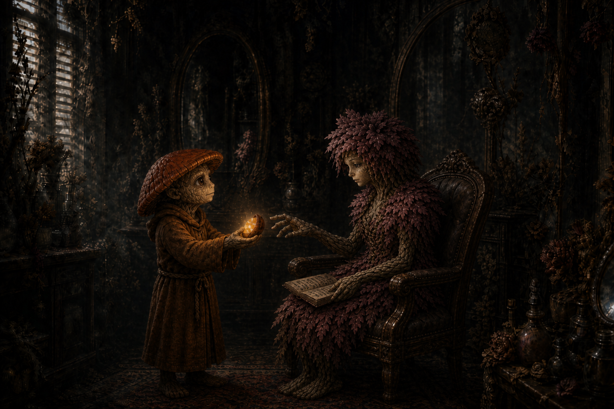

# Session Fourteen: The Grandmother's Gift

**Date:** August 20, 2026

*Chapter 14. The GM's verdict at the table, watching the party pass a curse-cleansing seed around like a hot potato: "I should have named this adventure Ginkgo's Nut, had I known it would go this way." The reversal was finished, the Grandmother freed, and Willowshore's cure came down to one plum-sized seed and the question the party will be answering for sessions to come: who gets the plum?*

*(Note: the recording started a few minutes into the session, mid-fight — the opening of the shadow-figment combat is reconstructed from context.)*

---

## Overview

Picking up mid-ritual at the [Hollow of Seven Cedars](../wiki/locations/hollow-of-seven-cedars.md), the party fought off the **shadow figments** that had risen from the ichor-smoke, then completed all five steps of the reversal — the seal, the nails, [Donkey's](../wiki/pcs/donkey.md) answer-phrase, [Cassian Voss's](../wiki/npcs/cassian-voss.md) name (interrupted by a **sand creature** that nearly killed [Da Baishan](../wiki/pcs/da-baishan.md)), and the unbinding. The **[Grandmother](../wiki/npcs/the-grandmother.md)** rose from the basin, asked [Ginkgo](../wiki/pcs/ginkgo.md) to strike *her* rather than the trees, and pressed a single warm **seed** into his hand before dissipating: *"This seed will clear the curse of one in Willowshore."* The grove healed before the party's eyes.

Back in a colder, meaner Willowshore, Ginkgo talked a curse-hollowed **[Radiant Willow](../wiki/npcs/radiant-willow.md)** into eating half the plum — the emotional heart of the session — restoring the party's one true ally. Research into stretching the cure further had barely begun when **[Kurosawa](../wiki/npcs/magistrate-kurosawa.md)** returned from [Cloudbreaker Cairn](../wiki/locations/cloudbreaker-cairn.md), strode into the salon, sat down, and asked the party to *"quietly, civilly surrender."* Session over — with the Rite of Open Reckoning on the party's lips.

---

!!! warning "GM retcon (post-session) — the spirit realm, and what the seed can do"
    Gary sent a note after the session that **changes canon**. Recorded here in spirit; the affected wiki entries have been retrofitted accordingly (see the end of this note).

    1. **The "transfusion" is retconned.** The DC on the party's research rolls was set too high, and the *"transfusion — a leshy must die"* answer was an improvised yes-and that Gary is walking back. The corrected canon: **Tian Xia has an active spirit realm.** The *characters* know this even if the players didn't — spirits are real, present, and interacted with (a fisherman might seek help from the river spirit). Ginkgo's question *"can we summon something to take the curse as a proxy?"* deserved a real roll and a real answer. That answer is now:
        - **The [Grandmother](../wiki/npcs/the-grandmother.md) was a nature spirit** — the spirit of the grove, **cast into service long ago**. By whom and why, the party may yet find out.
        - The seed she gave can be offered to **the spirit of Willowshore** to cleanse the whole town.
    2. **The party's actual options for curing Willowshore** are therefore:
        1. Do nothing
        2. The transfusion — sacrificing a nature spirit close to the town (likely a leshy)
        3. **Learn to commune with the town spirit of Willowshore, earn its favor, and let it consume the seed**

    **Retrofitted entries:** [The Grandmother](../wiki/npcs/the-grandmother.md) (reclassified as a nature spirit pressed into service), [Willowshore](../wiki/locations/willowshore.md) (the town spirit and the active spirit realm), and this session's Key Events and Open Threads, which present the transfusion alongside the corrected options.

---

## Key Events

### The Shadow in the Seal

The session opened mid-combat against the **shadowy figments** that had coalesced from the ichor-smoke at [Littlefinger's](../wiki/pcs/littlefinger.md) third circuit — gliding, polygonal silhouettes that never touched the ground:

- The things proved **weak to fire** and hungry for life: one raked Littlefinger with a shrouded tendril, draining his life essence — **9 damage and 3 max HP gone** (drained 1) — and *healing itself* as its missing polygons filled back in
- Boone ended the fight with a **natural 20** (35 damage with the crit rule): *"I would like to swing through it, and it catches on this polyhedral mess, and Boone breaks it — like a sound of shattering glass."* The forest went dead silent for a heartbeat, then the birdsong crept back in
- **Littlefinger never stopped etching.** *"I'm still going counterclockwise. That's what I've been doing this whole time."* Circuits three, four, five — and a pulse of energy bolted around the completed octagon like an arc reactor. **Step one: done**

### Seven Nails, Seven Memories

Boone pulled the copper nails in the documented reverse order, each one resisting like a magnet, each wound weeping black ooze — and each pull flashing a **stolen memory** into his mind, none of them his: someone crying over a lost loved one, someone burning with shame over a failed performance. The grove's centuries of swallowed grief, glimpsed one nail at a time. **Step two: done.** (Boone kept all seven cursed nails.)

### The Answer

Kurosawa spoke *"Memory is not sacred. It is only precedent"* into the pool; the reversal demanded an answer. Donkey delivered his homework, stated with full confidence as the trees echoed it back:

> *"Every action leaves a scar, and it can never be fully overwritten. It can only be amended."*

The GM's review: *"I think it's actually better than what I came up with."* The leaves slowed mid-fall for a moment, then resumed. **Step three: done**

### The Name and the Sandstorm

Da Baishan took his dagger to the third cedar, carving **Cassian Voss** in his best handwriting above the scratched-out original (dexterity-based crafting, 18 — *"it's actually pretty good, nice script"*). At the second *S*, the mustard moth-wing powder chipped off the old erasure — and instead of falling, it **spun up into a cyclone**, a screaming creature of sand and dust bent entirely on stopping the carving:

- The thing was a genuine threat: it battered Da Baishan inside a leaf-shredding vortex (9 damage in the aura, then a 29-to-hit club-arm that his **magic shield block** ate — the acid in the sand *dissolving the shield* — for 13 more). *"I'm not feeling so great."* Braedon's post-game: *"I almost died. But the rest of y'all did great"*
- Littlefinger's sling stones passed straight through (*"perhaps a few grains of sand fall to the ground"*); slashing and piercing both hit resistance
- **Da Baishan solved it as an investigator**: Devise a Stratagem (17 + Intelligence = 20) targeting the *"darker nexus"* shifting inside the cloud — predicting where the core would move and striking true for 22
- Boone crit with the **Owlbear's Claw** talisman (32 damage, shoving it 5 feet) and finished it one round later; the sand fell inert, dusting Da Baishan as he brushed it off
- Da Baishan finished the last letters — and a voice only he could hear, raspy and fainter than before but unmistakably **[Cassian Voss](../wiki/npcs/cassian-voss.md)**, spoke:

> *"Tell the Order — it was not the oni."*

(Da Baishan, deadpan: *"Now, if only I knew anyone else in this Order."*) **Step four: done**

### The Unbinding

Ginkgo stood in the dry basin as the blackness pooled and rose into a five-foot silhouette of **an elderly woman in blackened marble** — rough-hewn, a sculptor's first pass, eyes and a mouth that turned toward him. She was drawing the corruption *back*, a tug-of-war reeling the ley line's poison out of its path toward Willowshore. And she asked him for the one thing a pacifist leshy least wanted to give:

> *"Do not cut the trees. Cut me. It is the same kindness, only smaller."*

- Ginkgo, who carries no weapon, cast **Divine Lance** — *"a ray of life force"* — *"and suffer the consequences of my deity."* (Da Baishan: *"You could have asked any one of us to help."* Ginkgo: *"I'm doing it."*)
- The lance spread through her like roots and veins as she faded — and a hand reached out, opened, and held a single **black, walnut-like seed**, warm to the touch: *"Take this. This seed will clear the curse of one in Willowshore. They must consume it, but it will return their mind unblemished."*
- She sank back into the basin and was gone — **her presence gone entirely**, for the first time since Ginkgo became the pool's speaker
- **The grove healed in minutes.** Bark brightened, leaves greened, the grass came back, and clear, drinkable water refilled the pool. The Eater of Dreams no longer lives there — but the Hollow is a living grove again, *"untouched by anything that happened before"*

**Step five: done. The Root Correction is fully reversed.** The curse's *spread* is stopped forever; the damage already done to Willowshore's memories remains.

### What the Seed Is

- Donkey (Nature 23, +1 from his sacred-forest-sites gift) identified the shape: a seed of the **Mourndusk Willow** — but larger, softer, *"think of it more like a plum"*
- Ginkgo and Willow's later analysis (with Da Baishan's Occultism 27) confirmed it is **not natural at all** — occult/divine essence wearing a seed's shape. Plant it and nothing grows
- The party immediately began arguing about who eats it, to Braedon's slowly-reddening, off-mic delight — *"who gets the nut?"* / *"The plum. Who gets the plum?"* — before deciding: **someone the whole town loves**, who could then help them cure the rest. There was exactly one candidate

### A Colder Willowshore

The trek back east (~10 miles, arriving mid-morning) ended at a town that looked normal and *felt* wrong (Donkey, Society 21):

- The banter is gone. People work, transact, and move on — **siloed, standoffish, gruff** — the quaint openness that defined Willowshore simply absent. (Braedon: *"Sounds like New York City."*)
- **[Hong](../wiki/npcs/hong.md) and [Yong](../wiki/npcs/yong.md) are in open feud** — the party arrived to father and son screaming blame at each other in the street, Hong shouldering a packed bag and heading south toward the inn or out of town entirely, Yong shouting *good riddance* behind him. This from the family that had planned to leave *together*. Nobody in town consoled either of them; they watched, mumbled, and moved on
- The GM later confirmed the pattern (end-of-session recap): the curse hit hardest **the people who interacted most with the party or Kurosawa**. Hong and Yong got the most passionate dose; Willow was heavily tainted but her bottomless optimism bent the effect differently
- Littlefinger (Stealth 28) cleared the party's approach section by section into the west side of town, waved along by the Hong-Yong spectacle acting as its own distraction

### Willow and the Plum

**Dew Drop Petals** was dim, the flowers neglected, and [Radiant Willow](../wiki/npcs/radiant-willow.md) — the most nauseatingly optimistic person in Willowshore — sat slumped in her own styling chair, fumbling through a journal. Ginkgo went in alone:

- She recognized him without warmth, confused and disoriented: *"I know you're my friends. I feel you and your party, Ginkgo. I know it's you — but I only see darkness all the time. But I know it's not true."*
- Her lifeline was her own **journal** — doodled bunnies and flowers in the margins, little entries about sunlight and kindnesses, some about Ginkgo himself: *"I know this is my handwriting. I don't remember writing these, but I feel that it's true"*
- Ginkgo took her hands: *"The willow that wrote this journal — you are still that willow. I'm here to help you lift the darkness. Do you trust me?"*
- She almost pulled away: *"I want to believe you. I feel you're honest. But it's followed by these images of lies — how you lied to the town, how you were found guilty. But I know I stood up for you. I can remember holding my hand up. **Was I wrong?**"*
- *"No,"* said Ginkgo. *"And I'm here to repay that debt... I know that you see me. And I see you. I see you, Will."* He held out half the plum: *"Take a leap of faith. Have trust in me, and eat this."*
- **She ate it.** Within seconds her color returned, the confusion melted, and she wrapped him in a hug she didn't want to end: *"Ginkgo, my friend, it is over. The darkness is gone. I know everything now, clearly."*
- Ginkgo fell to his knees and **wept** — then got up, opened the door, and waved the eavesdropping party in (*"we were, like, totally listening"*). Willow greeted them all by name and immediately started making spa water
- Her account of the curse from the inside: *"There was a cloud in my mind. I knew in my heart it wasn't true... but I began to not trust my own words. Maybe the town was playing a trick on me, maybe they learned my handwriting — lots of conspiracies just started consuming me. **You've saved our town. Or at least me.**"*

### The Price of More

Half a plum remains, and Willowshore holds maybe 150–200 cursed souls. The research into stretching the cure (Ginkgo + Willow testing, Da Baishan's Occultism 27):

- The as-played answer was grim: the essence could be multiplied through a **living plant-being** — Willow, Ginkgo, another leshy, or the Seven Cedars themselves — a *transfusion* through which the host grows more of the essence in their own body... and **is tainted by the Dream Eater forever, and expires**. Ginkgo refused it flat: *"Ginkgo can't be part of that. All life is sacred."* Littlefinger, meanwhile, discovered where he lands on the trolley problem (*"the needs of the many outweigh the needs of that one rando leshy"*)
- Ginkgo asked the session's best question — *"can we **summon something** that will take that curse somehow, like a proxy?"* — and rolled a 13 on Nature at the worst possible moment
- **Per the GM's retcon (see the note above), that question was righter than the dice allowed.** The corrected picture: the Grandmother was a **nature spirit** pressed into service long ago, and the seed can be **given to the spirit of Willowshore itself** — commune with the town's spirit, earn its favor, and it consumes the seed and cleanses the town. The transfusion remains on the table as the dark alternative; doing nothing remains the free one

### Kurosawa Returns

Mid-deliberation, a gruff and familiar voice outside — then footsteps, the door handle turning, and **[Magistrate Kurosawa](../wiki/npcs/magistrate-kurosawa.md)** strode into Dew Drop Petals, alone, picked an open chair, and sat:

> *"I have to say — perhaps I've underestimated some of your capabilities. I am fully aware of my ritual being thwarted. Not sure how you were able to devise that... interesting story, no doubt. However — you being in town, of course, violates the commission. I'm here to ask that you quietly, civilly surrender."*

- Da Baishan, sideways to Ginkgo: *"So — about 'all life is sacred'..."* Littlefinger: *"What about that guy?"* Ginkgo: *"F*** that guy"* — and turned his back so the party could do as they pleased
- The party war-gamed it in real time: killing the magistrate in a town that already hates them ends badly; surrendering to a jail they already broke out of once ends worse; which left **[Mido's](../wiki/npcs/mido.md) plan** — invoke their own **Rite of Open Reckoning**, with Boone in the judge's seat and Kurosawa's own handwriting in evidence. Da Baishan: *"I think we should invoke the... rite of open gathering. Open reckoning. I got there eventually"*
- Ginkgo's open question: should they **cure key townsfolk first** so the public hearing isn't stacked by the curse? (Willow can now help. The mayor was floated as a candidate for the remaining plum)
- **Session ended with Kurosawa sitting in the salon chair, waiting for their answer**

### The Threads, Re-tied (GM's closing recap)

With several weeks between sessions, the GM pulled the mystery's strands back together:

- **Two signatures run through everything.** Orderly geometric/geomantic patterns = Kurosawa, always transformation. Hasty, chaotic, *emotional* work — the mustard powder, the frantic erasure of Voss's name — belongs to **someone else**, and Kurosawa is investigating that hand just as the party is
- **Voss's message completes the triangle**: *"It was not the oni"* that killed him. There is a **second ritual** in the cedars' history, linked to Voss and the [Order of the Palatine Eye](../wiki/factions/order-of-the-palatine-eye.md), that predates and underlies everything Kurosawa built
- Kurosawa knows his Root key is destroyed. Whether that ruins his whole Confluence, *"not sure"* — but he knows the party did it
- **Level 4 for everyone** at the start of chapter 15

---

## Memorable Moments

- **"How would you like this thing to die?"** — the GM, twice, and the table delivered twice: Boone shattering a shadow figment *"like a sound of shattering glass,"* then popping the sand creature after crediting *"Dabaishan's Sherlock Holmes stratagem"* with the real work
- **"Enter Sandman"** — Donkey's soundtrack call as the cyclone rose (Littlefinger: *"Like Pirates of the Caribbean meets Dune"*)
- **"I think it's actually better than what I came up with"** — the GM, conceding the answer-phrase to Donkey on the spot
- **"You could have asked any one of us to help." "I'm doing it."** — the pacifist cleric, insisting on being the one to strike the Grandmother
- **"I should have named this adventure Ginkgo's Nut"** — the GM, filing it away *"for the future, for sure,"* while Braedon *"just died over here"* watching the party earnestly debate *who gets the nut* with zero self-awareness. (*"You guys didn't even pick up on it at first... I'm over here just dying."*)
- **"No woman's ever been worried about a specialty tea"** — the party workshopping how Ginkgo should approach Willow (Boone's contribution: *"Tell her you love her"*)
- **The cured-Willow hug** — and Ginkgo falling to his knees crying, the session's emotional high point played completely straight
- **"We were, like, totally listening"** — the party falling through the salon door the moment Ginkgo opened it
- **The Leshy trolley problem** — Littlefinger: *"We're not monsters... it had to be some kind of leshy."* Da Baishan: *"So now we know where Littlefinger lands on the trolley problem."* Ginkgo: *"The Leshy trolley."*
- **"Spore Bag"** — Vic arriving with AI-generated leshy slurs in support of his shadow-lurking plan (*"evidently the culinary-based ones are the worst ones"* — *"Garnish."*)
- **"F*** that guy"** — Ginkgo, on the sanctity of all life, magistrates excepted
- **"If you kill him, it's like Highlander — you become the only one"** — Littlefinger's legal analysis of magistrate succession

---

## Discoveries

### Lore Learned

- **The Root Correction is fully reversed.** The grove is healed, the pool holds clean water, and the corruption flowing toward Willowshore is stopped — permanently. What was already eaten stays eaten
- **The Grandmother is gone** — freed, and departed. *(Retcon: she was a **nature spirit of the grove**, cast into service long ago by parties unknown — a thread the party may pull later)*
- **The seed/plum**: shaped like a Mourndusk Willow seed but occult/divine in essence, not natural; consuming it clears the curse from one person's mind, *unblemished*. **Half remains** after Willow's cure
- **"It was not the oni"** — Cassian Voss's spirit, to Da Baishan alone, confirming the second hand in the cedars was someone other than Kurosawa — and tasking the [Order](../wiki/factions/order-of-the-palatine-eye.md) with the truth
- **The curse discriminates**: those who interacted most with the party or Kurosawa took the worst of it (Hong and Yong most of all); temperament shapes its expression (Willow's optimism curdled into self-doubt rather than hatred)
- ***(Retcon)* Tian Xia's spirit realm is active and known** to the people of the setting — river spirits, grove spirits, town spirits are real and can be petitioned. **Willowshore has a town spirit** that could consume the seed and cleanse everyone — if the party learns to commune with it and earns its favor
- **No organized underworld in Willowshore** (Donkey, Willowshore Lore): the old smuggling tunnels and thieves' guilds died with the town's heyday — nothing for Da Baishan's streetwise connections to grab onto
- **Kurosawa is back from [Cloudbreaker Cairn](../wiki/locations/cloudbreaker-cairn.md)** — sooner than expected, unhappy, and *bold*. What he did (or failed to do) at the Stone key is unknown

### Items and Resources

| Item | Holder | Detail |
|---|---|---|
| **Half the Grandmother's seed** ("the plum") | Ginkgo | Cures the curse of whoever consumes it — or, per the retcon, could be offered whole... but half is what's left |
| **Seven cursed copper nails** | Boone | Pulled from the cedars; the party theorizes sling-able (*"we curse a new tree accidentally"*). Kurosawa's five spare nails still in party possession |

---

## Open Threads

### Active Mysteries

- **Who cast the Grandmother into service, and why?** *(Retcon thread, explicitly dangled by the GM)*
- **Who is the second hand?** Not the oni, says Voss. The frantic erasure, the moth-wing powder, the second ritual *"linked to Voss and the Order"* — Kurosawa himself is hunting the same answer
- **How does one commune with the spirit of Willowshore?** And what does *earning its favor* require of a party the town remembers only bitterly?
- **What happened at Cloudbreaker Cairn?** Kurosawa left with guards for the Stone key and returned within days, audibly displeased. Done? Failed? Interrupted?
- **What will Kurosawa do** when the party refuses to surrender — and does a magistrate who *asks politely, alone, in a salon* have something up his sleeve, or has losing his Root key genuinely weakened him?
- **[Otsuru](../wiki/npcs/atsura.md)** still operates from the estate; her relationship to Kurosawa (colleague, auditor, hunter) is still unknown
- **Can Hong and Yong be mended?** Their rift is curse-made — and the cure exists, in limited supply

### Next Steps

1. **Answer Kurosawa** — the party is converging on invoking their own **Rite of Open Reckoning** (Boone as judge, the stolen papers as evidence) rather than surrendering or fighting
2. **Decide the plum's fate** — key townsfolk first (the mayor was floated)? Save it for the town-spirit path? Willow is now an ally in the deliberation
3. **Pursue the town spirit of Willowshore** — the retconned road to curing everyone
4. **Level up to 4** before chapter 15
5. **Watch the schedule** — Chris possibly out next week; Vic out until September 10th (cruise-ship Wi-Fi at $19.95/minute notwithstanding)

---

## Timeline

| Time | Event |
|---|---|
| Day 3, midday | **Shadow figments** fought and destroyed at the grove; Littlefinger completes all five counterclockwise circuits — the seal pulses |
| Day 3, afternoon | Boone draws the **seven nails** (seven stolen memories); Donkey speaks the **answer**; Da Baishan carves **Voss's name** back — the **sand creature** rises from the powder and is destroyed; *"Tell the Order — it was not the oni"* |
| Day 3, afternoon | **The unbinding**: Ginkgo strikes the Grandmother at her own request; receives the **seed**; the Grandmother dissipates and the **grove heals** — clean water returns to the basin |
| Day 3, evening | Rest at the healed grove; healing, planning, plum jokes |
| Day 4, ~10:00 | Return to [Willowshore](../wiki/locations/willowshore.md): the town cold and transactional; **Hong and Yong feud** in the street; Littlefinger clears the path to Dew Drop Petals |
| Day 4, midday | **Willow eats the plum** and is cured; research into multiplying the cure; **Kurosawa enters** and demands a civil surrender; **session ends** with the party weighing the Rite of Open Reckoning |

---

## The Scene

### Half a Plum

The shop still smelled faintly of lavender, the way a house smells of its owner long after she has stopped living in it. Dried petals curled in their vases; the cucumber water pitcher stood empty on its tray, wearing a fine gray coat of dust. [Willow](../wiki/npcs/radiant-willow.md) sat slumped in her own styling chair like a client who had given up waiting, turning pages of a small journal with the careful suspicion of someone reading a stranger's mail. Ginkgo pulled back his cowl and stood very still, the way one stands near a wounded animal. She looked up. No smile — and that, more than the guards or the grudges or the whole cold town outside, told him exactly what had been stolen. *"I know you're my friends,"* she said, in the flat voice of someone reciting a fact she could no longer feel. *"I only see darkness all the time. But I know it's not true."* She held the journal out to him, open to a page crowded with pressed-flower doodles and happy little bunnies. *"This is my handwriting. I don't remember writing these. But I feel that it's true."*

He took her hands instead of the book. Small fungal fingers around trembling petaled ones, soil-warm against greenhouse-cold. *"The willow that wrote this journal — you are still that willow,"* he said. *"Do you trust me?"* And he watched the war happen behind her eyes, the images the curse dealt her like marked cards: the trial, the verdict, the lies. But she had one memory the darkness couldn't sour, because she had never written it down and never needed to — her own hand, rising alone above a silent crowd. *"I know I stood up for you,"* she whispered. *"Was I wrong?"* *"No,"* said Ginkgo. *"And I'm here to repay that debt."* He reached into his satchel and brought out the half-seed, dark and warm as a stone left in the sun — too big for a seed, too soft for a nut, and he had privately settled on *plum* because a plum was a thing you could offer a lady without the whole party sniggering behind the door. (Behind the door, the whole party was sniggering.) *"Take a leap of faith,"* he said, and placed it in her palm. *"Eat this."*

She looked at it a long moment — the strangest gift anyone had ever handed her in a shop built on gifts — and then, because some trust runs deeper than memory, she ate it. The change came the way morning comes: all at once, and as if it had never been otherwise. Color flooded back into her petals. The fog behind her eyes burned off, and what rose in its place was the old unbearable brightness, the thing the whole town had been living without and calling it normal. *"Ginkgo, my friend,"* she said into the top of his head, because she had already swept him into a hug that reordered several of his caps, *"it is over. The darkness is gone."* And Ginkgo — scout, cleric, veteran of a war with no winners, the mushroom who had that very morning struck a grandmother with a lance of living light because she asked him to — went down to his knees on her salon floor and wept like rain finding a dry basin. When he finally stood, she was already reaching for the pitcher. There were guests listening at her door, after all. They would want cucumber water.
