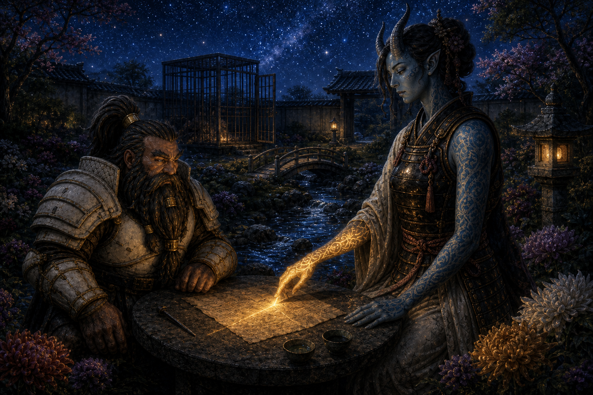

# Session Fifteen: Second Reckoning

**Date:** September 3, 2026

*Chapter 15. Da Baishan, closing the session with the campaign's most accurate status report: "How do we start with Kurosawa and that inescapable cliffhanger situation — and end with a worse inescapable situation?" (Vic, dear reader, was on a cruise. His character not only walked into the dream-realm nightmare — he paid for the potion.)*

*(Note: David was out; Braedon ran Donkey. Vic remains at sea; Littlefinger tagged along as the party's silent, load-bearing wallet.)*

---

## Overview

The standoff in Dew Drop Petals ended not with the Rite of Open Reckoning but with a surrender — and a twist waiting outside the door: **[Magistrate Atsura](../wiki/npcs/atsura.md)**, a blue tiefling oni of the **[Mirror Tribunal](../wiki/factions/council-of-the-magi.md#the-mirror-tribunal)** (the Council of the Magi's internal affairs), here to investigate [Kurosawa](../wiki/npcs/magistrate-kurosawa.md) himself. [Boone](../wiki/pcs/boone.md) charmed her, the evidence convinced her, and within hours she had unlocked the party's cage on her own legal reading of their sentence.

Free to move within Willowshore, the party chased the cure: [Mido](../wiki/npcs/mido.md) named the town spirit — **[Old Amber](../wiki/npcs/old-amber.md)**, the golden koi of the rivers — and the road to reach it: a deep-sleep brew of nightshade and poppy, and a journey through the **[Land of Dreams](../wiki/locations/land-of-dreams.md)**. [Donkey](../wiki/pcs/donkey.md) and [Littlefinger](../wiki/pcs/littlefinger.md) drank, went under in [Willow's](../wiki/npcs/radiant-willow.md) back room — and found five tethered lanterns in the dream-dark, a whisper (*"you must tear the veil"*), and, descending out of the blackness above them, the **Mother of a Thousand Wings**. Session over.

---

## Key Events

### The Surrender Negotiation

Kurosawa sat in Willow's salon chair, waiting for his answer. Ginkgo opened with exhausted honesty (*"We're all on the same side... enough is enough"*) and got the coldest reading of the man to date:

- **He admitted his real posture out loud.** *"I don't care about the people of Willowshore. I don't care what happens to them... It has been very convenient to use their pliable minds and spirits to keep yourselves at bay."* His goal: *"a transformation of this place as a starting point"* — for **"my personal vision."** He also admitted the party's work has left him **damage control**: the Gosembiki rift, the broken Seven Cedars ley line — things he must now *"recorrect"*
- **Da Baishan's Diplomacy 31** landed the pivot: *we'll all be held accountable at the end of this affair — but let's not get in each other's way in the meantime.* Kurosawa paused... and countered: then surrender *"as a gesture of good faith,"* since the town fears five convicted villains walking loose
- The GM re-confirmed the mystery's shape for the table: **two signatures** run through everything — Kurosawa's orderly geomancy, and a second **chaotic, frenzied hand** (the mustard moth-powder, the frantic erasure) that Kurosawa himself is investigating. And **[Masru](../wiki/npcs/mayor-masru.md) was hand-picked** by Kurosawa — not randomly
- The party played it smart before walking out: the **half plum stayed hidden with [Willow](../wiki/npcs/radiant-willow.md)**, and Littlefinger stealthed the **seven cursed nails** somewhere on his person (Stealth +9; the GM didn't ask further questions). [Ginkgo](../wiki/pcs/ginkgo.md) kept a **Message** line open for Mido — no answer; out of range

### The Woman at the Door

Kurosawa opened the salon door onto three red-skinned guards — and a fourth figure who was not in his script:

- **Boone (Perception 22) caught the beat**: when Kurosawa's eyes met the small blue tiefling woman, there was a flash of *surprise* — not fear, but visible **recalculation** — before the mask came back: *"Magistrate Atsura. I wasn't told you arrived in Willowshore."* Her entire reply: *"No. You weren't."*
- **Donkey (Perception 19) read her tattoos**: full arm sleeves, several of them **arcane** — and none offensive. Warding, abjuration, scrying: *protective and investigative* magic, unique among every oni they've seen
- **Boone (lore, 19) placed the "Mirror Tribunal"** from her credentials: the Council of the Magi's **internal affairs**, last seen (by him, in the war) descending on arcane misconduct. They do not wander aimlessly — *and Kurosawa knows it*
- Boone attempted to *"psychically convey that we may be on the same side"* via meaningful eye contact (Performance). She noticed, smirked, and shook her head — *"Are you flirting with her?"* — *"Even I don't know"*

### The Cage in the Courtyard

The party was marched north into the Yeshou estate grounds — into a purpose-built **lion cage** in the ornamental courtyard, dirt-and-straw floor, two guards posted, running brook for ambiance:

> *"There will be no invisible walls now for you to hide, or secret passages to adventure in."*

- Da Baishan, calling after him: *"Kurosawa — how long are we to suffer this indignity before we have our audience?"* — *"Audience? You've already been **convicted** of crimes, don't you remember?"* — *"That was a different party of adventurers that looked exactly like us"*
- From the cage, the party watched Atsura and Kurosawa walk to the estate — him asking rapid questions, her answering *"I'll tell you when I've learned enough. I have an investigation to do"* — past [Masru](../wiki/npcs/mayor-masru.md) breakfasting on the porch while [Meilin](../wiki/npcs/meilin.md) served him; the mayor straightened up and hurried inside like a man who suddenly remembered having work

### Atsura's Interview

Within the hour she returned **alone** and laid out her charter: sent by the **Council of the Magi decree** to investigate the *"disturbing echoes and reverberations"* from the area, armed with *"the full authority of the Council of the Magi and the Mirror Tribunal."*

- She was blunt about the law: the Rite of Open Reckoning was **legitimate** — *"leave it to Kurosawa to know all the laws that are currently on the books"* (the rite was last used in the **Lung Wa Dynasty**) — and the guilty verdict stands
- She was equally blunt about her purpose: *"I'm giving you an opportunity to tell me what is your truth"* — but *"I will need evidence... It can't be based on my eyes"*
- **Da Baishan put her on the stand first**: Kurosawa told us to our faces he doesn't care about these people — *do you share his views?* Her answer, carefully honest: she's been here two days, she can't claim to be *for* Willowshore — but her verdict is meant to *"eliminate the evils happening here"* and she hopes to leave the land, people, and spirits **back in balance**
- His second thrust was sharper: even a cursory investigation shows *none of us* can work geomancy — *"the only person in this town who has that kind of arcane knowledge and ability is not in a cage"*
- A crucial legal detail surfaced: another Open Reckoning can only be called by someone **in the municipality's service** — and the party still holds their **deputization from Mayor Masru** ("Masru's Faithful Five"), known only to them and the mayor. The judge plan lives

### Honest Eyes — Boone's Private Hearing

Boone asked to speak privately; she weighed taking all five and settled on **just him** — unlocked the cage herself (*"Keys."*) and led him to a small garden table by the koi ponds:

- Boone's opener, for the record: *"Is your boyfriend also a magistrate?"* (Ginkgo, from the cage: *"Smooth."*) She chuckled: no boyfriend — long travels, long hours, demanding road
- He walked her through the campaign's case file: the **signed device-commission note** in Kurosawa's hand (*"the first device has awakened, the second starved"*), the site the party watched collapse, the **cursed copper nail**, and the memory-curse twisting the town's testimony against them
- **Her tattoo shimmered** — a light tracing across the parchment — and she studied the nail intently. Verdict: *"There seems to be no arcane or illusionary script that you may have fabricated this document. I believe it's authentic... What you said and what this evidence shows seems to align directly"*
- Then the confession of purpose: her office **polices the Council's own** — *"there's been evidence that Kurosawa may be doing just that"* — and the party's evidence is *"further proof that he has been planning something for a while"*
- She stood, looked at him, and gave the session its line: **"You have honest eyes. I believe you're telling the truth here"**

### Free Within the Borders

Back at the cage, she asked the arcane-minded whether the curse could be lifted *from within the city borders*. Da Baishan: *"More likely than from within this cage."* She agreed — out loud, as a ruling:

> *"They are confined to the borders of Willowshore. That is what they were convicted of. And they will honor that. And you will honor my ruling as well."*

- The padlock opened. The guards looked at each other. The party walked
- **Kurosawa burst out of the estate yelling** — and stopped mid-stride when Atsura raised her hand. A brief, quiet exchange; he composed himself; he went back inside. The party flipped him every gesture they collectively knew (*"she notices as well"*)
- Boone risked one last **smolder** on the way out (Performance 13 — *"13's not bad"*): she smiled, and **winked**. *"Boone is walking away on clouds"*
- Willow skipped over the moment they crossed back into town — *"You're free! What happened?"* — admired Atsura's tattoos and dress (*"maybe one day she'll visit the salon and I can do up her horns"*), and put the offer on permanent record: a full makeover for Boone, on the house — *"You will look irresistible"*

### Old Amber, the Town Spirit

At the Silver Mist Inn, [Mido](../wiki/npcs/mido.md) — surprised again, and declaring she should *stop* being surprised by this group — gave them the spirit lore (with Donkey's Willowshore Lore 29 filling the old details):

- The spirit of Willowshore is really the **river spirit**: **[Old Amber](../wiki/npcs/old-amber.md)**, said by those who saw it to look like an old **amber-gold koi**. The protective spirit of the town since its founding
- The old customs: **rice and offerings put into the water** on full moons, festival nights, and the turning of seasons. The spirit answered, once — but tributes faded, fishing died off, crops thinned, and *"most of us believe that Old Amber has abandoned us"*
- **The timeline matters**: the spirit went quiet a few seasons — a couple of *years* — ago... **before the oni came to town**, and probably just before [Cassian Voss](../wiki/npcs/cassian-voss.md) arrived. Whatever silenced Old Amber predates every villain the party has met
- The road to it: *"Where the veil is thinnest is in the deepest sleep."* A slumber deep enough to reach the **[Land of Dreams](../wiki/locations/land-of-dreams.md)** — where nightmares, she noted conversationally, *are actual things*
- Her farewell hit the table harder than she meant it to: she has no more gifts to give — only gratitude *"beyond the words I can say"* for a group with no ties here spending themselves on her town over and over

### Nine Gold Pieces of Nightshade

The recipe (Boone's medical memory, Society 27 via Donkey): a brew of **nightshade** — *"which brings about the dreams"* — and **blessing of the poppy**, which drops the drinker into a near-unwakeable sleep. Deadly if mishandled. The party's collective response: *"We have a cleric and a medic. What could go wrong?"*

- The supplier: **[Luda](../wiki/npcs/luda.md)** — who met Donkey at her door with a scowl and an outstanding balance: *"I think you still owe me seven gold pieces."* (It might really have been four. She was standing at seven.) Donkey paid from his last fifteen
- Three doses: **nine gold**. The party's combined liquidity crisis (Da Baishan: 8gp; Boone: 3; Ginkgo: 28 total) was solved by the discovery that **Littlefinger was sitting on 35 gold pieces** of pickpocketing proceeds. *"Why do we have a thief? We've got 35 gold pieces!"* — the whole party turned and looked at him at once. Littlefinger paid
- Littlefinger then **stole 6 gold back** out of Luda's pouch while she talked (the GM rolled a 20 for him — 29 total). Net party cost of the entire operation: **three gold**
- Luda pressed the cut leaves and dark blue-purple petals into Donkey's hands with a blessing only she could deliver: *"Thank you, my old friend — and I hope you have powerful dreams"*

### The Brew and the Going-Under

One stop first: back to the estate courtyard, where **Atsura sat reading at the same garden table**. *"Surely the curse isn't lifted that quickly? Then I need to travel more often with this group."* They asked for a few undisturbed hours; she agreed to keep Kurosawa busy — *"he and I have a few things to discuss anyway."* (Da Baishan, still Da Baishan, kept the ritual's location vague. Boone: *"Boone trusts her completely."*)

- The venue: **Willow's back rooms** at Dew Drop Petals — incense, calming music, massage beds, the safest-feeling room in a town that hates them (Da Baishan: *"Ginkgo's been trying to get into Willow's back rooms for a while now"*)
- **Boone and Ginkgo brewed it together** — Medicine +10 and Nature +11, rolled **30 and 31** with Guidance, careful measuring, double-checks — producing three tiny syringe-sized vials of dark, bluish-black liquid at exactly the right viscosity and potency
- Casting decisions: **Donkey** (knows the land, closest to the spirit) and **Littlefinger** (*"he won't object"* — Vic being on a cruise) would go under; **Da Baishan stayed awake** as armed insurance with the third dose in reserve; **Boone and Ginkgo** monitored the sleepers
- The comms test worked: Ginkgo's **Message** reached into the dream — faint, far away, and on Donkey's end *"like the voice of God, with a little giggle."* Physical contact did not: Ginkgo squeezed Donkey's hand, poked his ear, and picked his nose. Nothing. *"Good to know"*

### The Land of Dreams

The two sleepers woke standing on **something like glass over deep water** — each step rippling outward — above (and below) a dark, warped **painting of Willowshore**, folded over itself like the city in *Inception*, lit by a sourceless purple glow. No north. No gravity worth the name:

- Donkey called out: *"Spirit of Willowshore, we seek your aid"* — and the words **echoed back in the town's voices**: his own, Willow's, Kurosawa's, Luda's, Mido's, from every direction at once
- Five **orange lantern-lights** kindled in the distance, one after another, floating as if on water. Donkey — genre-savvy to his ancient bones — *refused to walk toward them* (*"this feels like a trap"*) and called out again (Diplomacy 22)
- A new voice answered — soft, a whisper, *not* one of the echoes:

> *"You must tear the veil. The veil must be broken."*

- **The veil.** Donkey's Arcana (22) dredged it up: the word is from **Willow's ceremonial dance at the Festival of Returning Spirits** — the play about the founders' fragile bargain — performed the night a moth swarm destroyed **five front lanterns**. The dream was restaging the town's own founding pageant
- The lanterns drew closer: five real lanterns now, each trailing a **filament tether** up into the darkness. Donkey approached one — it drifted *away* from his reach — and then he looked up
- **Two fly-like eyes. Wings unfolding downward. A moth-creature made of thousands of moths** tore down out of the blackness, tethered to all five lanterns: the **Mother of a Thousand Wings** — *the Unspeakable One* — whose moth-wing residue the party has been finding since the Mourndusk Willow bowl
- Da Baishan, from the waking world, with feeling: *"I'm so glad I stayed in the real world"*
- **Session ended there.** Two party members asleep and face-to-face with the campaign's demon, in a realm where nightmares are actual things

---

## Memorable Moments

- **"That was a different party of adventurers that looked exactly like us"** — Da Baishan's legal defense strategy, in response to *"you've already been convicted"*
- **"No. You weren't."** — Atsura's complete response to Kurosawa's *"I wasn't told you arrived"*; the coldest four syllables of the campaign
- **The Zoolander gambit** — Boone attempting to *"psychically convey that we may be on the same side"* through sheer eye contact (*"Blue Steel, maybe"*), getting a smirk and a confused headshake for his trouble — then landing the actual **smolder and wink** two hours later. *"He is just shot through the heart. Boone is walking away on clouds"*
- **"Is your boyfriend also a magistrate?"** — Boone, opening a formal evidentiary review with the Mirror Tribunal. (Ginkgo: *"Smooth."*)
- **"Why do we have a thief? We've got 35 gold pieces!"** — the party discovering Littlefinger's pickpocketing endowment, unanimously electing him treasurer while he couldn't object, and Da Baishan keeping a hand on his shoulder so he wouldn't steal the herb money back. He stole 6 gold back anyway
- **"The counts are settled"** — Luda, pocketing seven gold of Donkey's dubious four-gold debt
- **"What could go wrong?"** — Ginkgo, on brewing lethal nightshade; followed shortly by the table workshopping the delivery method: *"Do we heat it over a spoon with a lighter?"* — *"Ginkgo can't find a vein"*
- **"You're never too old for Donkey"** — Braedon trying to matchmake Mido and Donkey mid-farewell, prompting a table-wide actuarial analysis of whether an ancient elf and an ancient matriarch are age-appropriate
- **Ginkgo's bedside manner** — testing the dream-link by squeezing the sleeping Donkey's hand, then escalating directly to picking his nose and poking his ear. For science
- **"I'm so glad I stayed in the real world"** — Da Baishan, watching the Mother of a Thousand Wings unfold over his sleeping friends
- **"Not only did you do it, Vic — you also paid for it"** — the table, composing the incident report for the absent Littlefinger, who woke up (on a cruise ship) inside a nightmare he funded

---

## Discoveries

### Lore Learned

- **The [Mirror Tribunal](../wiki/factions/council-of-the-magi.md#the-mirror-tribunal)** — the Council of the Magi's internal affairs, which polices magistrates who abuse their station. [Atsura](../wiki/npcs/atsura.md) carries its full authority, and there was already evidence against Kurosawa before she arrived
- **Kurosawa said the quiet part aloud**: he doesn't care about Willowshore or its people; the town is raw material for *"my personal vision"* — and he now has *damage control* to do on the rift and the broken ley line
- **The Rite of Open Reckoning** was last used in the **Lung Wa Dynasty**; only someone in the municipality's service can call one — which the party can, via their still-secret **deputization from Masru**
- **[Old Amber](../wiki/npcs/old-amber.md)** — Willowshore's protective spirit is the river spirit: an old amber-gold koi, once fed rice on full moons and festival nights, silent for ~two years. The silence **predates the oni and roughly coincides with Cassian Voss's visit**
- **The [Land of Dreams](../wiki/locations/land-of-dreams.md)** — the spirit realm is reached *"where the veil is thinnest: in the deepest sleep"*; a nightshade-and-poppy brew gets you there; nightmares there are real
- **"You must tear the veil"** — the dream-whisper's instruction, echoing the veil from Willow's festival dance; five tethered lanterns in the dream mirror the five lanterns the moths destroyed at the festival
- **The Mother of a Thousand Wings is *in* the Land of Dreams** — tethered to the five lanterns. The moth wings in the Mourndusk Willow bowl, the mustard powder, the festival swarm: the campaign's pestilence-demon thread now has an address

### Items and Resources

| Item | Holder | Detail |
|---|---|---|
| **Deep-sleep concoction (1 dose remains)** | Da Baishan | Third vial held in reserve; two consumed by Donkey and Littlefinger |
| **Half the Grandmother's seed** ("the plum") | Hidden with Willow | Safely stashed before the surrender; retrieved for the ritual |
| **Seven cursed copper nails** | Littlefinger | Stealthed on his person through captivity; one shown to Atsura as evidence |
| **~32 gold pieces** | Littlefinger | Paid 9gp for the herbs, stole 6gp back; the party's involuntary treasury |

### Character Notes

- **Level 4**: Da Baishan took **Sow Rumor** — *"I can start to sow rumors about Kurosawa throughout the town"* — earmarked for the pre-Reckoning ground game. Ginkgo (still level 3) will level up with the GM's help before next session; Oded is weighing options to make combat feel less helpless

---

## Open Threads

### Active Mysteries

- **The Mother of a Thousand Wings is right there.** Tethered to five lanterns, in a dream, over the party's two sleepers. Fight? Flee? Wake up? *Can* they wake up?
- **What does "tear the veil" mean** — and who was the whisperer? (Old Amber? Something else?) Is tearing the veil how you free the spirit — or how you finish what the second hand started?
- **What silenced Old Amber two years ago?** Before the oni. Around Voss's arrival. The chaotic second signature keeps predating everything
- **What will Atsura's verdict be** — and what happens when a Mirror Tribunal magistrate rules against a Council magistrate in a town with one working jail cage?
- **The name discrepancy**: Mido's network said *Otsuru*; she says *Atsura*. Sloppy intel, or something to it?
- **Kurosawa's "few hours" with Atsura** — she's keeping him busy, but he knows exactly why she's here. What does *he* do about internal affairs?

### Promises and Debts

- The party promised Kurosawa (via Da Baishan's diplomacy): **everyone will be held accountable at the end of this affair** — *"you have my word on that"*
- Atsura's ruling stands on the party's honor: **confined to Willowshore's borders**, no cage — *"they will honor that"*
- Willow owes Boone a **full makeover** (*"head to toe... you will look irresistible"*) — and wants a crack at Atsura's horns
- Kurosawa's canceled **daily stipend** — Da Baishan is keeping a tab: *"That'll come back around when we put him in jail. With interest"*

### Next Steps

1. **Survive the dream.** Donkey and Littlefinger vs. the Mother of a Thousand Wings; Da Baishan holds the third dose and can join if needed; Ginkgo has a working Message line into the dream
2. **Reach Old Amber** and offer the half plum to cleanse the town — presumably on the far side of the veil
3. **Feed Atsura's investigation** — more evidence, and possibly Willow's testimony about Kurosawa's *"I don't care about the people"* speech
4. **The Reckoning ground game** — Sow Rumor, the mayor's deputization, and Boone's judge seat are all loaded and waiting
5. **Scheduling**: Oded out next week; Vic back Tuesday; the GM traveling the 22nd–24th

---

## Timeline

| Time | Event |
|---|---|
| Day 4, midday | The salon negotiation: Kurosawa's *"personal vision"* speech; Da Baishan's Diplomacy 31; the party hides the plum with Willow and surrenders |
| Day 4, afternoon | **Atsura revealed** at the salon door — Kurosawa visibly surprised; the party caged in the estate courtyard |
| Day 4, afternoon | Atsura interviews the party; **Boone's private hearing** — evidence authenticated (*"you have honest eyes"*); the party **freed within town borders**; Kurosawa overruled with a raised hand |
| Day 4, afternoon | [Mido](../wiki/npcs/mido.md) names **Old Amber** and the Land of Dreams route; [Luda](../wiki/npcs/luda.md) sells three doses of nightshade and poppy (Littlefinger pays; Littlefinger partially un-pays) |
| Day 4, evening | Atsura agrees to occupy Kurosawa; **Boone and Ginkgo brew the concoction** (30/31) in Willow's back rooms; Donkey and Littlefinger go under |
| Day 4, night | **The Land of Dreams**: the mirrored painted town, the echoing voices, *"you must tear the veil,"* five tethered lanterns — and the **Mother of a Thousand Wings** descends. **Session ends** |

---

## The Scene

### Honest Eyes

She said *"Keys,"* and held out her hand, and the guard — a red-skinned wall of lacquered armor twice her size — hesitated for exactly as long as it took her to not repeat herself. The padlock came off. The cage door swung. And Boone Vestri, veteran of a war nobody won, dwarf of the Vestri clan whose motto was *endurance*, stepped out into a courtyard that smelled of running water and chrysanthemums, and followed a blue-skinned magistrate half his width and twice his height down a path between koi ponds. She chose a small garden table with four stone stools, sat, and folded her tattooed hands upon it, and the brook trickled, and somewhere sixty feet behind him Boone could feel four sets of party eyes pressed against the cage bars like children at a sweetshop window. *"So,"* said [Magistrate Atsura](../wiki/npcs/atsura.md) of the Mirror Tribunal, investigator of investigators, the woman who had made [Kurosawa](../wiki/npcs/magistrate-kurosawa.md) flinch. *"I'm very interested in what you have to say."* Boone sat down across from her, looked into her face with the frank, unhurried directness of a man who had rehearsed nothing, and said: *"Is your boyfriend also a magistrate?"*

From the cage, faintly, came the sound of a mushroom saying *"smooth."* But she laughed — a real one, quick and surprised out of her — and said no, no boyfriend; the travels were long and the hours were longer and the road she walked was a demanding one, and something in the way she said it made it a fact shared rather than a door closed. Then Boone did the thing that no one who watched him charge a werewolf would have predicted: he laid out a case like a scholar. The parchment with the device commission, signed in the magistrate's own hand — *the first device has awakened.* The copper nail, dark and wrong, that had drunk a stranger's grief. The town's twisted memories, the trials built on them, the ruin at Gosembiki that no dwarf with a polearm could have engineered. He talked her through all of it, plainly, without ornament — and she listened the way he imagined the Tribunal itself must listen, which is to say completely. When she took the parchment, one of the tattoos on her forearm *woke*: a thread of light slid off her skin and traced the page edge to edge like a finger reading a ledger. She studied the nail a long, intent moment. Then she set both down. *"There is no illusionary script here. You did not fabricate this. I believe it's authentic — and what you've said and what this evidence shows align directly."*

She told him then, quietly, in the voice of a woman laying her own card faceup, what her office existed to do — to police the Council's own, the magi who bent their station into something the credo would not recognize — and that there was already a file with Kurosawa's name on it before she ever crossed the town bridge. Then she stood, and Boone stood with her, and for a moment she simply looked at him, this rare dwarf from the far side of the world with his war behind him and his beard un-braided, and delivered the only verdict that mattered that day: *"You have honest eyes. I believe you're telling the truth here."* They walked back along the ponds toward the cage — toward the ruling that would open it, toward Kurosawa's shout and her one raised hand — and at the edge of it all Boone glanced back and gave her the smolder, the full one, the one he'd been saving since the salon door. She smiled. And then — courtly, deliberate, unmistakable — she winked, and turned away, and left the toughest fighter in Willowshore standing in a garden with his heart going like a forge bellows, walking on clouds all the way back to prison.
