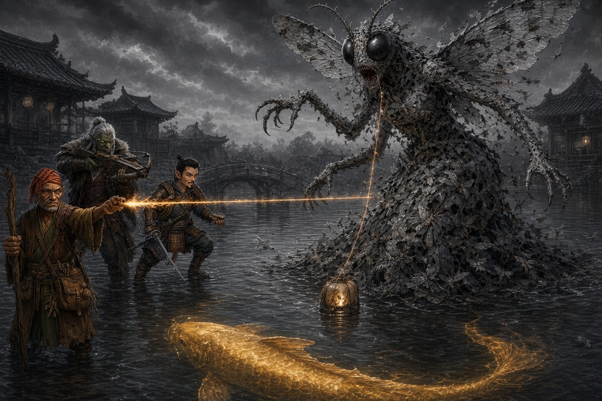

# Session Sixteen: Tear the Veil

**Date:** September 17, 2026

*Chapter 16. In which the party wins — actually, verifiably wins — for the first time since the warehouse fire, and Braedon speaks for the whole table twenty minutes before the end: "I was coming into this like, hey, he's probably not the cause of all this. And then Vic started grilling him, and now I'm changing my tune."*

*(Note: Vic and David were both back. Oded was out; Ginkgo stood watch in Willow's back room and the table cast his heals for him.)*

---

## Overview

The dream-fight opened where the last one froze: [Donkey](../wiki/pcs/donkey.md) and [Littlefinger](../wiki/pcs/littlefinger.md) under the descending **Mother of a Thousand Wings** — and Donkey's Arcana read the room in one glance: the five lanterns were the anchor-points of an **imprisonment ward**, the moth-thing was its **warden**, and the golden koi swimming in the water beneath them was **[Old Amber](../wiki/npcs/old-amber.md)**, the town spirit, caged in its own dream. The party never landed a meaningful blow on the demon. They didn't need to. Littlefinger's rapier, [Da Baishan's](../wiki/pcs/da-baishan.md) crossbow (twice!), and Donkey's natural-20 Ignition cut all five tethers, the ward collapsed, the moth-warden dissolved into shadow, and Old Amber rose out of the water to eat the Grandmother's plum and **lift the memory curse from all of Willowshore**.

The waking world turned to color at once: the river quickened, fish leapt into nets, reeds bloomed, [Yong](../wiki/npcs/yong.md) and [Hong](../wiki/npcs/hong.md) embraced in the street, and [Willow](../wiki/npcs/radiant-willow.md) named the party the town's saviors to [Kurosawa's](../wiki/npcs/magistrate-kurosawa.md) face. Then [Mayor Masru](../wiki/npcs/mayor-masru.md) apologized and produced **Kurosawa's handwritten script for the first trial's verdict**, [Atsura](../wiki/npcs/atsura.md) announced her investigation was *"nearly complete"* and offered the party a choice — her verdict now, or their Second Reckoning first — and Old Amber's parting warning sent the party to the Silver Mist Inn to ask [Mido](../wiki/npcs/mido.md) about the **older, colder second curse** that *"smiles from behind a door."* Session ended with Littlefinger grilling [Cheng the Smiling One](../wiki/npcs/the-smiling-one.md) about mustard moth-wing powder — and Mido, not Cheng, being the one in the room who looked nervous.

---

## Key Events

### The Prison of Five Lanterns

Donkey's **Arcana 24** decoded the dreamscape before initiative was rolled:

- The area inside the five lanterns was different from the glass the party walked on: it looked *down*, like a pond or aquarium, rippling with real depth — and swimming beneath the surface was a **large golden-copper koi**. Old Amber, exactly as Mido described
- Only Donkey could see the **arcane arcs drawn between the lanterns**: an **imprisonment spell cast in the dream world** — a ritual or powerful magic, origin unknown — with each lantern an anchor-line of the prison and of the ward that contained the koi
- The Mother of a Thousand Wings was **the guard**: *"a defender of this space,"* leashed by the same five gossamer filaments to the lanterns it protected
- Donkey's first thought was the right one: *"It sounds like we need to destroy the lanterns."* Littlefinger, remembering last session's whisper, refined it: **cut the tethers**. *"We shouldn't even get involved with the moth... focus on whatever tear the veil is"*
- Boone offered the third dose: *"Do y'all need a third person?"* Da Baishan volunteered instantly; Boone monitored him under (Medicine): breathing slowed to a barely-visible rise, a mirror under the nose to be sure

### The Fight for the Tethers

Initiative: Donkey 22, Littlefinger 14, Da Baishan 24 (arriving one round late after a full-speed run across the dark):

- **Round one.** The moth clawed Littlefinger (20 vs. AC 20 — *"I guess that's a hit"*) for **12 slashing**, then mouthed a spell in **Draconic** at Donkey. Will save 18 — failed. David narrated the vision himself: *"As the creature slashes him, the wound starts to turn yellow, turns into moths, and he gets absorbed into the creature."* **12 mental damage and frightened 1** — Donkey watched his friend die. In the waking world, Boone saw a fresh gash open across the sleeping Littlefinger and **Donkey's heart stop for a second or two**
- Donkey answered with **Sleep** on a nightmare (DC 20 — the moth rolled 35, critical success), then fled to a lantern. Littlefinger tested the theory: ran 25 feet, swung his rapier through a filament (22) — *"you feel a resistance... when it gets through, it cuts"* — the golden line faded, **the lantern went out**, a few moths on the creature turned to shadow, and the koi rose closer to the surface. **One down**
- **Round two.** The moth, moving *"more fluid"* now, streaked at Littlefinger: 30 (9 damage) and 18 (miss — *"it hits me so hard it knocks me out of range of the second shot, and I'm laying there contemplating my life choices"*). Donkey's Ignition missed a thread; his bare-handed grab found only *"a taut rope"* that vibrated and held. Littlefinger frayed a second tether (6 damage) and ran under the moth's wing to safety
- **Da Baishan arrived** and did the investigator thing: **Devise a Stratagem → Skill Stratagem → Perception** to work out *why nobody was attacking the monster*. The GM's answer defined the fight: the veil is the ward; **each cut tether frees Old Amber a little more — and loosens the creature's leash just as much**. Divine Lance missed (13). Then, for the first time since Chapter Seven: **crossbow, 23, hit, 8 damage — tether severed, second lantern out.** *"You've got one, I've got one. We're even. I don't want to hear anything about my crossbow anymore"*
- Water spread across the glass like mist; the sound of a real river came up from nowhere; **Old Amber's dorsal fin breached**. The moth **shrieked** — Will saves — Donkey held, Littlefinger and Da Baishan failed: **11 mental damage and stupefied 2** each (*"I wasn't feeling very willful"*). The GM's regret: *"I was hoping Donkey would also be stupefied. Nope, he can still cast his spells"*
- The moth hunkered low over the strongest remaining lantern, body shielding the thread

### Field Medicine Across the Veil

From the massage bed in Willow's back room, [Boone](../wiki/pcs/boone.md) tried **Battle Medicine** on the sleeping Littlefinger — a 20, a failure — until Vic read his new Level 4 feat aloud: **Robust Health** grants a circumstance bonus equal to his level when someone uses Battle Medicine on him. 20 + 4 = **22, success**. The GM ruled only *physical* damage could be treated from outside the dream: **12 HP back**, the exact slashing he'd taken. Littlefinger, feeling the aches vanish in the dreamland: *"It seemed like a very handy skill."* Boone, per the GM, administered it *"from the cozy confines, drinking cucumber water."*

### Bug Zapper

- Donkey — *"I don't know why I didn't think of this at first, considering it's a bunch of moths"* — cast **Dizzying Colors** (DC 20). The moth **critically failed** (18): **stunned 1, blinded one round, dazzled one minute**. Da Baishan: *"The bug zapper."* Braedon, watching the GM juggle three conditions: *"I love this. Gary's getting a taste of what he does to us"*
- Donkey punched the nearest thread again — it *"reverberates and gives you a nice C-major tone, but nothing else happens"*
- Littlefinger repeated the run-slash on the frayed tether — **25, 5 damage — third lantern out**; Old Amber's fin *and tail* splashed through the center; the creature was riddled with *"ghostly holes."* Then he spun his **sling** and put a flat river stone through Donkey's stubborn thread (23) — tattered but hanging. *"I've set you up. Finish the job"*
- **Da Baishan: crossbow hit, two in a row** — *"it's not a roll, he's impressing"* — **fourth lantern out**. Reload. Third shot 14 — struck the *moth* for 8 instead. *"Even when I miss, Littlefinger's still effective. Kind of"*
- The stunned, blinded warden, out of actions and options, **hunkered down over the last lit lantern**

### The Dam Breaks

Donkey aimed **Ignition** at the gap in the swarm covering the last thread — and rolled a **natural 20** (30 total):

> *"The thread lights on fire, streaks across, the last lantern goes out. Another part of the creature turns black, and the rest of it just starts to turn black and fade away as it turns into nothing. It's like the dam busts."*

Water poured across the dreamscape. Old Amber swam free and came up out of the water to the three dreamers, speaking in an old voice (*"Jimmy Stewart, a little bit"*):

> *"I thank you. You've broken the veil, and I am now free to journey and protect the town that I've been entrusted with."*

Then the warning that ended one mystery and opened the next — **two curses**, not one:

> *"There's a curse over the town. There's two. One has been developed and infects the minds of my people. The other is darker — runs beneath this current one. Older, colder. It wasn't part of the first. It moves the way grief moves through a family that stops speaking of it. Quiet in the day. Patient. It has learned to keep a door for itself, and to smile from behind it."*

The table caught *smile* instantly. Da Baishan: *"There is someone who smiles when they have no reason to, right?"* Vic: *"Thought he died."* GM: *"He didn't die. It's the Smiling One... he's in the family."*

### The Plum and the Cure

Da Baishan told Old Amber they held half the Grandmother's seed and a plan for the newer curse — but could only save one person without the spirit's help. Old Amber: *"Can I consume the plum?"* Donkey: *"Sure, bud."*

- The koi ate it as Willow had. The dreamscape — *"dark black and white, Sin City style"* — **bled into color** and began to evaporate. *"I will not forget what you've done for this area."* The dreamers floated *up* as the dream dissipated
- **In Willow's back room**: a sinking, draining pulse of energy — and then, outside, **the whole town changed**. Townsfolk stared at one another and *talked differently*. They **remember everything** — Yong and Hong remember the argument — but their *feelings* about it are transformed: *"a new awakening — why were they feeling that way?"* They understood immediately that they had been enchanted
- The **river accelerated**, as if spiritually dragging the curse downstream to nothing. Fishermen shouted as **fish leapt into nets**; the water brightened; **the reeds at the shoreline bloomed**. *"A painting that has gone from dark to light — like turning a page"*
- The town began saying it out loud: Old Amber has blessed them; the river spirit's favor is won; the dire days are over
- **The Seven Cedars memory curse on Willowshore is lifted.** Willow was already cured; now everyone is

### Waking Up

The three came out of the coma-sleep drained, and **the dream's wounds came with them** — physical and mental — though now, bodies reunited with minds, all of it could be healed:

- Boone threw **cucumber water in Da Baishan's face**. *"Baishan, can you hear me?"* — *"Hey, Boone, I think we'll need more than cucumber water. That was not a very pleasant dream"*
- Ginkgo's Heal: 9 to Donkey. Boone's Treat Wounds: 11 to Littlefinger (37/46), 10 to Da Baishan. A rules summit followed: Battle Medicine and Treat Wounds have separate cooldowns, the clock is on the *recipient*, and Robust Health cuts Battle Medicine immunity to one hour. Da Baishan remembered mid-conversation that he's trained in Medicine and owns a healer's kit. Everyone can heal except Donkey — *"so you could be receiving everybody's healing"*
- Littlefinger has no healer's kit — which explains the treasury: *"The reason I have so much money is the two times you guys have gone shopping are the sessions I missed"*

### The Sun on the Flowers

Out the salon door, Willowshore was *loud* — excited, confused, animated — and Yong and Hong stood **embracing** where they had been screaming at each other the day before. From the estate walked **Masru, Atsura, and Kurosawa**, three abreast:

- **Willow skipped to the party** — *"You did it! You guys did it! You're amazing!"* — and **hugged Ginkgo first**, then everyone. Then she pranced to Atsura and hugged *her* (surprised; didn't push her off; smirked). Then she turned to Kurosawa, made as if to embrace him — **and stopped**, and just smiled: *"It seems the sun is shining on the flowers again here in Willowshore. We are a happy community again. And you can thank"* — a gesture at the party — *"the so-called fugitives for saving our town. Again"*
- **Kurosawa** seized on one word: *"Obviously the right word was uttered. Fugitives. They are continuing to mess with forces beyond their understanding. While this excursion may have ended in a positive outcome, we've all experienced the dark side of their meddling... that group of five is an evil, dark part of Willowshore and have been since their arrival. And we have yet the laws to uphold here."* To Masru: *"They have been found convicted. Why are they free to roam about our city?"*
- **Atsura** answered before the mayor could: *"They haven't broken any of the rulings cast down on them from the Rite of Open Reckoning. They haven't left the city limits and they will not. They are abiding by the ruling."* Donkey, under his breath: *"For now"*
- Nobody was apprehended. Townsfolk came to thank them. **Yong** made his apology in person: *"I'm sorry that I wasn't brave enough, or didn't understand enough, to raise my hand in your defense. I regret that now... I wasn't in my normal state of mind."* Kurosawa, **fuming**, turned and walked back to the estate alone

### The Mayor's Confession

Masru stepped up and spoke before Atsura could:

> *"I also owe you an apology. Kurosawa has been affecting and manipulating a lot of the players here — not just the townsfolk, but myself included."*

- He pulled a small parchment from his pouch: **Kurosawa's handwriting**, and on it **what Masru was supposed to say and the verdict he was supposed to give** at the first Rite of Open Reckoning. The fix was in, and the judge had kept the script
- He started to put it away. Da Baishan: *"Littlefinger, you should steal the shit out of that."* Donkey: *"We have licenses from the mayor to investigate. I think we can just seize it."* Da Baishan (*"I've got a plus nine expert in Diplomacy"*) tried asking instead — the digital sheet labeled the roll **"Attack: Request"** (*"You attacked this request with gusto"*): **19**
- Masru handed it over — looking at Atsura as he did: *"If it'll help clear the wrongs that I've been a part of... if it allows me to get favor with the Magi and possibly get back to Kirahata and my established business, I'm happy to hand it over. I kept it because I thought I might need it for my own defense"*
- **Da Baishan's Sow Rumor debuted**: whispered into the crowd — *anyone willing to speak out against Kurosawa will be rewarded handsomely by the Magi for enforcing justice*. The GM rolled a secret Deception against a secret DC; results take hours. (David: *"I think more rolls should be hidden from the players."* Gary: *"We can do that again if you want"*)

### Atsura's Offer

The Tribunal magistrate had watched Masru's paper change hands. Her response, after a muttered aside about *"5,000 gold pieces"* the table never got explained:

> *"I think my investigation here is nearly complete. I have found all the evidence I believe I need to cast my verdict."*

- She was precise about jurisdiction: *"I am not part of the municipality that can free your name."* But *"there seems to be enough evidence that this original trial was a sham, a kangaroo court — I cannot defend that in any of my verdict"*
- **The choice**: she can cast her verdict on Kurosawa *now* — *"I don't know exactly what that outcome would be"* — **or** the party can hold their **Second Reckoning first**, and she casts her verdict after. *"It's up to you."* And the reason she's asking at all: *"I'm not exactly sure you will have an opportunity afterward once my verdict is cast"*
- Da Baishan named the risk out loud: without Kurosawa present and bound, undoing the first Reckoning gets harder. Donkey asked for time to consult. *"Very well"*
- She walked off with Masru at her elbow, the mayor **lobbying hard**: his commission to Willowshore should be null and void, all obligations gone, and he should be free to return to Kirahata *with Meilin* and reopen his businesses. Boone: *"What is this with Meilin?"* The table remembered what his businesses *were*
- The party split on her. Donkey: *"She hands us our freedom on a silver platter, and there's this other curse Kurosawa was investigating... she's up to something. We need to know more about this old curse before we do any deals with her."* Boone: *"I think she's great"*

### A Festival, a Glow-Up, and a Girl at the Estate

- **Willow** followed them out with orders: a **festival tonight at sundown (~7)** to celebrate the bounty of fish and Old Amber's return — dance, song, drink — and the party as *"the belles of the ball."* Before it: everyone to the salon, on the house. *"Tusks capped with something glittery and gold-y. Feathers and petals in your hairs."* Donkey booked a **private session with invited guests** — a relaxed room for a friendly chat
- **Littlefinger went to invite Meilin** — who hasn't left the estate grounds since the night Masru spotted her dancing. **Stealth 28** through the festival bustle, over the wall, into the Miyagi-style gardens. He found her alone, clearing plates from an anxiety-feast (*"Masru might overindulge"*)
- *"Are you safe? Do you feel in danger?"* She dropped a cup. Eyes darting. *"No. I'm fine. I'm very comfortable. I'm very happy. Thanks for asking."* Littlefinger's Perception said otherwise: **terrified, nervous, not fine** — and **bruising on her upper arms**, bicep-high, nothing on her face
- *"What if we came back tonight and got you out of here?"* (Diplomacy 15): *"I don't think that would be a good idea — to come in without an invitation — for anybody involved. But thank you. If I'm allowed to come, maybe I'll see you at the festival tonight."* Littlefinger took it as a maybe, pushed his luck no further, and slipped out clean (the GM's roll for the grounds: a 5)

### Grandmother, Where's Cheng?

At the Silver Mist Inn — **full, loud, alive** for the first time in memory — a dock worker poured half his pear-apple cider into an empty glass: *"I don't have a lot to offer, but please accept this and cheers for all that you've done. This is a turning point for Willowshore — a decade of good favor."* Littlefinger passed it two-fingered to Da Baishan, who chugged.

Upstairs, Mido's guard waved them in. Dates in a bowl, hot tea, cross-legged at the low table: *"Dear friends, you've obviously been successful. This town has not been like this in many a moon... How can I help you now? Please sit."*

- Donkey opened: Old Amber spoke of an older trouble. **Littlefinger — who had read every previous session (with AI help) on the cruise — came in swinging**: *"Amber went silent two years ago, before Kurosawa showed up. What happened two years ago? Who used the mustard moth-wing powder to violently erase Voss's name at the Hollow of Seven Cedars before nails got driven?"*
- Mido, sipping: *"Especially Littlefinger — we've been like family here. This curse that you speak of, I don't know anything about it... I did not travel to the Seven Cedars. I've been here in Willowshore. My assumption is that that's what caused the curse that Kurosawa created."* Littlefinger: *"It happened before Kurosawa got here. Where's Cheng? Is it possible to speak with Cheng — Grandmother?"*
- Da Baishan combined **Eyes of the City** and **Leveraging Connections** to locate him: north side of town, alone at the edge of a crowd hanging festival decorations, while Willow sang and twirled with the townsfolk. **The biggest smile on his face** — the one that has never left — head tilted, childlike face, blank eyes, *"bobbing"*; about 5'10", *"not reading the room."* Da Baishan's bribe (Request 11): *"Come back with me for treats and food and ale."* — *"Okay"*
- **He walked behind Da Baishan** the whole way, copying his gait step for step, smiling every time the orc glanced back. *"This guy's starting to creep me out a little bit"*
- At the table he sat beside Mido: *"Treats."* — *"Not yet. Those are for the festival."* He clapped
- Then the GM's correction as Da Baishan called him *"this man"*: **"It's her son."** Mido, asked if he'd always been this way: *"He wasn't always like this. He was a good, honorable boy, fighting a war he probably shouldn't have been at, and he came back from it like this. Harmless. A happy — might I say, dull — young man. I don't know what you'll be able to get from him"*

### Treats

Littlefinger walked over and told Cheng, plainly: *as part of our ritual, Da Baishan recarved Voss's name into the Seven Cedars, and the ghost told us the oni didn't kill him.* Perception (Littlefinger high; Donkey 27): no change in the gaze. The mouth opened. *"Treats."*

*"You can have a treat if you explain to me why there was mustard moth-wing powder packed into the scratches. Kurosawa didn't do that. Who did?"*

Perception, everyone: Cheng didn't move. **Elder Mido is the one who seemed nervous by the questioning.**

*"And we'll end it there."* — *"Oh, how the turntables."*

Post-credits, Boone asked the GM to replay his Session Six dream: at the Battle of Five Crows, while everyone else fled or fought the demon, **Cheng stood chanting at it** — and the smile grew, Grinch-wide, and never left, and he stared straight at Boone as he chanted. Chris: *"Is this family the ones trying to bring back that horrible Elder God?"* Vic: *"...covering for the moth?"* Gary: *"I don't know. It could go."*

---

## Memorable Moments

- **"I don't want to hear anything about my crossbow anymore"** — Da Baishan, after his first crossbow hit in nine chapters severed a demon's tether. Then he hit *again*. The GM: *"It's not a roll. He's impressing"*
- **"I'm laying there on my ass, contemplating my life choices"** — Littlefinger, 9 damage into a 30-to-hit, narrating his own knockback as an excuse for the second claw missing
- **Donkey narrates his own nightmare** — asked by the GM to describe *"Littlefinger's death,"* David delivered the yellowing wound and the body dissolving into moths without hesitation, then took 12 mental damage for it. *"So I believe Littlefinger is dead."* — *"If you saw a vision of it"*
- **The bug zapper** — Dizzying Colors on a creature made of moths; the moth crit-failed; the GM had to run stunned, blinded, and dazzled at once. *"Gary's getting a taste of what he does to us"*
- **Punching a piano wire** — Donkey's second attempt to tear a gossamer thread by hand produced *"a nice C-major tone."* First melee attack of his career; a musical one
- **"Sure, bud"** — Donkey, granting an ancient river spirit permission to eat the campaign's most valuable object
- **The pronoun summit** — *"He will dissipate. Or she."* — *"They/them. Especially if it's a group of moths"* — *"It does make a lot of sense"*
- **Cucumber water to the face** — Boone's revival protocol for a sleeping orc. *"That was not a very pleasant dream"*
- **"You attacked this request with gusto"** — Da Baishan's Diplomacy roll labeled *Attack: Request* by the character sheet, immediately before Masru surrendered the trial script
- **"Littlefinger, you should steal the shit out of that"** — Da Baishan, investigator, on the proper chain of custody for evidence
- **"What is this with Meilin?"** — Boone, hearing Masru plan to take the gravekeeper *back to his businesses*; the whole table remembering what the businesses are
- **Vic did the reading** — *"I did a lot of reading of previous sessions. I had AI help me. So I'm very raring to go on the mystery"* — and then dropped *"mustard moth-wing powder"* and *"before nails got driven"* on Mido like a prosecutor. The table's most dangerous player is now the one with the summaries
- **"Grandmother"** — Littlefinger, to Mido, in passing. Nobody at the table remarked on it. Everybody heard it
- **"Treats."** — Cheng Yesho's complete contribution to a two-year-old murder investigation. Twice
- **"Oh, how the turntables"** — Braedon, on a session that began with the party in a dream-prison and ended with them accidentally interrogating the ruling family

---

## Discoveries

### Lore Learned

- **Old Amber was imprisoned, not absent.** The five dream-lanterns were anchor-points of an **imprisonment ward** cast *in the dream world* — *"some type of ritual or pretty powerful magic"* — with the Mother of a Thousand Wings bound to it as **warden**. Cutting the tethers freed the spirit *and* the warden in equal measure; cutting all five dissolved the warden entirely
- **The Mother of a Thousand Wings, in the dream, casts spells in Draconic** — a fear-vision that shows a companion's death (12 mental, frightened) — and its shriek stupefies. Its swarm-body develops *"Achilles heels"* as the ward weakens. Whether what dissolved was *her*, or merely her leash-bound aspect, is unstated
- **Dream wounds are real.** Slashing damage appeared on the sleeping body; a heart stopped for two seconds on a failed Will save. From outside, only physical damage could be healed (Battle Medicine, Robust Health); mental damage carried into waking but became healable once mind and body were reunited
- **The memory curse is lifted from all of Willowshore.** Townsfolk *remember* what happened under it but their feelings are restored; they know they were enchanted. The river carried the curse downstream; fish, water, and reeds responded within minutes
- **There are two curses.** Old Amber's words: one *"developed"* (Kurosawa's Root Correction) that infects minds; another **older, colder**, running beneath it, *"not part of the first"* — moving *"the way grief moves through a family that stops speaking of it,"* patient, keeping *"a door for itself,"* and **smiling from behind it**
- **[Cheng Yesho](../wiki/npcs/the-smiling-one.md) is Mido's *son*** (per the GM this session; earlier sessions called him her brother — see his wiki entry). He *"wasn't always like this"*: a good, honorable boy who came back from a war he shouldn't have fought *"like this."* Mido calls him harmless and dull. In Boone's Session Six vision he was **chanting at the demon** while everyone else fled
- **Mido denies all knowledge** of the second curse and of the moth-powder erasure at the Hollow — *"I did not travel to the Seven Cedars"* — and assumed the erasure was Kurosawa's. She grew visibly nervous only when Littlefinger pressed *Cheng*
- **The first Reckoning was scripted.** Masru's handwritten note from Kurosawa dictates what the judge should say and what verdict to deliver. Masru kept it as insurance
- **Meilin is being hurt.** Bruises on both upper arms; terrified body language; confined to the estate since the festival; Masru intends to take her to Kirahata *"back to my established business"*

### Items and Resources

| Item | Holder | Detail |
|---|---|---|
| **Kurosawa's verdict script** | Da Baishan | Handwritten instructions to Masru for the first Rite of Open Reckoning; freely surrendered by the mayor (Request 19) in hope of Atsura's favor |
| **The Grandmother's seed** | *Consumed* | The last half eaten by Old Amber in the Land of Dreams; the memory curse is lifted town-wide |
| **Deep-sleep concoction** | *Consumed* | All three doses used (Donkey, Littlefinger, Da Baishan) |
| **Seven cursed copper nails** | Littlefinger | Still stealthed; unchanged |
| **~32 gold pieces** | Littlefinger | Still unspent — he has no healer's kit because he missed both shopping sessions |
| **Sow Rumor (pending)** | Da Baishan | Rumor seeded: the Magi will reward those who speak against Kurosawa; GM's secret Deception roll resolves in hours |

### Character Notes

- **Littlefinger — Level 4: Robust Health** (+level circumstance bonus to Battle Medicine on him; immunity one hour, not one day). Vic read all fifteen prior sessions before returning and arrived with a case file
- **Da Baishan** debuted **Sow Rumor** and confirmed **Eyes of the City + Leveraging Connections** can locate anyone in Willowshore within an hour. Also: trained in Medicine, owns a healer's kit, keeps forgetting both. **Crossbow: 2 for 3** on the night — a career record
- **Donkey** — the Ignition natural 20 was the killing blow on the veil; Dizzying Colors is the anti-moth spell of record. Currently the only party member who can't heal anyone: *"you could be receiving everybody's healing"*
- **Ginkgo** (Oded absent) — a 9-point Heal on Donkey and first place in Willow's hug order

---

## Open Threads

### Active Mysteries

- **The second curse.** *"Older, colder. Quiet in the day. Patient. Keeps a door for itself, and smiles from behind it."* It predates Kurosawa; it likely silenced Old Amber two years ago; it wears a face the party has known since Session Zero. **Is Cheng its vessel, its author, or its victim?**
- **What is Mido not saying?** She lied by subtraction once before (per the Book of Divided Testimony: *"she knows what followed the last traveler home"*). She was calm through the curse questions and nervous only when her son was pressed. Brother or son — the family story has moved
- **Who packed the moth-wing powder into Voss's erased name — and why did it happen *before* Kurosawa's nails?** Littlefinger has now asked the question to the two people most likely to know. Neither answered
- **Atsura's verdict — and Atsura's angle.** Boone trusts her completely; Donkey thinks *"she's up to something."* What did *"5,000 gold pieces"* refer to? And what does her *"not sure you'll have an opportunity afterward"* actually mean — that Kurosawa will be gone, or that *she* will?
- **Kurosawa's next move.** Publicly overruled twice, evidence against him now includes his own trial script, and the town he called *"pliable"* just woke up. He walked back into the estate alone and fuming
- **Was the Mother of a Thousand Wings destroyed — or just her warden-aspect?** *"He will dissipate one way or another."* The party never damaged her meaningfully; they dissolved her binding. The demon that Cheng chanted at on a battlefield decades ago is not obviously gone
- **Old Amber is free.** *"I will not forget what you've done for this area."* Its help is presumably available. Against what?

### Promises and Debts

- **Atsura is waiting on an answer**: her verdict now, or the party's **Second Rite of Open Reckoning** first (Boone as judge; Masru's deputization as standing; Kurosawa's device note, cursed nail, and verdict script as evidence)
- **Masru wants his commission voided** and passage back to Kirahata — *with Meilin*. The party has not agreed to anything, and increasingly does not intend to
- **Meilin**: *"If I'm allowed to come, maybe I'll see you at the festival tonight."* Littlefinger promised nothing but plainly intends something
- **Willow's festival tonight**, glow-ups first, private session booked; Cheng has been promised **treats**
- **Kurosawa's canceled stipend** — still on Da Baishan's tab, still accruing interest

### Next Steps

1. **Finish the conversation at the Silver Mist Inn** — Cheng, Mido, the treats, and the question about the moth powder that made the matriarch flinch
2. **Decide Atsura's question** — Second Reckoning first, or let the Tribunal rule? Donkey wants the old curse understood before any deal
3. **The festival** — reconvene with everyone (Cheng, Meilin, Atsura, possibly Masru) under cover of celebration; Sow Rumor's results land around then
4. **Get Meilin out** of the estate before Masru's Kirahata plans mature
5. **Shopping** — Littlefinger needs a healer's kit and has 32 gold burning a hole in it

---

## Timeline

| Time | Event |
|---|---|
| Day 4, night (dream) | Donkey reads the **imprisonment ward**; Da Baishan drinks the third dose and runs into the dark |
| Day 4, night (dream) | Round one: Littlefinger clawed (12), Donkey's death-vision (12 mental, frightened); Sleep crit-saved; **first tether cut** (Littlefinger) |
| Day 4, night (dream) | Round two: Littlefinger clawed (9); **second tether cut — by crossbow** (Da Baishan); the shriek — 11 mental, stupefied 2 (Da Baishan, Littlefinger); Boone's Battle Medicine 22 through the veil (+12 HP) |
| Day 4, night (dream) | Round three: **Dizzying Colors** crit-fails the moth; **third tether** (Littlefinger, rapier), **fourth tether** (Da Baishan, crossbow again); the warden hunkers over the last lantern |
| Day 4, night (dream) | Round four: Donkey's **natural-20 Ignition** burns the last thread; the warden dissolves; **Old Amber rises**, warns of **two curses**, eats the plum |
| Day 5, early afternoon | The **memory curse lifts town-wide**; river quickens, fish leap, reeds bloom; the party wakes and heals up |
| Day 5, ~1 PM | Willow's speech; Kurosawa's *"fugitives"*; Atsura's *"they are abiding"*; Yong's apology; **Masru surrenders Kurosawa's verdict script**; Sow Rumor seeded; **Atsura's offer** |
| Day 5, afternoon | Littlefinger sneaks into the estate — Meilin's *"I'm fine,"* the bruises, *"maybe at the festival"* |
| Day 5, afternoon | Silver Mist Inn: cider from a stranger; Mido's audience; Da Baishan fetches **Cheng**; *"It's her son"*; Littlefinger's interrogation — *"Treats."* — Mido nervous. **Session ends** |
| Day 5, ~7 PM (upcoming) | Willow's festival for Old Amber's return |

---

## The Scene

### The Dam Breaks

One lantern left. It sat in a spreading skin of water, and over it crouched what remained of the Mother of a Thousand Wings — less a body than a shape the moths kept agreeing to make, and agreeing to less and less. Four holes gaped where four tethers had been cut. She was blinded and stunned, undone by a single spray of Donkey's colors, and she folded herself over the last thread like a hen over an egg. Behind him Littlefinger bled from two claw-wounds and Da Baishan cranked a crossbow that had, tonight of all nights, decided to work. Beneath them all, an old golden fish turned in a circle that widened every time a light went out. Donkey found the gap in the swarm where the thread showed through, and set it on fire.

The die came up twenty. Fire threaded the hole in her like a needle and *took*. The gossamer snapped with the same C-major note he'd gotten punching it bare-handed, and the flame ran both ways at once — down to the lantern, which went out, and up into her. The moths did not scatter; they *ceased*, soot to smoke to nothing, and the two fly-eyes that had watched Littlefinger die in Donkey's mind blinked out last. For one breath the dream was very quiet. Then the water that had been leaking through the broken ward simply *came*, warm and river-smelling, shin-deep and rising, and it was not trying to knock them down. It was trying to get *out*.

Out of it, unhurried, rose [Old Amber](../wiki/npcs/old-amber.md) — gold going to copper going to something older than either, one great slow eye finding each of them in turn. *I thank you. You've broken the veil.* Da Baishan, shrieked at and stupefied and two-for-two for the first time in his life, said only, *Good. That's what we were hoping.* The spirit spoke of the curse on the town, and then of the other one — older, patient, smiling behind a door — and the three of them went still, because they knew a smile like that. Then Da Baishan held out the half plum they had carried through a grove, a heist, a cage, and a nightmare, and the fish asked, politely, whether it might eat. Donkey, knee-deep in a river that was also a dream, said the only thing there was to say. *"Sure, bud."* And the world began to remember its colors.
