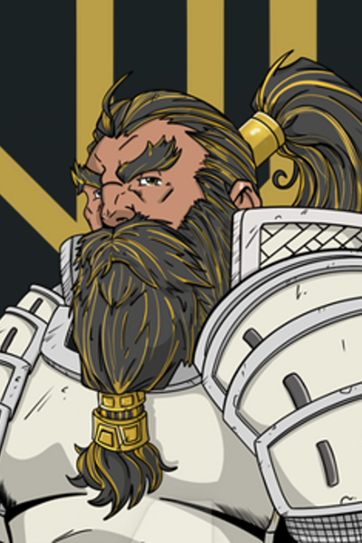

# Boone

*A stranger from distant lands, drawn by curiosity to a town on the edge of change.*

---

## Overview

  

    <table>
      <tbody>
        <tr><th>Player</th><td>Chris</td></tr>
        <tr><th>Ancestry</th><td>Dwarf</td></tr>
        <tr><th>Class</th><td>Fighter</td></tr>
        <tr><th>Background</th><td>Veteran, outsider</td></tr>
      </tbody>
    </table>
  

  

    
  

---

## Description

Boone is a dwarf—a rarity in Tian Xia, where his kind are almost unheard of. He arrived in Willowshore as a stranger wandering in from distant lands, his presence drawing curious and sometimes suspicious glances from locals who have never seen his like.

His children are grown. His old life is behind him. He's out looking for adventure, and rumors of a new oni taking control of this quiet village drew his curiosity. He wandered in to see what was happening—and found himself in the middle of something far more complex than he expected.

---

## Personality

Boone is direct and uncomplicated in a way that contrasts sharply with Willowshore's web of secrets and unspoken traditions. He is not a diplomat. He has no idea what's really happening with the oni and the ruling family's tensions. But he knows how to fight, and he's been itching to get back into the swing of things after years of peaceful retirement.

He likes hitting things. It's been a while, but some skills never fade.

---

## Background

Boone is a veteran of a war fought long ago—the same conflict that [Ginkgo](ginkgo.md) and [Donkey](donkey.md) remember with their private memorial. But Boone was on the opposite side. None of them feel like winners. The war was like that—nobody came out ahead, and everyone carries the weight of what was lost.

---

## Why He Came to Willowshore

Willowshore had been quiet for decades—a declining village that the wider world had largely forgotten. Then word spread that an oni mayor was coming, claiming power after generations of absence. Boone heard the rumors and grew curious. What kind of change was coming to this forgotten place?

He wandered in to find out. He's still figuring out the answer.

---

## Relationships

### [Ginkgo](ginkgo.md) & [Donkey](donkey.md)
Boone, Ginkgo, and Donkey are all veterans of the same war—though Boone fought on the opposing side. Despite this, they share an understanding that transcends old battle lines. All three see themselves as losers in a conflict that had no real winners. It was their Vietnam.

---

## Session History

### Session Zero (2026-01-16)
- Character created
- Established as a rare dwarf outsider in Tian Xia
- Revealed as a veteran who fought opposite Ginkgo and Donkey in an old war
- Arrived in Willowshore drawn by curiosity about the oni transition

### Session One (2026-01-30)
- Recognized the warehouse explosion as deliberate (not just fireworks) using Warfare Lore
- Used his forge dwarf fire resistance to dive through flames and rescue Kimmy
- Crashed through a window to deliver the girl to her mother's arms
- Traded his longsword to [Yong](../npcs/yong.md) as partial payment for a ji-sarm polearm
- Recruited as a deputy by [Magistrate Kurosawa](../npcs/magistrate-kurosawa.md)
- Resisted [Radiant Willow's](../npcs/radiant-willow.md) attempts to braid his beard

### Session Two (2026-02-05)
- Stayed with [Hong](../npcs/hong.md) at Silver Mist Lodge while the party met with [Migo](../npcs/migo.md); bonded with the boy over stories of distant lands
- Used **Sudden Charge** in the graveyard combat to close 40 feet and strike in one move
- Killed the ghoul with a vertical cleave and the zombie with a horizontal slash—establishing a signature fighting style
- Used **Raise Shield** for +2 AC during combat
- Took 5 points of bludgeoning damage from the zombie
- Requested [Yong](../npcs/yong.md) prioritize the party's weapon orders; blades now expected by dusk
