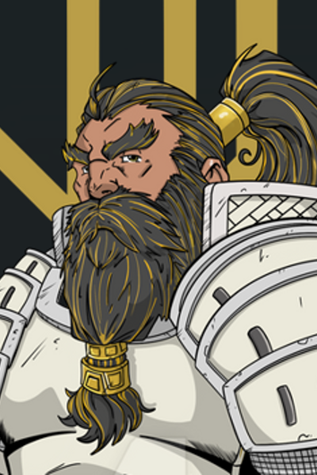

# Boone

*A stranger from distant lands, drawn by curiosity to a town on the edge of change.*

---

## Overview

  

    <table>
      <tbody>
        <tr><th>Player</th><td>Chris</td></tr>
        <tr><th>Ancestry</th><td>Dwarf</td></tr>
        <tr><th>Class</th><td>Fighter</td></tr>
        <tr><th>Background</th><td>Veteran, outsider</td></tr>
      </tbody>
    </table>
  

  

    
  

---

## Description

Boone is a dwarf—a rarity in Tian Xia, where his kind are almost unheard of. He arrived in Willowshore as a stranger wandering in from distant lands, his presence drawing curious and sometimes suspicious glances from locals who have never seen his like.

His children are grown. His old life is behind him. He's out looking for adventure, and rumors of a new oni taking control of this quiet village drew his curiosity. He wandered in to see what was happening—and found himself in the middle of something far more complex than he expected.

---

## Personality

Boone is direct and uncomplicated in a way that contrasts sharply with Willowshore's web of secrets and unspoken traditions. He is not a diplomat. He has no idea what's really happening with the oni and the ruling family's tensions. But he knows how to fight, and he's been itching to get back into the swing of things after years of peaceful retirement.

He likes hitting things. It's been a while, but some skills never fade.

---

## Background

Boone is a veteran of a war fought long ago—the same conflict that [Ginkgo](ginkgo.md) and [Donkey](donkey.md) remember with their private memorial. But Boone was on the opposite side. None of them feel like winners. The war was like that—nobody came out ahead, and everyone carries the weight of what was lost.

---

## Why He Came to Willowshore

Willowshore had been quiet for decades—a declining village that the wider world had largely forgotten. Then word spread that an oni mayor was coming, claiming power after generations of absence. Boone heard the rumors and grew curious. What kind of change was coming to this forgotten place?

He wandered in to find out. He's still figuring out the answer.

---

## Relationships

### [Ginkgo](ginkgo.md) & [Donkey](donkey.md)
Boone, Ginkgo, and Donkey are all veterans of the same war—though Boone fought on the opposing side. Despite this, they share an understanding that transcends old battle lines. All three see themselves as losers in a conflict that had no real winners. It was their Vietnam.

---

## Session History

### Session Zero (2026-01-16)
- Character created
- Established as a rare dwarf outsider in Tian Xia
- Revealed as a veteran who fought opposite Ginkgo and Donkey in an old war
- Arrived in Willowshore drawn by curiosity about the oni transition

### Session One (2026-01-30)
- Recognized the warehouse explosion as deliberate (not just fireworks) using Warfare Lore
- Used his forge dwarf fire resistance to dive through flames and rescue Kimmy
- Crashed through a window to deliver the girl to her mother's arms
- Traded his longsword to [Yong](../npcs/yong.md) as partial payment for a ji-sarm polearm
- Recruited as a deputy by [Magistrate Kurosawa](../npcs/magistrate-kurosawa.md)
- Resisted [Radiant Willow's](../npcs/radiant-willow.md) attempts to braid his beard

### Session Two (2026-02-05)
- Stayed with [Hong](../npcs/hong.md) at Silver Mist Lodge while the party met with [Mido](../npcs/mido.md); bonded with the boy over stories of distant lands
- Used **Sudden Charge** in the graveyard combat to close 40 feet and strike in one move
- Killed the ghoul with a vertical cleave and the zombie with a horizontal slash—establishing a signature fighting style
- Used **Raise Shield** for +2 AC during combat
- Took 5 points of bludgeoning damage from the zombie
- Requested [Yong](../npcs/yong.md) prioritize the party's weapon orders; blades now expected by dusk

### Session Three (2026-02-12)
- Stood guard while others investigated the Mourndusk Willow ritual pit; spotted the metallic glint of the ceremonial dagger
- Attempted **Treat Wounds** on himself before the clearing (failed—9)
- Charged the infected bear with his longsword (27 to hit, 7 damage); spores exploded from the wound (passed Fortitude save 22)
- **Restrained and mauled by the bear** — pinned, clawed, and bitten; unable to escape across three rounds of attempts
- **Knocked to 0 HP** by a critical claw attack (12 slashing damage); entered dying condition
- Healed back to consciousness by Ginkgo's Heal spell (12 HP)
- Rose and delivered the **killing blow** to the bear (10 damage), slicing deep into its side
- Visited [Hong](../npcs/hong.md) with Da Baishan in the evening; confirmed no further sabotage was planned by the children
- Received his **ji-sarm** from [Yong](../npcs/yong.md), bearing a striking rune as a gift of gratitude
- Reassured the terrified Hong with a clap on the shoulder (Hong flinched)

### Session Four (2026-02-26)
- Sensed no deception from [Kimmy](../npcs/kimmy.md) when she reported Hong in the well (Perception 20)
- Recognized the **Kaizo clan dagger** found with the dwarven skeleton—a veteran from the opposing side of the old war: *"We weren't friends, but I guess we're not enemies anymore."*
- Compared the Kaizo dagger to his own **Vestri clan dagger**; identified the "endurance" rune as the family motto
- Helped bury Kaizo's bones at the graveyard
- Scouted the ceremony route with Da Baishan and Littlefinger (Perception 20—nothing suspicious)
- Stayed at the Festival of Returning Spirits to observe the ceremony and provide backup
- Chased down [Mayor Masru](../npcs/mayor-masru.md) with a basket of fish to stall him from returning to the estate—**tripped and scattered food everywhere** (Diplomacy 3)
- Despite the fumble, Masru liked him; the mayor introduced himself casually and went back to feasting
- [Radiant Willow](../npcs/radiant-willow.md) has matchmaking plans for him with **Cloud Ygritte**, a patient yak herder with chin fuzz
- **Reached Level 2**

### Session Five (2026-03-12)
- Reunited with the party outside the estate walls; headed back to the festival
- Wanted to find [Willow](../npcs/radiant-willow.md) and facilitate the matchmaking; wanted to ask [Mido](../npcs/mido.md) about the moths
- Gave **Guidance** to Littlefinger during his Diplomacy check with [Meilin](../npcs/meilin.md)
- During martial law, used a bold deception on oni guards: *"He asked us to come see him. Do you want to be the one to tell him that you denied his explicit order?"* (Deception—good roll); guards escorted the party to Kurosawa instead of arresting them
- Backed up Da Baishan before Kurosawa: *"As we understand it, he asked us to find any unrest. This is clearly unrest."*
- Visited Mido; asked about escape routes from town; learned the magistrate's arcane abilities make simple evasion risky
- Cloud Ygritte, his matchmaking candidate, had retired early from the festival before they could meet
- **Level 2 upgrades:** Medic Dedication (archetype feat—expertise in Medicine; enhanced Battle Medicine and Treat Wounds; once per day break Battle Medicine immunity); Assurance in Medicine (skill feat—guaranteed success at basic DCs)
- **Homebrew hero point:** Second Wind—gain temporary HP; immune to fatigued, slowed, and sickened for 10 minutes

### Session Six (2026-03-19)
- Had a **unique dream** different from the rest of the party—a battlefield vision of the **Battle of Five Crows**, a massacre from the old war; saw [Cheng Yesho](../npcs/the-smiling-one.md) performing a chanting ritual that summoned a demonic entity; a voice repeated: *"The artist, the ruler, the sage, the lover, the judge. Five must fall before the world is born anew."*
- Felt a **chill** upon seeing Cheng's permanent smile again—a visceral flashback to the dream where Cheng's face distorted during the ritual
- Shared the dream with the party; the prophecy became a central investigation thread
- **Demoralized the infected werewolf** in combat (Intimidation vs. Will—creature rolled a 1, becoming frightened); helped **trip** the creature prone
- Dealt **21 damage** with his polearm after the trip, the heaviest single hit of the fight
- [Radiant Willow](../npcs/radiant-willow.md) attempted to set him up with someone new; politely declined
- Religion check (18) revealed the old gods had shifting names (one called the "Nameless God"), their domains were chaos, destruction, lust, and blood

### Session Seven (2026-04-02)
- Healed himself with **Assurance (Medicine)** for 7 HP during the rest period
- Used the **Scout** exploration activity while approaching the ruins—granting +1 initiative to the entire party
- **Critically hit** the first stone guardian with his polearm for **30 damage** (using the new crit rule: max 24 + 14 rolled), then struck again for **16 damage**—shattering it to dust in two swings
- Killed the second stone guardian alongside Da Baishan in the "**Predator handshake**"—clasping hands across the crumbling stone as both weapons pierced it
- Used **Battle Medicine** on Da Baishan for 7 HP after the guardian fight
- **Recall Knowledge** (Nature 22) on the corrupted wolves: learned they are pack hunters, much less effective alone; no special resistances
- **Recall Knowledge** (Religion 14) on the spectral guardian: learned it's resistant to non-magical weapons, immune to poison/bleed, and **weak to vitality damage**
- First attack on the spirit missed (12), but second attack struck for **20 damage**—arcing through its form with his magical polearm
- Landed the **killing blow** on the invisible spirit—struck for **20 damage**, shattering its tether to the world; the spirit exploded in a cold shockwave
- Took **12 cold damage** from the spirit's phase-through attack and **7 cold damage** from the death explosion (successful Reflex save)
- Carries the **alabaster dial piece** removed by Donkey from the "Mother" symbol
- Discovered that his polearm has the **reach trait**—allowing him to strike from 10 feet away without adjacent positioning

### Session Eight (2026-04-22)
- Survived the ruin collapse mostly intact (3 bludgeoning damage); received his personal mark from [Vujravati](../npcs/vujravati.md) in the frozen moment—the echo of the voice from his Battle of Five Crows dream
- **Stabilized Da Baishan** using **Assurance (Medicine)** after Littlefinger's kit was damaged in the collapse and couldn't stabilize him
- **Identified the name "Shen Takashi"** through warfare lore (25)—the *Silent Duelist*, a legendary oni ronin who broke from the oni leadership; hadn't been seen in ~20 years
- Landed a 15-damage polearm hit on a demon in the Willowshore street fight, gutting it across the belly
- Performed the **"Predator handshake"** again with Da Baishan over a finishing blow (locked in as a permanent move)
- **During the trial:** argued the mayor should hear *all* evidence, not Kurosawa's accusations; called to the crowd to address the accusation pattern
- **Delivered the session-defining appeal:** asked the whole town *"Who had the dream?"* (Diplomacy 13 with Ginkgo's Guidance); only [Radiant Willow](../npcs/radiant-willow.md) raised her hand
- Still carried the **alabaster dial piece**—confiscated with his other gear at the end of the session

### Session Nine (2026-05-07)
- Caught in [Kurosawa's](../npcs/magistrate-kurosawa.md) opening **earthen-grasp** as the chase began — earth and rock closed around him *"like a python"*. Failed reflex save 17 (vs. DC unknown but high)
- **Athletics 30** to escape the grasp — ripped his arms through, pulled his legs out, broke free; took two of his three actions and ran
- Critically struck twice by Kurosawa at the wall — **24-damage crit + 18 follow-up** — dropped to **0 HP** and died on his feet
- Saved from death twice in two minutes:
    - First by Ginkgo's **[Vujravati](../npcs/vujravati.md) gift** stabilizing him (1 HP, no longer dying) — Kurosawa stood over him tasting his blood as it happened
    - Then by Boone's own **battle medicine** crawl-over to revive Littlefinger, plus **a second battle medicine on himself**
- Crawled with the **Step action** (no reactive strikes) to reach Littlefinger across the open ground
- **Surrendered to honor Willow.** *"Willow, you showed bravery during our trial. Out of respect for you, I will talk peacefully."* Boone was the one who turned the room
- Smuggled his **clan dagger** past the weapon-search (Thievery 19)
- In the warehouse, ran the **treat-wounds clinic** for the entire party — 11 to Littlefinger, 11 to Da Baishan, 7+8 to himself, 10 to Ginkgo, with healer's tools borrowed from Donkey
- Asked Mido for **heavier armor** — finally **[full plate sized for him](../npcs/mido.md)**, +2 AC, "where it's supposed to be." His new baseline armor for the chapters ahead
- Took one of the five healing potions
- Stripped the plate to wade across the river south of Willowshore at moonrise; redonned on the far bank. **Reached Level 3**
