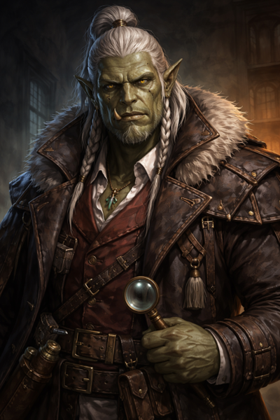

# Da Baishan

*"The mountain does not rush, does not shout, and does not move without cause."*

---

## Overview

  

    <table>
      <tbody>
        <tr><th>Player</th><td>Braedon</td></tr>
        <tr><th>Ancestry</th><td>Orc</td></tr>
        <tr><th>Class</th><td>Investigator</td></tr>
        <tr><th>Background</th><td>Detective among the orc clans</td></tr>
      </tbody>
    </table>
  

  

    
  

---

## Description

Da Baishan (大白山, "Big White Mountain") is an orc investigator who grew up in the cavern networks where the orc clans of Chu Ye carved their homes into the bones of the earth. Unlike many of his kin, Baishan was educated deliberately—learning clan histories, ancestral customs, and the unwritten laws that kept blood feuds from becoming extinction events.

Among his people, strength is respected, but endurance is revered. Baishan learned early that the strongest orc is not the one who strikes first, but the one who understands *why* the strike is coming.

---

## Personality

Baishan is scholarly and observant—somewhat surprising for his brutish appearance. He trusts patterns over proclamations and approaches problems methodically. When investigating, he doesn't ask who is guilty—he asks who benefited, who stayed silent, and who changed their habits afterward.

He does not threaten. He explains. And when the truth surfaces, as it always does, Baishan is already standing where it will break.

---

## Why He Came to Willowshore

When the oni appeared—after generations of absence—and overthrew the old ruling order, Baishan did not celebrate. Power that arrives suddenly and claims inevitability always hides a cost. While others accepted the new hierarchy, Baishan watched. He listened. And when answers did not come, he left the caverns to investigate for himself.

The trail led him to Willowshore. He finds the oni's "I've always been here" posture deeply suspicious and seeks to uncover the truth behind their sudden return.

---

## Relationships

### [Littlefinger](littlefinger.md)
Baishan caught Littlefinger committing a crime against the oni—cleanly, unmistakably. The evidence was sound, the motive obvious. Rather than turn him in, Baishan recognized a shared suspicion. An alliance formed, not from trust, but from aligned doubt.

### [Ginkgo](ginkgo.md)
By the river, Baishan witnessed something that unsettled him deeply: a spirit killing a mortal in full view of the living world. He and Ginkgo stood as witnesses. Ginkgo's leshy beliefs—that death fed life, that decay was not corruption but transformation—stood in stark opposition to Willowshore's funerary laws. Against local custom, Baishan agreed to hide the body in the forest and allow it to return to the cycle. It was a calculated risk. One he still weighs.

### [Donkey](donkey.md)
At a tavern, Baishan crossed paths with Donkey, an ancient elf who spoke a truth so carefully framed that it led Baishan into public embarrassment. The statement was technically accurate—and deeply misleading. Baishan does not forget such things. Deception masked as wisdom is still deception. Yet he respects Donkey's knowledge and considers him a valuable, if unreliable, source of information.

---

## Session History

### Session Zero (2026-01-16)
- Character created
- Established backstory as orc detective from the caverns
- Formed alliance with Littlefinger after catching him stealing from oni
- Witnessed a spirit killing with Ginkgo; helped hide the body
- Had an encounter with Donkey that left him wary but respectful

### Session One (2026-01-30)
- Ordered a polearm with pennant rings from [Yong](../npcs/yong.md)
- Guarded the warehouse exit during the rescue; prepared burn salve for the victims
- Opened formal investigation: **"The Investigation of the Children's Fire"**
- Determined the fire was arson (kerosene accelerant, unnatural spread)
- Deduced the children accidentally triggered sabotaged fireworks
- Negotiated payment from [Magistrate Kurosawa](../npcs/magistrate-kurosawa.md) (50 gold up front, 50 after)
- Attempted to read the magistrate's motives; detected only extreme confidence
- Resisted [Radiant Willow's](../npcs/radiant-willow.md) attempts to adorn his tusks with jewels

### Session Two (2026-02-05)
- Used **Clue In** to help Donkey read [Hong's](../npcs/hong.md) evasions during the interrogation
- Led the questioning of [Migo](../npcs/migo.md); earned her respect with honest disclosure of the party's dual loyalties
- Left [Hong's](../npcs/hong.md) satchel with the Yeshou family to be filled with gold
- Used crossbow and **Devise a Stratagem** in the graveyard combat; killed the undead cat with a precisely planned short sword strike (rolled a 19 on stratagem)
- Saw the **river spirit** during and after combat—the same body he and Ginkgo hid; it shielded him from the cat's attack
- Heard the spirit's message: *"Something stolen, something broken"*
- Spirit lore check (15) found no spirit realm connection to the Mourndusk Willow
