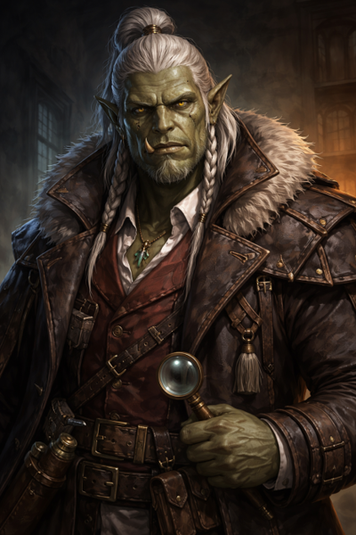

# Da Baishan

*"The mountain does not rush, does not shout, and does not move without cause."*

---

## Overview

  

    <table>
      <tbody>
        <tr><th>Player</th><td>Braedon</td></tr>
        <tr><th>Ancestry</th><td>Orc</td></tr>
        <tr><th>Class</th><td>Investigator</td></tr>
        <tr><th>Background</th><td>Detective among the orc clans</td></tr>
      </tbody>
    </table>
  

  

    
  

---

## Description

Da Baishan (大白山, "Big White Mountain") is an orc investigator who grew up in the cavern networks where the orc clans of Chu Ye carved their homes into the bones of the earth. Unlike many of his kin, Baishan was educated deliberately—learning clan histories, ancestral customs, and the unwritten laws that kept blood feuds from becoming extinction events.

Among his people, strength is respected, but endurance is revered. Baishan learned early that the strongest orc is not the one who strikes first, but the one who understands *why* the strike is coming.

---

## Personality

Baishan is scholarly and observant—somewhat surprising for his brutish appearance. He trusts patterns over proclamations and approaches problems methodically. When investigating, he doesn't ask who is guilty—he asks who benefited, who stayed silent, and who changed their habits afterward.

He does not threaten. He explains. And when the truth surfaces, as it always does, Baishan is already standing where it will break.

---

## Why He Came to Willowshore

When the oni appeared—after generations of absence—and overthrew the old ruling order, Baishan did not celebrate. Power that arrives suddenly and claims inevitability always hides a cost. While others accepted the new hierarchy, Baishan watched. He listened. And when answers did not come, he left the caverns to investigate for himself.

The trail led him to Willowshore. He finds the oni's "I've always been here" posture deeply suspicious and seeks to uncover the truth behind their sudden return.

---

## Relationships

### [Littlefinger](littlefinger.md)
Baishan caught Littlefinger committing a crime against the oni—cleanly, unmistakably. The evidence was sound, the motive obvious. Rather than turn him in, Baishan recognized a shared suspicion. An alliance formed, not from trust, but from aligned doubt.

### [Ginkgo](ginkgo.md)
By the river, Baishan witnessed something that unsettled him deeply: a spirit killing a mortal in full view of the living world. He and Ginkgo stood as witnesses. Ginkgo's leshy beliefs—that death fed life, that decay was not corruption but transformation—stood in stark opposition to Willowshore's funerary laws. Against local custom, Baishan agreed to hide the body in the forest and allow it to return to the cycle. It was a calculated risk. One he still weighs.

### [Donkey](donkey.md)
At a tavern, Baishan crossed paths with Donkey, an ancient elf who spoke a truth so carefully framed that it led Baishan into public embarrassment. The statement was technically accurate—and deeply misleading. Baishan does not forget such things. Deception masked as wisdom is still deception. Yet he respects Donkey's knowledge and considers him a valuable, if unreliable, source of information.

---

## Session History

### Session Zero (2026-01-16)
- Character created
- Established backstory as orc detective from the caverns
- Formed alliance with Littlefinger after catching him stealing from oni
- Witnessed a spirit killing with Ginkgo; helped hide the body
- Had an encounter with Donkey that left him wary but respectful

### Session One (2026-01-30)
- Ordered a polearm with pennant rings from [Yong](../npcs/yong.md)
- Guarded the warehouse exit during the rescue; prepared burn salve for the victims
- Opened formal investigation: **"The Investigation of the Children's Fire"**
- Determined the fire was arson (kerosene accelerant, unnatural spread)
- Deduced the children accidentally triggered sabotaged fireworks
- Negotiated payment from [Magistrate Kurosawa](../npcs/magistrate-kurosawa.md) (50 gold up front, 50 after)
- Attempted to read the magistrate's motives; detected only extreme confidence
- Resisted [Radiant Willow's](../npcs/radiant-willow.md) attempts to adorn his tusks with jewels

### Session Two (2026-02-05)
- Used **Clue In** to help Donkey read [Hong's](../npcs/hong.md) evasions during the interrogation
- Led the questioning of [Mido](../npcs/mido.md); earned her respect with honest disclosure of the party's dual loyalties
- Left [Hong's](../npcs/hong.md) satchel with the Yeshou family to be filled with gold
- Used crossbow and **Devise a Stratagem** in the graveyard combat; killed the undead cat with a precisely planned short sword strike (rolled a 19 on stratagem)
- Saw the **river spirit** during and after combat—the same body he and Ginkgo hid; it shielded him from the cat's attack
- Heard the spirit's message: *"Something stolen, something broken"*
- Spirit lore check (15) found no spirit realm connection to the Mourndusk Willow

### Session Three (2026-02-12)
- Ventured into the [Dark Woods](../locations/dark-woods.md) to investigate the [Mourndusk Willow](../locations/dark-woods.md)
- Retrieved the **clay bowl** from the ritual pit between the tree's roots—held it through the entire combat, one-handed
- Examined the **ceremonial dagger** (Perception 25); identified **Toanin** inscriptions (Occultism 21): *"Let ancient law be sealed in the hand that guides Willowshore"*
- Used **Imperial Lore** (24) to confirm Toanin is a common oni dialect; "the hand that guides" references the magistrate
- Investigated the ritual (Occultism 24): identified it as a **dark sacrificial substitution ritual**—a summoning or communion, at least partially successful
- Assisted Ginkgo in crafting a **salve bomb** using his alchemist toolkit (Crafting 21)
- **Abandoned his crossbow** after every shot missed; switched to short sword and landed multiple hits on the bear while flanking with Boone
- **Leapt over his allies** to tackle and restrain an infected squirrel (Athletics success), then detonated the salve bomb to cure both squirrels
- Visited [Hong](../npcs/hong.md) in the evening; intimidated the boy (23) to confirm no further sabotage was planned
- Received his **guandao** from [Yong](../npcs/yong.md), bearing a striking rune as a gift of gratitude

### Session Four (2026-02-26)
- Helped rescue [Hong](../npcs/hong.md) from an old well; climbed down, tied the rope, and investigated the scene
- Discovered a **dwarven skeleton** and **clan dagger** (Kaizo clan, "endurance" rune) in the well's mud
- Used **Odd Feet** (investigator feat) to notice the body had been stripped of armor—placed deliberately, not a fall
- Opened a new investigation: **"The Mystery of the Submerged Dwarf"**
- Collected the bones and buried them properly at the graveyard
- Played wingman for [Hong](../npcs/hong.md) and [Kimmy](../npcs/kimmy.md): "He needs a kiss to feel better"
- Scouted the ceremony route with Boone and Littlefinger; nothing suspicious found
- Infiltrated the Yeshou estate during the festival via the **shed tunnel** (Stealth 12, Athletics 16 to break the latch)
- Checked for traps on the first floor (Perception 26—none found)
- Met Littlefinger in the wine cellar; heard the fox alarm from upstairs; heard the front door open (magistrate entering)
- [Radiant Willow](../npcs/radiant-willow.md) has matchmaking plans for him with **[Peony Switchstep](../npcs/peony-switchstep.md)**, a cheerful seamstress
- **Reached Level 2**

### Session Five (2026-03-12)
- Whispered to Littlefinger to hide and search, then crept toward the estate's front door at half speed (Stealth 18, 19—one creaky floorboard and a knocked-over object along the way)
- Emerged outside and bluffed [Magistrate Kurosawa](../npcs/magistrate-kurosawa.md) at the front door: *"I heard the alarm—I'm here to help"* (Deception 12—not great, but Kurosawa's grip on his sword loosened)
- Helpfully pointed out the shed door was ajar, redirecting Kurosawa's attention to investigate there
- Dismissed by the magistrate; reconvened with the party outside the estate walls
- During martial law, helped lead the distraction team to confront Kurosawa directly, offering investigative services
- Kurosawa told him pointedly: *"I believe our criminals are within my sight"*—then said he would summon Da Baishan in the morning for investigative assistance
- Escorted back to Silver Mist Inn under guard
- Requested an **alibi** from [Mido](../npcs/mido.md); the Yeshou family agreed to vouch for the party
- **Level 2 upgrades:** Skill increase in Thievery; Shared Stratagem (class feat—ally also treats target as off-guard when using Devise a Stratagem); Eyes of the City (skill feat—use local citizens to help track people in settlements)
- **[Peony Switchstep](../npcs/peony-switchstep.md)** gave [Willow](../npcs/radiant-willow.md) visible resistance when she tried to arrange a meeting at the festival

### Session Six (2026-03-19)
- Had the **shared dream** of the wounded land with the rest of the party
- **Channeled [Cassian Voss's](../npcs/cassian-voss.md) spirit** during a cemetery séance (Spirit Lore 18, Diplomacy check)—his body and voice taken over by the spirit while he could hear but not control himself; described the experience as "deeply unsettling"
- Voss's spirit revealed critical information through him: the old gods are closer than believed, the prophecy is a ritual for "the Unspeakable One," and five must be sacrificed
- Spirit lore (17) confirmed the old gods were banished to a pocket dimension, not destroyed; communing requires a medium with cross-planar reach—suggested the **ancient willow tree** in the Dark Woods
- Spirit lore (20) identified that communing with old gods generally requires a proxy medium; ley lines have cross-planar reach; five ley lines would be especially powerful
- Missed **three consecutive crossbow shots** during the werewolf combat; switched to his **Guan Dao** and landed a hit for 8 damage in melee while flanking
- Devise a Stratagem rolls were poor both rounds—low D20 results

### Session Seven (2026-04-02)
- Missed **three more crossbow shots** against the wolves—one went to the river, one was "not even close," and one "fell off the crossbow"
- Entered the [Gosembiki ruins](../locations/gosembiki-ruins.md) first using **That's Odd** (investigator feat)—noticed two statues that looked **relatively new** compared to everything else in the ruin; pointed them out to the party before they animated
- **That's Odd** (second use) in the ritual chamber—noticed the broken alabaster dial had been **recently reassembled**; dust impressions showed where pieces had lain for ages before being moved
- **Finally hit with the crossbow** for the first time in the campaign—7 damage against the immobilized stone guardian: *"The crossbow wasn't broken. It was building suspense."*
- Killed the second stone guardian alongside Boone in the **Predator handshake**—plunging his Guan Dao through it while clasping hands with Boone across the crumbling stone
- Rolled a **critical miss** (natural 1) on a Guan Dao attack against the second guardian
- **Devise a Stratagem** continues to produce poor results—rolled a 1 on the D20, used Skill Stratagem instead for +1 circumstance bonus
- Became **frightened 2** from the spectral guardian's howl (failed Will save); penalized on all checks for the encounter
- Missed the spectral guardian with his Guan Dao attack
- Took **15 cold damage** from the spirit's death explosion (failed Reflex save)
- Discovered his Guan Dao has the **reach trait**—can attack from 10 feet, same as Boone's polearm
- Noted he needs to "get rid of that damn crossbow" (again)

### Session Eight (2026-04-22)
- **Pulled the device** free from the gear cradle, triggering the collapse and the chasm; dropped to 0 HP (4 damage on 4 HP) from the falling ruin and entered dying condition—stabilized by Boone's Assurance (Medicine)
- Received his personal mark from [Vujravati](../npcs/vujravati.md) in the frozen moment of the collapse
- Took possession of **[Judgement's Edge](../locations/gosembiki-ruins.md#items-recovered)**, a magical longsword recovered from the rubble; once wielded by the legendary oni [Shen Takashi](../npcs/shen-takashi.md): *"Only criminals would be afraid of such a person."*
- **Felled the first demon** in the street fight with a 13-damage longsword blow—its eyes blackened and it tumbled at his feet (after missing the first swing with the new weapon)
- Took **13 damage** from a demon's claw—half his HP in one exchange
- During the trial: opened the party's defense with *"You haven't asked where we've been, what we've been doing, or whose mission we've been on."*
- Attempted to belittle the farmer's testimony; [Kurosawa](../npcs/magistrate-kurosawa.md) turned it around, accusing him of belittling the farmer himself
- **Confiscated:** Judgement's Edge, the Guan Dao, and the alabaster dial piece (via Boone) were taken by oni guards at the end of the session

### Session Nine (2026-05-07)
- Already running at the open of session — took all three actions to **dash west** out of town, pulling away from Kurosawa's grasp on the way past
- **Parkoured Kurosawa's earthen wall.** Combat Climber + Terrain Expertise made the climb routine: Athletics 23 then 17 — to the top in two motions. Flipped off Kurosawa from the parapet
- **Used the Guan Dao like a fireman's pole** to pull Donkey and Ginkgo up over the wall (+2 assist, both made it)
- Avoided being grappled at the top of the wall by an oni who critically failed his climb (DC 9 vs. acrobatics 18)
- Stalled the parley with: *"Your kangaroo court charges, Kurosawa, do not prove our guilt. But this battle serves no good."* Argued for a **fair trial** with the recovered evidence; was rebuffed
- Smuggled a **crowbar** past the oni weapon-search (Thievery 16) — *"You wouldn't want me to have that in confinement, so I'm gonna keep it"*
- Used the crowbar on the back wall of the warehouse to **pry old planks loose** (Athletics 27 with crowbar +2 and assist +2) — opened the way for Littlefinger's exfiltration
- Hours later, the **Perception roll that turned the night** (19) — heard the floor-hatch lift open at the back of the warehouse and saw [Kuji Yasho](../npcs/kuji-yasho.md) climb up out of the family's smuggling tunnel
- **Made the Occultism check (21) on his Vujravati gift** — at last understood it: a token tied to the **[Order of the Palatine Eye](../factions/order-of-the-palatine-eye.md)**, an extinct legendary occult-investigator order with a known location ~40–50 miles south in the mountains. *"There may be allies there, or something useful there for fighting Kurosawa if they know these lost dark arts."*
- Explained the mark — and the cryptic phrase *"When the town closes its hand against you, seek the eye that opens"* — to the party; **advocated heading south first** to the Order before the Hollow. The party agreed
- Recovered Judgement's Edge, the guan dao, and the alabaster dial piece from Mido's stash; took one of the **healing potions** for the road
- Crossed the river south at moonrise; Littlefinger climbed onto his back when Vic dropped from the call. **Reached Level 3**

### Session Ten (2026-05-14)
- **Survival check on the trail south** — picked up the bipedal tracks of what would turn out to be a [Glutton Ogre](../locations/palatine-eye-vault.md#approach-glutton-s-bridge); estimated stride length at 8–12 feet
- Hauled the bamboo tree down for the **ham trebuchet** at one shot — *"I'll grab that tree"* — hand over hand, bent it into an arch, latched it, and went on overwatch with **Perception 22** on Seek action while the ogre repositioned. Spotted the rush early
- Climbed the switchbacks with the team to [Cliché](../npcs/cliche.md)'s fire. Did not get an explicit name from the hermit — *"What's your name? You are standing… one small scan."* Asked the hermit about *"a giant friendly dragon who gives gifts"* — Cliché answered with the *"celestial one"* line, confirming [Vujravati](../npcs/vujravati.md) by epithet
- Took a warm hand-stone from the fire and pocketed it — *"Forge dwarf loves hot rocks"*
- At the cliff, the only one who **felt the magnetic pull** of [the door](../locations/palatine-eye-vault.md#the-cliffside-door); his Vujravati gift had been homing on this point the whole way. Two raps on stone produced the deeper, metallic-toned answer; an **eye drew itself in henna ink on the back of his hand** as the door drew the matching eye in the cliff and opened
- **Recall Knowledge (Intelligence)** on the eye-mark — recalled, with a jolt, that **[Cassian Voss](../npcs/cassian-voss.md) had carried the same mark on the back of his hand**
- Inside the [Hall of Divided Testimony](../locations/palatine-eye-vault.md#the-hall-of-divided-testimony), held the *"That's Odd"* clue from the dissonant lantern shadows the entire puzzle — *"the shadows are wrong"* was his standing read; eventually paired it with Donkey's verbal-component arcana hint to land on **read the scrolls aloud** as the unlock
- After the inner door opened, kept watch in the sanctum — the kneeling [Stone Witness](../locations/palatine-eye-vault.md#the-sanctum-and-the-stone-witness) was standing at attention while Boone took the book
- **Dropped his eye-tattoo** voluntarily on exit — *"I'll drop the tattoo. Let Donkey be the ink master here"* — handing the Order's bearer-mark to Boone, who is now the named member
- Carrying the warm stone, walked out onto the cliff path knowing the next leg is **west** to the [Hollow of Seven Cedars](../locations/hollow-of-seven-cedars.md), per Cliché and per the Book

### Session Eleven (2026-06-04)
- **Came into the Palatine Detective archetype.** The GM walked Braedon through the new investigator subclass at session open — still an investigator, now with the **Order of the Palatine Eye** archetype layered on, the ability to **swap prepared spells**, and the **eye-mark on the back of his hand** (see the [Order's continuity note](../factions/order-of-the-palatine-eye.md#session-eleven-2026-06-04) on who carries the eye)
- **Debuted [Divine Lance](../factions/order-of-the-palatine-eye.md)** — a beam of divine energy fired *from the eye on his palm.* Missed the spiders and the web lurker every time, but the table loved it (*"very Iron Man-ish"*). Still cannot *see* through the eye — *"not with that attitude, you can't"*
- Carried the grove's investigation. **"That's Odd"** flagged the third cedar; **Recall Knowledge** read the scratched-out letters as **[Cassian Voss](../npcs/cassian-voss.md)**; **quick magic-identification** established a live **ritual between the copper nails and the pond**, dated the Voss carving to **6 months–1 year old** (older than Kurosawa's nails), and caught a **glint of magic in the base of the basin** with his dark vision
- **Touched the black pool** when the eye-mark warmed and tugged his hand toward the water — and received the vision of [Kurosawa](../npcs/magistrate-kurosawa.md) grafting the corrupting root, the incantation *"Memory is not sacred. It is only precedent. And precedent can be overturned,"* and the projected ruin of Willowshore's memory. Relayed all of it to the party
- Helped Ginkgo try to wrench the master graft loose (failed Athletics) before Boone finished the job; identified the **[Warden of the Grove](../npcs/warden-of-the-grove.md)** (Occultism) as it erupted from the treeline
