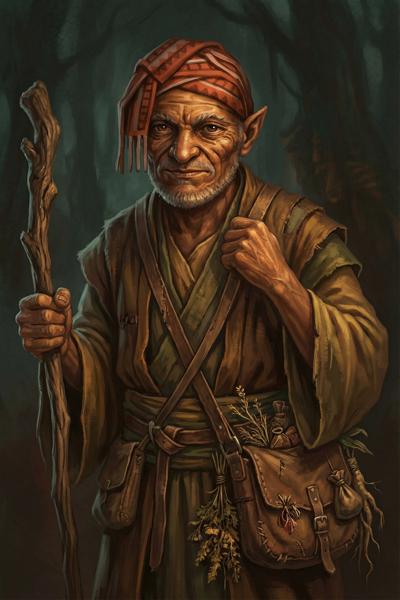

# Donkey

*Nobody knows why he's called Donkey. Including himself.*

---

## Overview

  

    <table>
      <tbody>
        <tr><th>Player</th><td>David</td></tr>
        <tr><th>Ancestry</th><td>Elf (ancient, appears human)</td></tr>
        <tr><th>Class</th><td>Wizard</td></tr>
        <tr><th>Background</th><td>Village witch, herbalist</td></tr>
      </tbody>
    </table>
  

  

    
  

---

## Description

Donkey is impossibly old. Nobody knows exactly how old—there's definitely some human back in the woodpile somewhere, and people aren't really sure if he's an elf or a human anymore. He's been around Willowshore forever. The name "Donkey" just came about at some point; he didn't correct people, they didn't ask, and it stuck.

Nobody really knows where he lives. He seems to just live off the land, appearing in town every so often to trade herbs and offer help to those who need it. He's something of a village witch—everyone seems to have had at least one conversation with him, though he doesn't talk much.

---

## Personality

Donkey speaks rarely, but when he does, his words carry weight—though not always in the way the listener expects. He has a habit of telling truths that are technically accurate but carefully framed to lead people exactly where he wants them to go. Whether this is mischief, wisdom, or something else entirely remains unclear.

He observes more than he participates, watching the town's affairs with the patience of someone who has seen cycles repeat many times over.

---

## Role in Willowshore

Donkey serves as an informal resource for the village:

- **Herbalist** — Brings herbs from the forest to trade
- **Advisor** — Helps those who seek him out, in his own way
- **Living memory** — Knows everyone and their family histories through sheer longevity

---

## Relationships

### [Ginkgo](ginkgo.md)
Donkey and Ginkgo share a private tradition—a memorial for a war they both fought in. Once a year, they take time away to remember those who fell. The details remain between them.

### [Boone](boone.md)
Boone fought on the opposite side of the same war. Despite this, there's a shared understanding among all three veterans—none of them feel like winners. The war left its mark on everyone.

### [Da Baishan](da-baishan.md)
Donkey has become one of Da Baishan's sources of information in Willowshore. However, their relationship is complicated. Donkey once told Da Baishan something that was technically true but incomplete, leading the investigator into a dangerous situation. Da Baishan emerged, but he's "still slightly miffed" and doesn't fully trust the old wizard—even as he respects his knowledge.

*"You want to play hardball in Willowshore? I just wanted to see if you got what it takes."*

---

## Session History

### Session Zero (2026-01-16)
- Character created
- Established as an ancient elf wizard serving as Willowshore's village witch
- Revealed shared war history with Ginkgo (same side) and Boone (opposing side)
- Established as an information source for Da Baishan (with a history of "technically true" misdirection)

### Session One (2026-01-30)
- Was ill and stayed in his quarters; missed the warehouse fire and recruitment

### Session Two (2026-02-05)
- Rejoined the party at Silver Mist Lodge after recovering from illness
- Used **Diplomacy** (23) to stop [Hong](../npcs/hong.md) from fleeing; commanded him with authority as a known local
- Identified the [Yeshou family](../factions/willowshore-ruling-family.md) as "the most money" in town via Society check
- Used **Willowshore Lore** (18) to connect the Mourndusk Willow's glen to a tragedy in the Yeshou family's past
- Cast **Tangle Vine** on the ghoul (success—immobilized with -10 speed)
- Cast **Ignition** on the zombie (5 fire damage)
- Learned that **Daze doesn't work on mindless undead**
- Picked up a **cricket cage** during combat for its defensive bonuses
- Examined a gold coin from Hong's payment—confirmed standard local currency
- Confirmed the undead rising is unprecedented for Willowshore

### Session Three (2026-02-12)
- Confirmed the Dark Woods felt **different and unnatural**—colder, with a presence that wasn't there before, despite years of familiarity
- Identified the **river spirit** as **[Cassian Voss](../npcs/cassian-voss.md)** via Willowshore Lore (26)—a religious researcher from Absalom who studied "old gods" and visited Willowshore months before the magistrate
- Used **Spell Substitution** to swap a spell slot for **Detect Magic** (10-minute preparation)
- Attempted **Hydraulic Push** with salve to blast the infected bear (missed)
- Cast **Tangle Vine** on the bear (missed)
- Went to **0 HP** from squirrel bites and a bear claw; stabilized and healed by Ginkgo
- Visited [Mido](../npcs/mido.md) with Ginkgo to share findings about the ritual; learned about the **Mother of a Thousand Wings** and the **ley line convergence** beneath Willowshore
- Learned about **two secret entrances** to the Yeshou estate (stables → wine cellar; koi pond)

### Session Four (2026-02-26)
- Received a spa treatment from [Radiant Willow](../npcs/radiant-willow.md)—soft skin, leafy hair adornments
- Casually told Willow he'd be leaving for a foraging trip soon and wouldn't be at the ceremony—establishing his alibi
- Visited [Liwen](../npcs/liwen.md) the florist; learned that [Magistrate Kurosawa](../npcs/magistrate-kurosawa.md) ordered **five dozen white lilies** (funeral flowers), calling it an "oni custom"
- Used **Spell Substitution** to swap a spell during the morning (10-minute preparation)
- Received fortune petal: *"Carry hope in your pocket and every path will bloom brighter."*
- Infiltrated the Yeshou estate by casting **Pest Form** (firefly); flew to the second-floor master bedroom through an open window
- Searched the bedroom (Perception 7—couldn't find an office; Perception 21—successfully scanned the desk)
- Found **papers in Chthonic script** (the Devil's tongue)—same language as the Mourndusk Willow dagger—along with diagrams
- Spotted a **fox construct** (Arcana 9—identified only as "some type of construct") that activated and locked onto him
- Used **Telekinetic Hand** to grab the fox and fling it out the window (Wizard DC 17 vs. its Athletics—success)
- The fox **howled a deafening alarm** before clearing the window
- **Transformed back** from firefly, grabbed the papers from the desk
- **Reached Level 2**

### Session Five (2026-03-12)
- Stuffed **three papers** from the magistrate's desk into his backpack (Dexterity check—poor, managed only three)
- Won initiative (15) and completed **Pest Form** (firefly) just as Kurosawa burst through the bedroom door—escaped through the window with seconds to spare
- Flew over the estate grounds, saw Kurosawa head to the shed and Da Baishan walk away; transformed back in a copse of trees
- Identified the stolen papers: a **Chthonic journal entry** with recent date markings (Decipher Writing 19), an **arcane Web scroll** (2nd level), and a **map** with a marking ~10 miles east of Willowshore featuring a diagram resembling the device [Yong](../npcs/yong.md) was building for the magistrate
- Used **Read Aura** cantrip to confirm [Cheng Yesho's](../npcs/the-smiling-one.md) military medal is not magical
- Spoke with [Luda](../npcs/luda.md), his regular arcane supplier; learned Kurosawa demanded high-volume, specific arcane ingredients from her
- Asked Luda to track and report future purchases by the magistrate; she agreed
- Tested the martial law perimeter by walking toward the edge of town; confronted by an oni guard with a drawn sword
- Used **Conceal Spell** (new wizard feat) to cast **Sleep** without visible components (DC 18; guard rolled 17—failure); the guard toppled unconscious
- *"Remember to meddle not in the affairs of wizards."*
- **Level 2 upgrades:** Conceal Spell (class feat—spells gain the Subtle trait), Tattoo Artist (skill feat—can inscribe magical tattoos)
- **Homebrew hero point:** Improvise Spell—cast any spell in spellbook even if not memorized, once per session

### Session Six (2026-03-19)
- Had the **shared dream** of the wounded land
- Deflected [Kurosawa's](../npcs/magistrate-kurosawa.md) pointed questions about the Yeshou family during the interrogation: *"My business is usually restricted to the preparation or finding of herbs and other forest objects of interest"*
- Requested **investigative licenses** from [Mayor Masru](../npcs/mayor-masru.md) and reviewed the contract for hidden clauses (Society check—found it straightforward and honest)
- Cautioned the mayor: *"My investigations tend to be very thorough and you might not like what we turn up"*—asked whether to investigate the magistrate; the mayor deferred pending evidence
- Started a **notebook** documenting Kurosawa's contradictions and leading questions
- **Tangle Vine** failed against the werewolf (spell attack 14 vs. AC 17)
- Used **Battle Medicine** to heal Littlefinger for **13 HP** during combat (Medicine 18—success, 2D8 healing)
- Suggested the party should not explore the ruins at night: *"I don't think we should explore the spooky temple at night"*

### Session Seven (2026-04-02)
- **Critical hit** with **Treat Wounds** on Boone (rolled 19—critical success, healed 4D8)
- **Critical hit** with **Ignition** on the first corrupted wolf—the creature burst into flames, yelped, ran toward the water, and collapsed smoldering and burning (13 fire damage, killing it)
- Used **Read Aura** on the dead wolves—identified the school of magic as **alteration/transformation**, not necromancy; the infection is arcane in origin
- Scored **two consecutive natural 20s** on **Tangle Vine** against the same stone guardian—critically immobilizing it twice in a row, wrapping it in vines like a mummy
- Put **both corrupted leshies** to Sleep with a single casting—both **critically failed** their Will saves and collapsed instantly
- Suggested trying to **treat the corrupted wolves** using Ginkgo's salve, showing concern for the infected creatures
- Identified the **"Mother" symbol** on the alabaster dial through arcana knowledge and prior research—connecting it to the Mother of a Thousand Wings
- **Removed a piece of the dial** to prevent full reassembly; gave it to Boone to carry
- Cast **Tangle Vine on the device** in the subterranean chamber, wrapping vines around the gear mechanism and **freezing it in place**—some vines burned near the center from the energy, but the outer bindings held
- Called out to the spectral guardian mid-combat: *"We mean you no harm. We've come to heal this place."* No response.
- Used **Mage Hand** concept to propose extracting the device (it may be light enough to carry)
- Took **15 cold damage** from the spirit's death explosion (failed Reflex save)
- Suggested investigating whether the ruins might be **repairing themselves**, checking for inanimate golems before proceeding

### Session Eight (2026-04-22)
- Used **Detect Magic** to analyze the device; helped confirm (with Ginkgo's arcana) that the device was winding **potential energy** rather than simply redirecting flow
- Knocked unconscious by the ruin collapse; received his personal mark from [Vujravati](../npcs/vujravati.md) in the frozen moment
- Tirelessly dug through the rubble afterward; recovered **four leshy bodies** for burial rites and the unblemished **[Judgement's Edge](../locations/gosembiki-ruins.md#items-recovered)** sword
- Identified Judgement's Edge as a **+1 longsword with a Rune of Striking**
- Cast **Tangle Vine** twice on demons during the Willowshore battle—one success, one **natural 20 critical immobilization** (vines wrapped a demon like a mummy)
- Summoned a **root-and-bark construct** ("basically if Groot were a dog")—used as a hit-point sponge through the fight
- **During the trial:** produced the writs of investigation from [Mayor Masru](../npcs/mayor-masru.md) as the party's first defense
- **Landed the one clean hit on Kurosawa's testimony:** *"How did you know it was a magical artifact?"* → Kurosawa: *"Because I commissioned it."* (he recovered within seconds, but it was the only crack all evening)
- Ended the session disarmed and under guard

### Session Nine (2026-05-07)
- *David was absent for this session. Donkey ran with the party through the chase, the wall, the warehouse, and the tunnel — flagged as "running with the group" through the GM's narration*
- Donkey ran along with the party as they fled west; tried to climb Kurosawa's earthen wall, failed badly (Athletics +0 → 5 ft up only), got pulled to the top by Da Baishan's guandao on the next round
- **Smuggled his spell book** through the weapon-search by hiding it on his person (DM-rolled; the oni took his dagger but missed the book — they knew he was a wizard and were specifically looking for it)
- His healer's toolkit was the one Da Baishan borrowed during the warehouse clinic
- Kept his lent toolkit and his potion share through the southern crossing. **Reached Level 3**

### Session Ten (2026-05-14)
- Recognized the [Glutton Ogre](../locations/palatine-eye-vault.md#approach-glutton-s-bridge) species from Littlefinger's description of the kill — Nature check; flagged its low intelligence, ambush style, and the **gluttons-rush** burst-speed ability that would have caught the party on the path
- Argued in favor of the ham-trebuchet plan over Boone's poison-deer plan — *"Ogres aren't particularly bright. If we got his attention with the ham and put it somewhere out of reach, would that distract him for a while?"* (yes)
- Volunteered to **mage hand the ham** as a backup deployment plan; not needed once the trebuchet worked
- Climbed the switchbacks with the party and rolled **Society 26** on [Cliché](../npcs/cliche.md) — confirmed he is **not** anyone in any Willowshore-area description, and noted that he knows things he should not (*the smiling one*, [Vujravati](../npcs/vujravati.md), the existence of the Order without ever naming it). The hermit named him personally: **"the one who makes sparks"**
- Did the *itinerant-old-man-meets-itinerant-old-man* probing-questions routine on Cliché — confirmed the hermit's land-knowledge was real, but his other-knowledge ran far past it
- Took a warm hand-stone from the fire
- At the [cliff door](../locations/palatine-eye-vault.md#the-cliffside-door), worked out *"the hand that doubts"* logic-puzzle style — *"my hand doubts that knocking on rock will work, therefore my hand is the doubting hand"* — and was the first to knock. The cliff stayed solid for him; Da Baishan's knock was the answer the door wanted
- Inside the [Hall of Divided Testimony](../locations/palatine-eye-vault.md#the-hall-of-divided-testimony), drove **80% of the puzzle reasoning** — read the dial-mappings off the scrolls, asked the GM the questions that found the broken parts of the lies (where is the moon hanging? which hand do the monks raise their torches with?), and called the verbal-component / *"reading aloud"* hint after his **Arcana 18** check on the lantern. *That* unlocked the puzzle
- Read the scrolls aloud one by one as the others set the dials — Pale Witness, Weeping Root, Loyal Crossing, Devout Flame
- Took the **Frost Walker** and **Bewitching Bloom** tattoos he'd had stocked, plus picked up **Navigator Star** as a backup since "it gives you a compass on your body"
- Did not knock again. Followed Boone into the sanctum at *"a reasonable distance"*

### Session Eleven (2026-06-04)
- *David was absent for this session. Donkey traveled and fought with the party, run by the GM as a companion — *"I'm not good at this though,"* the GM noted, moving him through combat*
- Spotted the **odd, three-toed bipedal footprints** in the marshy grass during the spider ambush — alerting the party to the **web lurker** lurking nearby, directly south of his position
- Took swings at the tree spiders during the fight (and fled one that was put down beside him); [Littlefinger](littlefinger.md) suggested he drop a **tangle spell** on the web lurker to pin it, though the lurker fled before it came to that
- Took a small amount of damage in the fight and was patched up afterward; crossed to the [Hollow of Seven Cedars](../locations/hollow-of-seven-cedars.md) with the party and was present (in narration) for the discovery of the corruption and the rousing of the [Warden](../npcs/warden-of-the-grove.md)

### Session Twelve (2026-07-16)
- **Found the [Warden's](../npcs/warden-of-the-grove.md) weakness**: his **Ignition** (18 to hit, 7 fire, now 3d4 at Level 3) set the creature smoldering and *spread wider than it should have* — fire was the only damage that visibly hurt it. *"I knew there was a reason I went Lord of the Rings so many times"*
- Followed with **Tangle Vine** (21) — immobilized/slowed it — then **bolted for cover** behind a rock and ate a 12-damage claw for being the Warden's chosen target
- **Recall Knowledge (12, +2 circumstance)** turned the Grandmother's ritual-name into a lead: he had **seen the Root Correction papers on Kurosawa's desk** during his Session Four firefly infiltration. Arcana (15) confirmed it's a **custom ritual in Kurosawa's own hand** — no other copies. *"All right, so we gotta steal that ritual"*
- Architected the heist: **Pest Form (dragonfly)** through the office window (choosing dragonfly for night vision on a Nature 18), cased the room, spotted the swept desk / greenish vial / new lacquered chest, and pocketed the **30 gp coin pouch**
- Spotted the **fox construct** padding down the hall with ~30 seconds to spare — *"we got company"* / *"the jig is up"* over Message — latched the chest shut behind Littlefinger (*"he's got the goods"*), attempted a windowsill dismount on **Athletics +0**, clanged his knee off the bedpost, and escaped as a dragonfly with the fox watching the room. **No alarm sounded**
- Floated the campaign's worst/best infiltration plan for a town that now hates them: *"We could be clowns that are specifically mocking us... It'll be my greatest role yet: playing myself"*
- At camp, poked the load-bearing hole in trusting the lockbox note: *"Are you sure? Who sticks notes on lockboxes?"* — then the counter-theory: *"Maybe he is earnestly here to fix things, he just doesn't know how"*
