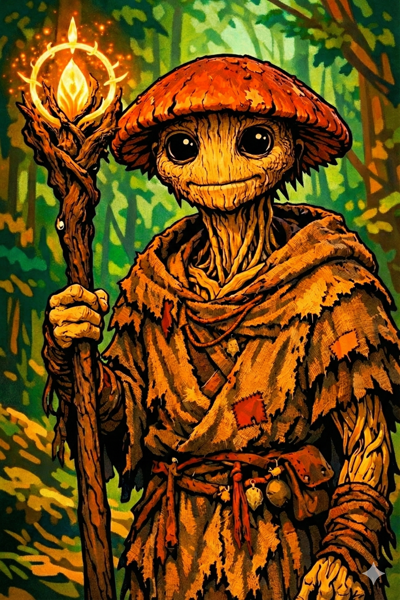

# Ginkgo

*"Death is not an ending. It is a return to the cycle."*

---

## Overview

  

    <table>
      <tbody>
        <tr><th>Player</th><td>Oded</td></tr>
        <tr><th>Ancestry</th><td>Leshy (Fungus)</td></tr>
        <tr><th>Class</th><td>Cleric</td></tr>
        <tr><th>Background</th><td>Scout and information gatherer</td></tr>
      </tbody>
    </table>
  

  

    
  

---

## Description

Ginkgo is a fungus leshy who serves as a scout, collecting information about the oni presence in Chu Ye. As a leshy, he is connected to other members of his kind through the mycelium network—a vast underground web of fungal communication that spans the forests.

His fungal nature gives him a unique perspective on life and death. To Ginkgo, decay is not corruption but transformation. Death feeds life. Everything is part of one great ecosystem, endlessly cycling.

---

## Personality

Ginkgo approaches the world through the lens of ecology and natural cycles. He is uncertain about spirits—their existence doesn't quite fit with his worldview—but he cannot deny that something is happening in Willowshore that defies easy explanation.

He is pragmatic about death in ways that others find unsettling. Where villagers see tragedy, Ginkgo sees the continuation of the cycle.

---

## Beliefs

Ginkgo's philosophy centers on the interconnectedness of all living things:

- **Death is transformation** — Bodies should return to the earth, feeding new life
- **The mycelium connects all** — Through the fungal network, information and nutrients flow between all living things
- **Spirits are uncertain** — He neither fully believes nor disbelieves, but observes

---

## Relationships

### [Donkey](donkey.md)
Ginkgo and Donkey share a private tradition—a memorial for a battle they both fought in long ago. On this day each year, they take time away from others to remember. The details of this war remain private between them.

### [Boone](boone.md)
Boone fought on the opposite side of the same war that Ginkgo and Donkey commemorate. There are no winners in their shared history—all three consider themselves on the losing side. This creates an unusual bond of mutual understanding among embittered veterans.

### [Da Baishan](da-baishan.md)
By the river one night, Ginkgo and Da Baishan witnessed a spirit kill a person. According to local legend, death by a spirit means the body could return or be controlled unless disposed of through special rites. Ginkgo, following his beliefs about the natural cycle, convinced Da Baishan to help hide the body in the forest instead—allowing it to decompose naturally and return to the earth. This shared secret binds them.

---

## Session History

### Session Zero (2026-01-16)
- Character created
- Established as a fungus leshy cleric connected to the mycelium
- Revealed shared war history with Donkey (same side) and Boone (opposing side)
- Witnessed a spirit killing with Da Baishan; hid the body against local custom

### Session One (2026-01-30)
- Helped rescue children from the burning warehouse; used Message cantrip to guide Hong to safety
- Applied Da Baishan's burn salve to the injured boy
- Provided Guidance to allies throughout the rescue
- Cast Heal on Littlefinger after the rescue
- Met [Radiant Willow](../npcs/radiant-willow.md), a fellow leshy; scheduled for a makeover before the festival
- Recruited as a deputy by [Magistrate Kurosawa](../npcs/magistrate-kurosawa.md)

### Session Two (2026-02-05)
- Cast **Guidance** to help allies during Hong's interrogation
- Offered to accompany Hong to the Yeshou family; shuffled to block the view when Littlefinger palmed a coin
- Identified the **Mourndusk Willow** via Nature check (21)—ancient, rare, linked to dark magics but coexisting harmlessly with Willowshore for generations
- Cast **Bless** during the graveyard combat, providing +1 to attack rolls for the party; sustained and expanded it to 25-foot radius
- Attempted **Divine Lance** against the undead cat (missed)
- Saw the **river spirit**—the same body he and Da Baishan hid—reaching out for help
- Religion check identified the first creature as a ghoul (feeds on recently dead flesh)

### Session Three (2026-02-12)
- Tasted the earth upon entering the Dark Woods (Nature 8—failed to gather useful info, but sensed an unnatural presence through his bare feet)
- Examined the **yellow lichen blight** on the Mourndusk Willow (Nature 25): identified it as an arcane blight—a "bruise" or after-effect of an energy blast, not a natural growth
- Communed with the tree and felt it was **"sad and battered"**
- Scraped the lichen and observed spores releasing into the wind; confirmed the blight was surface-level, not deeply infecting the bark
- **Created a healing salve** from his own body—tearing off a piece of his fungal self, mixing it with healer's toolkit ingredients. Applied it to the tree, turning the lichen gray and neutralizing it
- Begged Boone not to kill the infected bear: *"Please don't kill it. Please. Just incapacitate it."*
- Cast **Fear** on the bear (frightened 2, -2 to all checks/saves/AC)
- Cast **Heal** on Boone twice (11 HP and 12 HP) to bring him back from unconsciousness
- Cast **Stabilize** on Boone when he was dying
- Healed **Donkey** with Treat Wounds (Medicine 20, 9 HP)
- Attempted to grab and cure a squirrel (failed grapple checks)
- Crafted additional salve during combat for the salve bomb
- Spoke a **farewell to the fallen bear**: *"The soil welcomes you. By tomorrow the forest will know your name."*
- Led the effort to **cleanse the entire tree** of blight using the salve
- Visited [Mido](../npcs/mido.md) with Donkey to share findings; learned about the **Mother of a Thousand Wings** and **ley lines** beneath Willowshore
- Enjoyed Mido's rice cakes (again)

### Session Four (2026-02-26)
- Received a **peach petal exfoliation** and makeover from [Radiant Willow](../npcs/radiant-willow.md)—flower petals woven into his fungal exterior, leaving him "glistening in the light of day"
- Flirted with Willow, telling her about the leshy belief that five successful matches earn a place in heaven; said "maybe you and I are a match" then immediately apologized for being unsubtle
- Willow agreed to get a drink with him later
- Recruited by Willow as a **matchmaking accomplice** for Da Baishan, Boone, and Littlefinger
- Learned from Willow that [Cassian Voss](../npcs/cassian-voss.md) spoke of **"five lines, five fortunes"** and that **"something is being drawn here"**
- Received fortune petal: *"Even the tiniest bud dreams of becoming a blossom. So should you."*
- Stayed at the festival during the infiltration; maintained **Message** communication with Da Baishan
- Watched the ceremonial dance; observed the **moth swarm** destroy five lanterns (Perception 25)
- Noticed [Magistrate Kurosawa](../npcs/magistrate-kurosawa.md) and [Mido](../npcs/mido.md) lock eyes after the moth incident
- Tapped into the **mycelium network** (Nature 27) to eavesdrop on the magistrate and mayor's conversation—overheard the mayor's complaint about missing food
- Helped Boone stall [Mayor Masru](../npcs/mayor-masru.md) with food to buy the infiltration team time
- Cast **Guidance** on Boone's diplomacy attempt (it didn't help—Boone rolled a 3)
- **Reached Level 2**

### Session Five (2026-03-12)
- Reunited with the party outside the estate walls after the escape; remarked on Da Baishan's sweat and Littlefinger's soaking
- Proposed splitting up during martial law: go talk to the magistrate as a distraction while Littlefinger hides the contraband
- Part of the distraction team that confronted [Magistrate Kurosawa](../npcs/magistrate-kurosawa.md): backed up Boone's deception—*"He hired us. He paid us gold. We're reporting back to him."*
- Escorted back to Silver Mist Inn by oni guards
- Visited [Mido](../npcs/mido.md) with the party; learned about the **Gosembiki** (Five Pointed Star)—haunted ruins east of Willowshore
- Responded to Mido's question about the mayor: *"Unbelievably friendly."*
- Lit his pipe with the martial law decree
- Rolled poorly on the Society check at the festival (distracted—"very distracted by maybe the drink or other things")
- **Level 2 upgrades:** Communal Healing (class feat—when healing one character, also heal an adjacent character); skill feat TBD
- **Homebrew hero point:** Divine Surge—instantly heal self or one ally in range, OR regain a focus point / re-roll a failed save

### Session Six (2026-03-19)
- Had the **shared dream** of the wounded land; interpreted it as the spirits calling for help
- Used **Message** cantrip to warn [Mido](../npcs/mido.md) that [Kurosawa](../npcs/magistrate-kurosawa.md) was heading to confront her about stolen items
- **Demanded name and rank** from [Captain Akoto](../npcs/captain-akoto.md) during a martial law encounter—*"Not so fast. Name and rank, please."*—establishing authority with their new credentials
- Caught [Cheng's](../npcs/the-smiling-one.md) **loaded glance at Mido** before answering (Perception 20); said "the old gods" aloud when Cheng wrote "the old ones," prompting a direct look from Cheng
- Asked key questions during the séance and to [Mido](../npcs/mido.md) about the old gods and dreams
- Hit the werewolf's leg with **Divine Lance** (spirit damage), inflicting the **clumsy condition**—slowing the creature and reducing its AC; asked GM if he was "allowed to hurt" given his pacifist inclinations
- Cast **Shield** on himself during combat
- Signed the mayor's contract without reading it; Littlefinger noted his signature "looks like a mushroom"
- Visited [Radiant Willow](../npcs/radiant-willow.md); received a spritz of new perfume; asked about her dream and the land's health

### Session Seven (2026-04-02)
- **Felt the land's wound** through his feet as the party approached the [Gosembiki ruins](../locations/gosembiki-ruins.md)—not dead or blighted, but wounded by something unnatural; the sensation intensified with every step
- Cast **Sanctuary** on Boone during the wolf fight—the surviving wolf failed its Will save and froze mid-bite, unable to attack
- Failed a **Treat Wounds** check on Boone (11, even with Guidance); the wounds were too severe for natural remedies
- Prepared a **salve** and gave it to Littlefinger as a precaution
- Cast **Divine Lance** on a stone guardian construct—"I'm not going to enjoy this... but maybe just a bit." The party: *"Who the fuck are you?"*
- Reached through the **mycelium network** (Nature 20) to check the corrupted leshies—confirmed **consciousness still exists** beneath the corruption; they can potentially be saved
- Cast a **3-action Heal** (30-foot emanation) against the spectral undead—healed all allies for 5 HP and dealt 5 vitality damage to the spirit
- Used **Perception** to locate the invisible spirit (success), then cast **Healer's Blessing** + **Heal** for 7 vitality damage
- Took **6 cold damage** from the spirit's invisible slash attack
- Rolled a **zero** on his arcana check to analyze the device—"Ginkgo probably thinks it's divine in some way"
- Prepared **Message** for scouting communication when Littlefinger descended the staircase

### Session Eight (2026-04-22)
- Spent the opening of the session on **Arcana** (14) trying to read the device; concluded it was winding potential energy, not merely redirecting
- Knocked unconscious by the ruin collapse; received his personal mark from [Vujravati](../npcs/vujravati.md) in the frozen moment
- Performed a **leshy burial rite** for the four crushed leshies Donkey recovered from the rubble: *"Go back to the soil, my brothers. The mycelium will carry you home."*
- Cast **Bane** in the demon street fight and sustained it—two demons failed Will saves and took −1 on attacks
- During the trial: called **[Meilin](../npcs/meilin.md)** as the party's first defense witness; her quiet testimony was the cleanest defense they got
- Demanded an **impartial expert** when [Kurosawa](../npcs/magistrate-kurosawa.md) claimed authority over device's meaning; the demand was crushed with *"I am the Council of the Magi"*
- Cast **Guidance** on Boone for his closing appeal to the townspeople
- Ended the session disarmed and under guard

### Session Nine (2026-05-07)
- Used all three actions to **flee** at the chase opening; pacifist instinct held even under direct pursuit
- Tried to **burrow** through Kurosawa's earthen wall — discovered the rules-as-written that he needs an actual burrow speed; pivoted to climbing instead. *"He's a mushroom."*
- Failed his climb (Athletics 7) and fell back to the base of the wall as Kurosawa's nodachi arrived
- After [Da Baishan](da-baishan.md) helped pull him to the top with the guandao (Athletics 10 → 21 with assistance), used **[Vujravati's](../npcs/vujravati.md) gift** for the first time — his **once-per-day stabilize** — to bring [Boone](boone.md) back from dying as Kurosawa stood over him tasting blood from the blade
- Argued for **bolting** rather than surrendering, when [Radiant Willow](../npcs/radiant-willow.md) intervened: *"Let's keep running."* Was overruled, agreed to surrender
- His **scale gift** from Vujravati was searched by oni guards and **not recognized as a weapon**; he was allowed to keep it
- In the warehouse, cast a **3-action area Heal** (1d8 = 3 to everyone), used as a top-up after Boone's medicine work
- Healed Littlefinger directly with a follow-up **Heal**
- Voted to **leave town** and try to **blackmail or out-strategize** Kurosawa with the recovered papers rather than fight him head-on: *"He probably will assume we will go [to the Hollow] at some point. We need to have a plan to deal with him."*
- Backed Da Baishan's recommendation to head **south** to the Order of the Palatine Eye first
- Asked Mido for **healing supplies / kits** in the resupply; collected one of the healing potions
- Crossed the river south of Willowshore in the night with the rest of the party; **reached Level 3**

### Session Ten (2026-05-14)
- **Surveyed the wildlife** on the trail south — 10-minute Survival check on nests, scat, and broken vegetation. Confirmed the southern woods are *not* carrying the *wounded-land* sickness from the Dark Woods. Picked up the bipedal tracks that would turn out to be the [Glutton Ogre](../locations/palatine-eye-vault.md#approach-glutton-s-bridge); read the stride correctly
- Camped **up in a tree** during the rest hour while Littlefinger scouted forward — Perception 13 + **Guidance** self-cast for the watch. *"He's a mushroom"* applies; he is also a mushroom that prefers branches to soil
- **Pacifist's role in the ogre encounter** — flatly refused the alchemist's-toolkit poison plan; held to it. The party pivoted to the ham trebuchet because of him. He found the **bamboo grove** on Nature 1 (lucky terrain ruled in his favor) for the trebuchet's flexible spar
- Read [Cliché](../npcs/cliche.md) carefully — the only PC to ask outright *"is Cliché your real name?"* and got the smiling non-answer. Took a warm hand-stone with thanks
- Inside the [Hall of Divided Testimony](../locations/palatine-eye-vault.md#the-hall-of-divided-testimony), drove most of the experimentation: tried to **burn the scrolls** in the lantern (no light), **overlay them** to look for hidden text, **hold one up under the lantern's blue flame** to look for warmth or watermarks. None worked, but the shadows reacted to the held scroll, which became the breadcrumb to the actual unlock
- Suggested *"voicing the words, blow on the lantern somehow"* — Donkey's arcana hint plus this guess crystallized as **read the scrolls aloud**, which is what the puzzle wanted
- Read the **Pale Witness scroll** aloud first, opening the answer chain that solved all four dials
- Took a warm stone, did not take a tattoo — *"I do not have 30 gold coins, sorry"*

### Session Eleven (2026-06-04)
- Gathered **widow's lanterns** (night-blooming bioluminescent flowers) on Nature checks to make a glowing purple **dye**; suggested coating [Littlefinger's](littlefinger.md) sling ammo with it to leave **traces** on targets
- **Stepped into a hunter-spider web trap** and was immobilized; recall-knowledge'd the ambush, naming both the **hunter spiders** and the far more dangerous **web lurker** that runs them, and quietly warned the party. Freed by Boone yanking him out
- Cast **Daze** on the first spider for mental damage; later **turned the whole fight** with a single **Calm** — both nearby spiders failed their Will saves (one critically), going passive long enough for the party to kill them safely
- Harvested **hunter spider poison** from a carcass (Nature 26) — **two applications**, a two-stage poison for coating a weapon
- At the grove, cast **Augury** on pulling the copper nails (*"no positive outcome"*) and **Surveyed the wildlife** (nothing agitated — the corruption is *localized*, not spreading like the Dark Woods)
- Consulted the **mycelium** (ecology 21): confirmed all seven cedars' roots are interconnected and poisoned, **no cure and no extraction** — the trees must die. As a leshy, found this nearly unbearable: *"these are old trees, older than all of us."*
- **Jumped into the pool anyway** to try. Got the basin's *"who would you save?"* test — answered his **childhood friend from the village he left behind** — and rode the draining water to the dry basin floor and the heartbeat-alive master graft
- Tried to rip the graft out with Da Baishan (failed Athletics) before Boone wrenched it free
